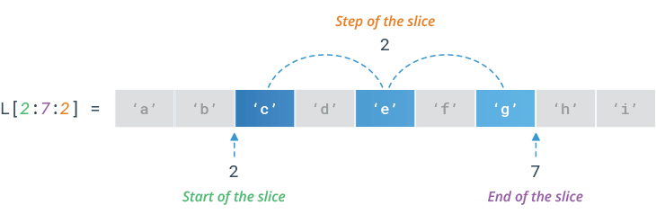
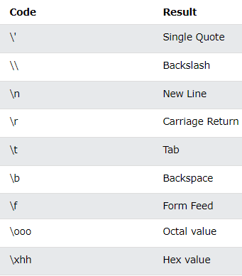

# 03. Satr (str) bilan ishlash 
 
**Reja:**
<!-- TOC -->
* []()
    * [1 Satrlar](#1-satrlar)
      * [Satrni solishtirish: in, not in, ==, >, <](#satrni-solishtirish--in-not-in----)
    * [2 Satrni kesish](#2-satrni-kesish)
    * [3 Satrni o'zgartirish](#3-satrni-ozgartirish)
    * [4 Satrni qo'shish](#4-satrni-qoshish)
    * [5 Satrni formatlash](#5-satrni-formatlash)
      * [Maxsus belgilari](#maxsus-belgilari)
    * [6 Satr metodlari](#6-satr-metodlari)
    * [7 Xatoliklar](#7-xatoliklar)
<!-- TOC -->

### Qayatirish uchun
#### Satrlar bilan ishlash

soz = 'Men dasturchiman'

| Amal nomi                 | Yozilishi                       | Natija           |
|---------------------------|---------------------------------|------------------|
| Bosh harf                 | soz[0]                          | M                |
| Ohirgi harf               | soz[-1]                         | n                |
| O'rta harf                | soz[ len(soz) // 2 ]            | u                |
| Boshidagi 3 ta harf       | soz[0:3] <br> yoki <br> soz[:3] | Men              |
| Ohirgi 3 ta harf          | soz[-3:] <br> yoki <br> soz[:3] | man              |
| Hammasi                   | soz <br> yoki <br> soz[:]       | man              |
| 2 ta qadam bo'yicha olish | soz[::2]                        | Mndsucia         |
| Teskarilash               | soz[::-1]                       | namihcrutsad neM |

#### Satr metodlari

| Amal nomi                                                      | Metod                                                                                                                            | Natija                           |
|----------------------------------------------------------------|----------------------------------------------------------------------------------------------------------------------------------|----------------------------------|
| Harflarni kichiklash                                           | soz.lower()                                                                                                                      | men dasturchiman                 |
| Harflarni kattalshtirish                                       | soz.upper()                                                                                                                      | MEN DASTURCHIMAN                 |
| So'zdagi bosh harfni kattalashtirish                           | soz.title()                                                                                                                      | Men Dasturchiman                 |
| Gapdagi bosh harfni kattalashtirish                            | soz.capitalize()                                                                                                                 | 'Men dasturchiman'               |
| a harfi nechta                                                 | soz.count('m')                                                                                                                   | 2                                |
| d harfi indeksi                                                | soz.find('d')  <br/>yoki <br/>soz.index('d') <br/> Izoh: index() metodida topmasa xatolik beradi, find() metodida esa -1 qaytadi | 4                                |
| 30 ta joy olib, o'rtasiga joylash                              | soz.center(30)                                                                                                                   | '       Men dasturchiman       ' |
| 'man' so'zi bilan tugaydimi                                    | soz.endswith('man')                                                                                                              | True                             |
| 'men' so'zi bilan boshlanadimi                                 | soz.startswith('men')                                                                                                            | False                            |
| 'dasturchi' so'zini 'uchuvchi' so'ziga almashtirish            | soz.replace('dasturchi', 'uchuvchi')                                                                                             | Men uchuvchiman                  |
| probel bo'yicha bo'lib tashlash                                | soz.split(' ')                                                                                                                   | ['Men', 'dasturchiman']          |
| Ikki tarafdan bo'sh joylarni olib tashlash                     | soz.strip()                                                                                                                      | Men dasturchiman                 |
| so'zlarni son ekanligini tekshirish                            | soz.isdigit()                                                                                                                    | False                            |
| so'zlarni hammasi kichik harf bilan yozilganligini tekshirish  | soz.islower()                                                                                                                    | False                            |


### 1 Satrlar

```python
ism = "Anvar" # int
print(type(ism)) # <class 'str'>
print(len(ism)) # 5
print(ism[0]) # A 
print(ism[-1]) # r
print(ism[0:2]) # An
print(ism[:2]) # An
print(ism[2]) # v
print(ism[-3:]) # var

```


1. Matnni o'zgaruvchiga o'zlashtirish

Kod:
```python
text = "probe"
```
yoki

```python
text = 'probe'
```

2. Ko'p qatorli matnni o'zlashtirish

Kod:
```python
text = """probe probe
probe probe"""
```

3. Matndagi birinchi elementni ekranga chiqaramiz

Kod:
```python
text = "probe"
print(text[0]) 
```

Natija:
```text
p
```

4. Matndagi ikkinchi elementni ekranga chiqaramiz

Kod:
```python
text = "probe"
print(text[1])
```

Natija:
```text
r
```

5. Matndagi ohirgi elementni ekranga chiqaramiz

Kod:
```python
text = "probe"
print(text[-1])
```

Natija:
```text
e
```

6. Matndagi ohiridan uchinchi elementni ekranga chiqaramiz

Kod:
```python
text = "probe"
print(text[-2])
```

Naitja:
```text
b
```

7. Matndagi hamma elementlarni ekranga chiqaramiz

Kod:
```python
text = "probe"
for letter in text:
    print(letter)
```

Natija:
```text
p
r
o
b
e
```

8. Matndagi hamma elementlarni sonini ekranga chiqaramiz

Kod:
```python
text = "probe"
total = len(text)
print(total)
```

Natija:
```text
5
```


#### Satrni solishtirish: in, not in, ==, >, <

9. Matnda boshqa matn borligini tekshiramiz

Kod:
```python
text = "probe"
letters = "ob"
print(letters in text)
```

Natija:
```text
True
```

10. Matnda boshqa matn borligini tekshirib, natijaga qarab ekranga mos yozuv chiqarish

Kod:
```python
text = "probe"
letters = "ob"

if letters in text:
    print("bor")
else:
    print("yo'q")
```

Natija:
```text
bor
```

11. Matnda boshqa matn yo'qligini tekshirib, natijaga qarab ekranga mos yozuv chiqarish

Kod:
```python
text = "probe"
letters = "li"

if letters not in text:
    print("To'g'ri")
else:
    print("Xato")
```

Natija:
```text
To'g'ri
```

12. Ikki satr o'zaro tengligini solishtirish

Kod:
```python
admin = "admin"
login = input("Loginingizni kiriting")
if admin == login:
    print("Siz adminsiz")
```

Natija:
```text
Loginingizni kiriting>? admin
Siz adminsiz
```

13. Ikki harfni alfavit bo'yicha ketma-ketligini solishtiramiz. Bu yerda 'b' harfi 'a' dan keyin kelgani uhcun 'b' harfi katta hisoblanadi :

Kod:
```python
print('a' > 'b')
```

Natija:
```text
False
```

14. Birinchi harfi bir hil bo'lda, keyingi harflarni solishtiradi

Kod:
```python
print('ac' > 'ab')
```

Natija:
```text
True
```

### 2 Satrni kesish

15. Matnni boshidan kesib olamiz

Kod:
```python
gap = "Men dasturchiman"
print(gap[0:3]) # 1-usul
print(gap[:3]) #2-usul: boshi 0 bo'lsa, yozmasa ham bo'ladi
```

Natija:
```text
Men
Men
```

16. Matnni orasidan kesib olamiz

Kod:
```python
gap = "Men dasturchiman"
print(gap[4:13]) #musbat indeks bilan
print(gap[-12:-3]) #manfiy indeks bilan
```

Natija:
```text
dasturchi
dasturchi
```

17. Matnni orasidan ohirigacha kesib olamiz

Kod:
```python
gap = "Men dasturchiman"
print(gap[4:16]) #musbat indeks bilan
print(gap[4:]) # ohirini yozmasa, eng ohirgi indeksni oladi 
print(gap[-12:]) #manfiy indeks bilan
```

Natija:
```text
dasturchiman
dasturchiman
dasturchiman
```



18. Qadam bo'yicha kesish

Kod:
```python
text = "abcdefghi"
print(text[2:7])
print(text[2:7:2])
```

Natija:
```text
cdefg
ceg
```

### 3 Satrni o'zgartirish

19. So'zni katta harflarga o'zgartiramiz

Kod:
```python
text = 'probe'
text = text.upper()
print(text)
```

Natija:
```text
PROBE
```

20. So'zni kichik harflarga o'zgartiramiz

Kod:
```python
text = 'prOBe'
text = text.lower()
print(text)
```

Natija:
```text
probe
```

21. So'zdan bo'sh joyni olib tashlaymiz

Kod:
```python
text = '   probe   '
text = text.strip()
print(text)
```

Natija:
```text
probe
```

22. So'zdagi ba'zi harflarni almashtiramiz

Kod:
```python
text = 'probe'
text = text.replace("r","o")
print(text)
```

Natija:
```text
poobe
```

23. Matnni ma'lum element boyicha bo'lib tashlaymiz

Kod:
```python
text = 'prob,probe,probe'
text_list = text.split(",")
print(text_list)
```

Natija:
```text
['prob', 'probe', 'probe']
```

### 4 Satrni qo'shish

24. Ikki matnni qo'shishdan hosil bo'lgan so'zni ekranga chiqaramiz

Kod:
```python
ism = "Otabek"
familiya = "Anvarov"
ism_familiya = ism + " " + familiya
print(ism_familiya)
```

Natija:
```text
Otabek Anvarov
```

### 5 Satrni formatlash

25. f-string yordamida matnni qo'shish

Kod:
```python
ism = "Otabek"
familiya = "Anvarov"
ism_familiya = f"{ism} {familiya}"
print(ism_familiya)
```

Natija:
```text
Otabek Anvarov
```

26. Matnni format() metodi yordamida birlashtirish

Kod:
```python
ism = "Otabek"
familiya = "Anvarov"
ism_familiya = "{} {}".format(ism, familiya)
print(ism_familiya)
```


Natija:
```text
Otabek Anvarov
```

#### Maxsus belgilari



\r - belgidan keyin kelgan satrni boshidagi bilan almashtirib qo'yadi

Kod:
```python
print('123456789\rabcde')
```

Natija:

```text
abcde6789
```


27. Ekranga menyu chiqarish:

Kod:
```python
menu = "Menyudan birini tanlang\n\t\t1. Kiritish\n\t\t2. O'zgartirish\n\t\t3. O'chirish"
```

yoki

```python
# \ belgisi ikki qatordagi kodlarni birlashtirish uchun ishlatiladi
menu = "Menyudan birini tanlang\n" \
        "\t\t1. Kiritish\n" \
        "\t\t2. O'zgartirish\n" \
        "\t\t3. O'chirish"
```

Natija:
```text
Menyudan birini tanlang
		1. Kiritish
		2. O'zgartirish
		3. O'chirish
```

### 6 Satr metodlari

28. Matn metodlarini birma-bir ko'rib chiqamiz

Kod:
```python
text = "mening ismim Otabek"
print('capitalize() -', text.capitalize())
print('title() -', text.title())
print('split(" ") -', text.split(' '))
print('center(30):')
print(text.center(30))
print('Otabek'.center(30)) # 30 ta simvolli joy ajratib o'rtaga joylashtiradi
print('count("i") -',text.count('i')) # matndagi belgilar soni
print('endswith("bek") -', text.endswith('bek')) # ohiri berilgan ketma-ketlikka tugashiga tekshiradi
text = text.replace(" ", "\t") # probelni tab ga almashtiradi
print('replace(" ", "\t") -', text) 
print("expandtabs(10) -", text.expandtabs(10)) #tab - probellar soniga almashtiradi
print("find('ism') -", text.find('ism')) # topsa indeksini, topmasa -1 ni qaytaradi
```

Natija:
```text
capitalize() - Mening ismim otabek
title() - Mening Ismim Otabek
split(" ") - ['mening', 'ismim', 'Otabek']
center(30):
     mening ismim Otabek    
            Otabek
count("i") - 3
endswith("bek") - True
mening	ismim	Otabek
mening    ismim     Otabek
find('ism') - 7                                
```

Qolgan metodlarni [w3schools](https://www.w3schools.com/python/python_strings_methods.asp) dan o'rganib oling

### 7 Xatoliklar

29. Satrni o'zgartirib bo'lmaydi

Kod:
```python
ism = 'Otabek'
ism[0] = 'o'
```

Natija:
```text
TypeError: 'str' object does not support item assignment
```


