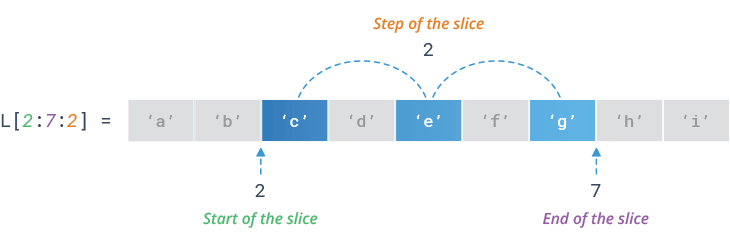
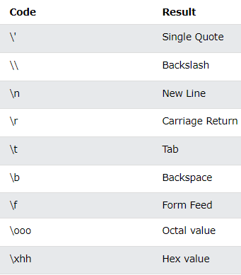

# Mavzu 3: str(satr). str bilan ishlash 
 
## Reja:
1. [Bilim](#1-bilim)
   - [1.1 Terminlar](#11-terminlar)
   - [1.2 O'qish uchun materiallar](#12-oqish-uchun-materiallar)
2. [Amaliyot. O'qituvchi](#2-amaliyot-oqitucvhi)
3. [Amaliyot. O'quvchi](#3-amaliyot-oquvchi)

## 1. Bilim

### 1.1 Terminlar
```
```
### 1.2 O'qish uchun materiallar
- sariq dev
  - [#05 STRING (MATN)](https://python.sariq.dev/ozgaruvchilar-va-malumot-turlari/05-string)
- w3schools
  - [Strings](https://www.w3schools.com/python/python_strings.asp)

## 2. Amaliyot. O'qitucvhi

**Reja:**
- [2.1 Satrlar](#21-satrlar)
- [2.2 Satrni kesish](#22-satrni-kesish)
- [2.3 Satrni o'zgartirish](#23-satrni-ozgartirish)
- [2.4 Satrni qo'shish](#24-satrni-qoshish)
- [2.5 Satrni formatlash](#25-satrni-formatlash)
- [2.6 Satr metodlari](#26-satr-metodlari)
- [2.7 Xatoliklar](27-xatoliklar)
### 2.1 Satrlar
#### 2.1.1 Turlicha ishlatilishi
```python
ism = "Anvar" # int
print(type(ism)) # <class 'str'>
print(len(ism)) # 5
print(ism[0]) # A 
print(ism[-1]) # r
print(ism[0:2]) # An
print(ism[:2]) # An
print(ism[2]) # v
print(ism[-3:]) # var

```

1. Matnni o'zgaruvchiga o'zlashtirish

```python
text = "probe"
```
yoki
```python
text = 'probe'
```
2. Ko'p qatorli matnni o'zlashtirish
```python
text = """probe probe
probe probe"""
```
3. Matndagi birinchi elementni ekranga chiqaramiz
```python
text = "probe"
print(text[0]) 
```
```text
p
```
4. Matndagi ikkinchi elementni ekranga chiqaramiz
```python
text = "probe"
print(text[1])
```
```text
r
```
5. Matndagi ohirgi elementni ekranga chiqaramiz
```python
text = "probe"
print(text[-1])
```
```text
e
```
6. Matndagi ohiridan uchinchi elementni ekranga chiqaramiz
```python
text = "probe"
print(text[-2])
```
```text
b
```
7. Matndagi hamma elementlarni ekranga chiqaramiz
```python
text = "probe"
for letter in text:
    print(letter)
```
```text
p
r
o
b
e
```
8. Matndagi hamma elementlarni sonini ekranga chiqaramiz
```python
text = "probe"
total = len(text)
print(total)
```
```text
5
```
### Satrni solishtirish: in, not in, ==, >, < 
9. Matnda boshqa matn borligini tekshiramiz
```python
text = "probe"
letters = "ob"
print(letters in text)
```
```text
True
```
10. Matnda boshqa matn borligini tekshirib, natijaga qarab ekranga mos yozuv chiqarish
```python
text = "probe"
letters = "ob"

if letters in text:
    print("bor")
else:
    print("yo'q")
```
```text
bor
```
11. Matnda boshqa matn yo'qligini tekshirib, natijaga qarab ekranga mos yozuv chiqarish
```python
text = "probe"
letters = "li"

if letters not in text:
    print("To'g'ri")
else:
    print("Xato")
```
```text
To'g'ri
```
12. Ikki satr o'zaro tengligini solishtirish
```python
admin = "admin"
login = input("Loginingizni kiriting")
if admin == login:
    print("Siz adminsiz")
```
13. Ikki harfni alfavit bo'yicha ketma-ketligini solishtiramiz. Bu yerda 'b' harfi 'a' dan keyin kelgani uhcun 'b' harfi katta hisoblanadi :
```python
print('a' > 'b')
```
```text
False
```
14. Birinchi harfi bir hil bo'lda, keyingi harflarni solishtiradi
```python
print('ac' > 'ab')
```
```text
True
```
### 2.2 Satrni kesish
15. Matnni boshidan kesib olamiz
```python
gap = "Men dasturchiman"
print(gap[0:3]) # 1-usul
print(gap[:3]) #2-usul: boshi 0 bo'lsa, yozmasa ham bo'ladi
```
```text
Men
Men
```
16. Matnni orasidan kesib olamiz
```python
gap = "Men dasturchiman"
print(gap[4:13]) #musbat indeks bilan
print(gap[-12:-3]) #manfiy indeks bilan
```
```text
dasturchi
dasturchi
```
17. Matnni orasidan ohirigacha kesib olamiz
```python
gap = "Men dasturchiman"
print(gap[4:13]) #musbat indeks bilan
print(gap[4:]) # ohirini yozmasa, eng ohirgi indeksni oladi 
print(gap[-12:]) #manfiy indeks bilan
```
```text
dasturchiman
dasturchiman
dasturchiman
```

18. Qadam bo'yicha kesish
```python
text = "abcdefghi"
print(text[2:7])
print(text[2:7:2])
```
```text
cdefg
ceg
```
### 2.3 Satrni o'zgartirish
19. So'zni katta harflarga o'zgartiramiz
```python
text = 'probe'
text = text.upper()
print(text)
```
```text
PROBE
```
20. So'zni kichik harflarga o'zgartiramiz
```python
text = 'prOBe'
text = text.lower()
print(text)
```
```text
probe
```
21. So'zdan bo'sh joyni olib tashlaymiz
```python
text = '   probe   '
text = text.strip()
print(text)
```
```text
probe
```
22. So'zdagi ba'zi harflarni almashtiramiz
```python
text = 'probe'
text = text.replace("r","o")
print(text)
```
```text
poobe
```
23. Matnni ma'lum element boyicha bo'lib tashlaymiz
```python
text = 'prob,probe,probe'
text_list = text.split(",")
print(text_list)
```
```text
['prob', 'probe', 'probe']
```
### 2.4 Satrni qo'shish
24. Ikki matnni qo'shishdan hosil bo'lgan so'zni ekranga chiqaramiz
```python
ism = "Otabek"
familiya = "Anvarov"
ism_familiya = ism + " " + familiya
print(ism_familiya)
```
```text
Otabek Anvarov
```
### 2.5 Satrni formatlash
25. f-string yordamida matnni qo'shish
```python
ism = "Otabek"
familiya = "Anvarov"
ism_familiya = f"{ism} {familiya}"
print(ism_familiya)
```
26. Matnni format() metodi yordamida birlashtirish
```python
ism = "Otabek"
familiya = "Anvarov"
ism_familiya = "{} {}".format(ism, familiya)
print(ism_familiya)
```
#### Maxsus belgilari

27. Ekranga menyu chiqarish:
```python
menu = "Menyudan birini tanlang\n\t\t1. Kiritish\n\t\t2. O'zgartirish\n\t\t3. O'chirish"
```
yoki
```python
# \ belgisi ikki qatordagi kodlarni birlashtirish uchun ishlatiladi
menu = "Menyudan birini tanlang\n" \
        "\t\t1. Kiritish\n" \
        "\t\t2. O'zgartirish\n" \
        "\t\t3. O'chirish"
```
```text
Menyudan birini tanlang
		1. Kiritish
		2. O'zgartirish
		3. O'chirish
```
### 2.6 Satr metodlari
28. Matn metodlarini birma-bir ko'rib chiqamiz
```python
text = "mening ismim Otabek"
print('capitalize() -', text.capitalize())
print('title() -', text.title())
print('split(" ") -', text.split(' '))
print('center(30):')
print(text.center(30))
print('Otabek'.center(30)) # 30 ta simvolli joy ajratib o'rtaga joylashtiradi
print('count("i") -',text.count('i')) # matndagi belgilar soni
print('endswith("bek") -', text.endswith('bek')) # ohiri berilgan ketma-ketlikka tugashiga tekshiradi
text = text.replace(" ", "\t") # probelni tab ga almashtiradi
print('replace(" ", "\t") -', text) 
print("expandtabs(10) -", text.expandtabs(10)) #tab - probellar soniga almashtiradi
print("find('ism') -", text.find('ism')) # topsa indeksini, topmasa -1 ni qaytaradi
```
```text
capitalize() - Mening ismim otabek
title() - Mening Ismim Otabek
split(" ") - ['mening', 'ismim', 'Otabek']
center(30):
     mening ismim Otabek    
            Otabek
count("i") - 3
endswith("bek") - True
mening	ismim	Otabek
mening    ismim     Otabek
find('ism') - 7                                
```
Qolgan metodlarni [w3schools](https://www.w3schools.com/python/python_strings_methods.asp) dan o'rganib oling

### 2.7 Xatoliklar
29. Satrni o'zgartirib bo'lmaydi
```python
ism = 'Otabek'
ism[0] = 'o'
```
```text
TypeError: 'str' object does not support item assignment
```
## 3. Amaliyot. O'quvchi 
### Sintaksis
#### Oson daraja

1. Quyidagi o'zgaruvchilarni yarating:
```text
ism = "Ulug'bek"
sharifi = "Anvarov"
otasini_ismi = "Bekzod og'li"
```
2. Yuqoridagi kodni davom ettirib, ekranga quyidagi ko'rinishda chiqaring. *Yordam: f-string dan foydalaning*. [Yechim](uy%20ishi/str2.py)
```text
Ismi: Ulug'bek
Sharifi: Anvarov
Otasining ismi: Bekzod og'li
```
3. Yuqoridagi kodga ozgina o'zgartirish kiriting, natijada quyidagi ko'rinishga kelsin. [Yechim](uy%20ishi/str3.py)
```text
Ismi: ULUG'BEK
Sharifi: ANVAROV
Otasining ismi: BEKZOD OG'LI
```
4. Endi ismi, sharifi va otasining ismini foydalanuvchidan so'rab, ekranga foydalanuvchi qanday harflar bilan kiritganidan qat'iy nazar quyidagi ko'rinishda chiqarsin. [Yechim](uy%20ishi/str4.py)
```text
Ismingiz: Ulug'BEK
Sharifingiz: ANVAROV
Otangizni ismi: BEKzod og'li
  
Ismi: Ulug'bek
Sharifi: Anvarov
Otasining ismi: Bekzod og'li
```
5. Quyidagi ifodalarning natijasida ekranga  nima chiqadi og'zaki ayting, so'ng javobi bilan solishtiring [[1]](http://openbookproject.net/thinkcs/python/english3e/strings.html):
```python
print("Python"[1])
print("Strings are sequences of characters."[5])
print(len("wonderful"))
print("Mystery"[:4])
print("p" in "Pineapple")
print("apple" in "Pineapple")
print("pear" not in "Pineapple")
print("apple" > "pineapple")
print("pineapple" < "Peach")
```
6. Foydalanuvchidan ismini so'rab, nechta harfdan iboratligini chiqarib beradigan dastur tuzing. [Yechim](uy%20ishi/str6.py)
```text
Ismingizni yozing: Otabek
Ismingiz 6 harfdan iborat
```
7. Foydalnuvchidan uch marta ketma-ket ism, sharifini so'rang, natijada ekranga quyidagi formatda chiqaring. Ustun uzunligi 15. [Yechim](uy%20ishi/str7.py)
```text
Ismingiz: Otabek
Sharifingiz: Anvarov
Ismingiz: Anvar
Sharifingiz: Bekzodov
Ismingiz: Sherzod
Sharifingiz: Oybekov

      Ism           Sharifi    
     Otabek         Anvarov    
     Anvar          Bekzodov   
    Sherzod         Oybekov
```
8. Foydalanuvchidan ixtiyoriy matn kiritishni so'rang. So'ng kiritilgan matnning birinchi harfi matnda necha marta uchraganini chiqaring. [Yechim](uy%20ishi/str8.py)
```text
Matn kiriting: Men dasturchiman
M harfi matnda 2 marta ishlatilgan
```
9. Foydalanuvchidan matn kiritishni so'rang. Matnda quyidagi almashtirishlarni ishlating. [Yechim](uy%20ishi/str9.py)<br>
" " belgisini "-" belgisiga<br>
"," belgisini o'chirib tashlang<br>
"." belgisini o'chirib tashlang<br>
```text
Matn kiriting: gap gap,.gap
Hosil bo'lgan matn: gap-gapgap
```
10. Foydalanuvchidan parol kiritishni so'rang. Parolda ba'zi almashtirishlarni amalga oshiring. Go'yoki shifrlayapmiz. [Yechim](uy%20ishi/str10.py)
"o" belgisini "0" belgisiga
"e" belgisini "3" belgisiga
"u" belgisini "4" belgisiga
```text
Parol kiriting: Erofuqe
Sizning parolingiz quyidagicha bo'ldi:
3r0f4q3
```
11. Foydalanuvchi ingliz tilida kiritgan matnni quyidagi almashtirishlar bilan shifrlaymiz. Har bir harfga takrorlanmas boshqa belgini yozib chiqamiz. Sharti shuki foydalanuvchi faqat ingliz harflarini kiritadi. [Yechim](uy%20ishi/str11.py)
"a" -> "0"
"b" -> "1"
"c" -> "2"
"d" -> "3"
...
"z" -> ""
```text
Matn kiriting: Men mohir dasturchiman 
Shifrlangan matn: M4$ #%78* 30()-*278#0$
```
Deshifrlash uchun yuqoridagi masalada teskari almashtirishni amalga oshiramiz. 
#### O'rta daraja
12. Matnning replace() metodidan foydalanib, kirilchani lotinga o'giradigan dastur yozing.
Sharti shuki, foydalanuvci faqat kichik harflar bilan kiritadi. Kirilchada е harfini lotinchada e yoi ye bo'lishini hisobga olmaymiz. Soddaroq dastur qilamiz. [Yechim](uy%20ishi/str12.py) 
```text
Kirilcha matn kiriting: бу  кирилча матн
Natija: bu kirilcha matn
```
13. Foydalanuvchidan ism sharifini kiritishni so'rang. So'ng ekranga ism va sharifini ajratib chiqaring. *Yordam: split() metodidan foydalaning*. [Yechim](uy%20ishi/str13.py)
```text
Ism sharifingiz: Anvar Bekzodov
Ismingiz: Anvar
Sharifingiz: Bekzodov
```
### Mantiqiy
#### Oson daraja
14. Foydalanuvchidan email kiritishni so'rang. Agar kiritilgan email da @ belgisi bo'lmasa, 'Elektron pochta xato' degan yozuv chiqsin, aks holda 'To'g'ri' degan yozuv chiqsin. [Yechim](uy%20ishi/str14.py) 
```text
Elektron pochtangiz: test_com.ru
Elektron pochta xato
```
```text
Elektron pochtangiz: test@com.ru
To'g'ri
```
15. Foydalanuvchidan ismini hammasini katta harf bilan kiritishni so'rang. Agar katta harf bilan kiritmagan bo'lsa, 'Xato' dega yozuv chiqsin. [Yechim](uy%20ishi/str15.py)
```text
Ismingizni katta harflar bilan kiriting: OTAbek
Xato
```
```text
Ismingizni katta harflar bilan kiriting: OTABEK
To'g'ri
```
16. Foydalanuvchidan rasm nomini va kengaytmasi bilan (.jpg, .bmp, .png) kiritishini so'rang. So'ng tekshiring agar  rasm bo'lmasa 'Xato' degan habar chiqsin. [Yechim](uy%20ishi/str16.py)
```text
Rasm nomini kiriting: rasm1.jpg
```
```text
Rasm nomini kiriting: rasm1.p
Xato
```
#### O'rta daraja
17. Foydalanuvchidan ikki chetida bir hil harfli (Katta kichikligidan qat'iy nazar) so'z kiritishni so'rang, so'ng yuqoridagi kabi tekshiring. [Yechim](uy%20ishi/str17.py)
```text
Boshi va ohiri bir hil harfli so'z kiriting: Oslo 
```
```text
Boshi va ohiri bir hil harfli so'z kiriting: olma 
Xato
```
#### Qiyin daraja
18. Kiritilgan so'z o'rtasidagi harfni ekranga chiqarib bering. [Yechim](uy%20ishi/str18.py)
```text
So'z kiriting: Olma
Bu so'zda o'rta harf yo'q
```
```text
So'z kiriting: Toq
Bu so'zda o'rta harf: o
```
19. Foydalanuvchi kiritgan matn sondan iboratligini tekshiradigan dastur yozing. [Yechim](uy%20ishi/str19.py)
```text
Son kiriting: wer45
Bu son emas
```
```text
Son kiriting: 355
Rahmat
```
20. Foydalanuvchidan ikki son kiritishni so'rang, natijada dastur ko'paytmasini chiqarsin. Agar foydalanuvchi son bo'lmagan qiymat kiritsa, unda 'Bu son emas' degan habar chiqarsin. [Yechim](uy%20ishi/str20.py)
```text
Birinchi sonni kiriting: we
Bu son emas
```
```text
Birinchi sonni kiriting: 3
Ikkinchi sonni kiriting: we
Bu son emas
```
```text
Birinchi sonni kiriting: 3
Ikkinchi sonni kiriting: 4
3 * 4 = 12
```
21. Foydalanuvchidan ism sharifini kiritishni so'rang, so'ng ism va sharifini ajratib ekranga chiqaring. Bu holda foydalanuvchi ismini birinchi yoki ikkinchi yozishi mumkin. Siz ism va sharifini o'zingiz aniqlang. Sharti shuki, sharifi 'ov' qo'shimchasi bilan tugashi kerak. [Yechim](uy%20ishi/str21.py)
```text
Ism sharifingiz: Bekzodov Anvar
Ismingiz: Anvar
Sharifingiz: Bekzodov
```
```text
Ism sharifingiz: Anvar Bekzodov
Ismingiz: Anvar
Sharifingiz: Bekzodov
```
22. Foydalanuvchidan biror matn kiritishni so'rang. Shu matnda uchragan hamma harflar va ularning sonini chiqaring. [Yechim](uy%20ishi/str22.py)
```text
Matn kiriting: baqa
Harflar soni
b - 1
a - 2
q - 1
```
23. Foydalanuvchidan biror matn kiritishni so'rang. Shu matnda uchragan harf va harfdan tashqari belgilar sonini ekranga chiqarsin. [Yechim](uy%20ishi/str23.py)
```text
Matn kiriting: Buxoro shahrining tarixiy markazida
Harflar soni 32
Belgilar soni: 3
```