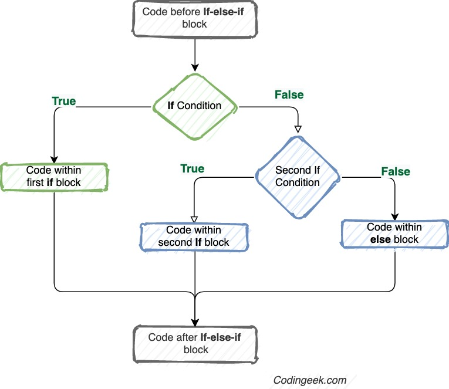
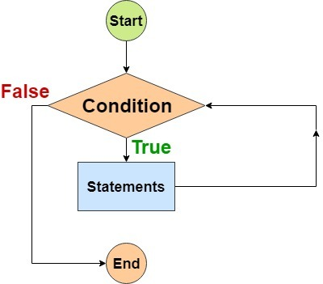
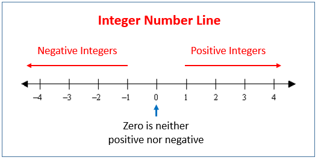
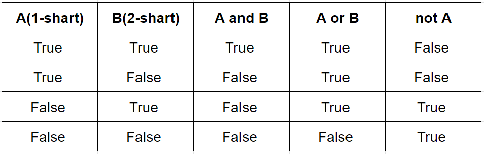
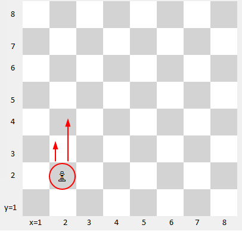
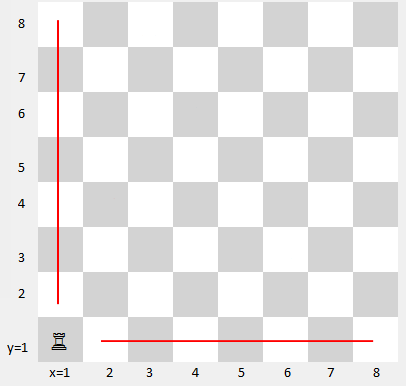

# 04. Mantiq (bool) bilan ishlash 
 
**Reja:**
<!-- TOC -->
* []()
  * [1 True/False qiymatlari haqida](#1-truefalse-qiymatlari-haqida)
  * [2 Sonlarni solishtirish](#2-sonlarni-solishtirish)
    * [2.1 Sonlarni katta, kichik va tenglikka tekshirish](#21-sonlarni-katta-kichik-va-tenglikka-tekshirish)
    * [2.2 Sonlarni musbat/manfiylikka tekshirish](#22-sonlarni-musbatmanfiylikka-tekshirish)
    * [2.3 Sonlarni juft/toqlikka tekshirish](#23-sonlarni-jufttoqlikka-tekshirish)
    * [2.4 Sonlarni karralikka tekshirish](#24-sonlarni-karralikka-tekshirish)
  * [3 Satrni solishtirish](#3-satrni-solishtirish)
    * [3.1 Tenglikka tekshirish](#31-tenglikka-tekshirish)
    * [3.2 Tarkibida borligini tekshirish](#32-tarkibida-borligini-tekshirish)
  * [4 To'plam bilan solishtirish](#4-toplam-bilan-solishtirish)
  * [5 Qiymatlarning True/False bo'lishi](#5-qiymatlarning-truefalse-bolishi)
  * [6 Murakkab solishtirish: and/or](#6-murakkab-solishtirish--andor)
  * [7 Operatorlar](#7-operatorlar)
    * [7.1 Arifmetik operatorlar](#71-arifmetik-operatorlar)
    * [7.2 O'zlashtirish operatorlar](#72-ozlashtirish-operatorlar)
    * [7.3 Tarkibida borligini bildiruvchi operatorlar](#73-tarkibida-borligini-bildiruvchi-operatorlar)
    * [7.4 Taqqoslash operatori](#74-taqqoslash-operatori)
<!-- TOC -->

### Qayatirish uchun

#### Sonlarni solishtirish

<table>
<tr><td>№</td><td>Nomi</td><td>Misol</td><td>Javobi</td></tr>
<tr><td>1</td><td>3 soni 6 sonidan kattami?</td><td>3 > 6</td><td>False</td></tr>
<tr><td>2</td><td>3 soni 6 sonidan kichikmi?</td><td>3 < 6</td><td>True</td></tr>
<tr><td>3</td><td>3 soni 6 sonidan katta yoki tengmi?</td><td>3 >= 6</td><td>False</td></tr>
<tr><td>4</td><td>3 soni 6 sonidan kichik yoki tengmi?</td><td>3 <= 6</td><td>True</td></tr>
<tr><td>5</td><td>3 soni 6 soniga tengmi?</td><td>6 == 4</td><td>False</td></tr>
<tr><td>6</td><td>3 soni 6 soniga teng emasmi?</td><td>6 != 3</td><td>True</td></tr>
<tr><td>7</td><td>6 soni 0 ga tengmi?</td><td>not 6</td><td>False</td></tr>
</table>

<br>

#### Satrlarni solishtirish

soz1 = 'dastur'<br>
soz2 = 'dasturchi'<br>
soz3 = ''<br>
<table>
<tr><td>№</td><td>Nomi</td><td>Misol</td><td>Javobi</td><td>Izoh</td></tr>
<tr><td>1</td><td>'a' ning kodi 'b' ning kodidan kattami?</td><td>'a' > 'b'</td><td>False</td><td>ord('a') > ord('b')</td></tr>
<tr><td>2</td><td>'a' ning kodi 'b' ning kodidan kichikmi?</td><td>3 < 6</td><td>True</td><td>ord('a') < ord('b')</td></tr>
<tr><td>3</td><td>soz1 bilan soz2 bir xilmi?</td><td>soz1 == soz2</td><td>False</td><td></td></tr>
<tr><td>4</td><td>soz1 bilan soz2 bir xil emasmi?</td><td>soz1 != soz2</td><td>True</td><td></td></tr>
<tr><td>5</td><td>soz1 bo'sh satrmi?</td><td> not soz1</td><td>False</td><td></td></tr>
<tr><td>6</td><td>soz3 bo'sh satrmi?</td><td>not soz3</td><td>True</td><td></td></tr>
 <tr><td>6</td><td>soz2 ichida soz1 uchraydimi?</td><td>soz1 in soz2</td><td>True</td><td></td></tr>
</table>

<br>

#### To'plamlarni solishtirish

toplam1 = [1, 2, 3, 4]<br>
toplam2 = ''<br><br>
<table>
<tr><td>№</td><td>Nomi</td><td>Misol</td><td>Javobi</td></tr>
<tr><td>1</td><td>1 soni toplam1 da uchraydimi?</td><td>1 in toplam1</td><td>True</td></tr>
<tr><td>2</td><td>1 soni toplam1 da uchramaydimi?</td><td>1 not in toplam1</td><td>True</td></tr>
<tr><td>3</td><td>toplam2 bo'shmi</td><td>not toplam2</td><td>True</td></tr>
</table>

<br>

#### Sonlarni tekshirish

son = 10 <br>

<br>
<table>
<tr><td>№</td><td>Nomi</td><td>Misol</td><td>Javobi</td></tr>
<tr><td>1</td><td>son musbatmi?</td><td>son > 0</td><td>True</td></tr>
<tr><td>2</td><td>son manfiymi?</td><td>son < 0</td><td>False</td></tr>
<tr><td>3</td><td>son juftmi?</td><td>son % 2 == 0</td><td>True</td></tr>
<tr><td>4</td><td>son toqmi?</td><td>son % 2 == 1</td><td>False</td></tr>
<tr><td>5</td><td>son 5 ga karralikmi?</td><td>son % 5 == 0</td><td>True</td></tr>
<tr><td>6</td><td>son 5 ga karralik emasmi?</td><td>son % 5 != 0</td><td>False</td></tr>
</table>

<br>

#### Arifmetik operatorlar

Arifmetik operatorlar oddiy matematik amallarni bajarish uchun ishlatiladi:
<table>
<tr><td>Operator</td><td>Nomi</td><td>Misol</td><td>Javobi</td></tr>
<tr><td>+</td><td>Qo'shish</td><td>3 + 6</td><td>9</td></tr>
<tr><td>-</td><td>Ayirish</td><td>3 - 6</td><td>-3</td></tr>
<tr><td>*</td><td>Ko'paytirish</td><td>3 * 6</td><td>18</td></tr>
<tr><td>/</td><td>Bo'lish</td><td>6 / 3</td><td>2.0</td></tr>
<tr><td>%</td><td>Qoldiq olish</td><td>7 % 4</td><td>3</td></tr>
<tr><td>**</td><td>Darajaga oshirish</td><td>7 * 2</td><td>49</td></tr>
<tr><td>//</td><td>Bo'lib butun qismini olish</td><td>9 // 4</td><td>2</td></tr>
</table>

<br>


#### O'zlashtirish operatorlar
x = 9
<table>
<tr><td>Operator</td><td>Nomi</td><td>Misol</td><td>Bir hil</td><td>x</td></tr>
<tr><td>=</td><td>O'zlashtirish</td><td>x=9</td><td>x=9</td><td>9</td></tr>
<tr><td>-=</td><td>O'zidan ayirib o'zlashtirish</td><td>x -= 3</td><td>x = x - 3</td><td>6</td></tr>
<tr><td>+=</td><td>O'ziga qo'shib o'zlashtirish</td><td>x += 3</td><td>x = x + 3</td><td>12</td></tr>
<tr><td>*=</td><td>O'ziga ko'paytirib o'zlashtirish</td><td>x *= 3</td><td>x = x * 3</td><td>27</td></tr>
<tr><td>/=</td><td>O'ziga bo'lib o'zlashtirish</td><td>x /= 3</td><td>x = x / 3</td><td>3</td></tr>
<tr><td>%=</td><td>O'zidan qoldiq olib o'zlashtirish</td><td>x %= 4</td><td>x = x % 4</td><td>1</td></tr>
<tr><td>//=</td><td>O'zidan butun qismini olib o'zlashtirish</td><td>x //= 4</td><td>x = x // 4</td><td>2</td></tr>
<tr><td>**=</td><td>O'zini darajaga ko'tarib o'zlashtirish</td><td>x **= 2</td><td>x = x ** 2</td><td>81</td></tr>
</table>

<br>

#### Tarkibida borligini bildiruvchi operatorlar
in operatori biron qiymat to'plamda yoki satrda borligini tekshirish uchun ishlatiladi 
<table>
<tr><td>Operator</td><td>Misol</td><td>Ma'nosi</td><td>Natija</td></tr>
<tr><td>in</td>
<td>'h' in 'habar'<br>5 in [1,2,3]<br>5 in (1,2,3)<br>3 in {1,2,3}<br>'car' in lugat.keys()<br>'moshina' in lugat.values()</td>
<td>h harfi habar so'zida bormi<br>5 soni [1,2,3] to'plamida bormi<br>5 soni (1,2,3) to'plamida bormi<br>5 soni {1,2,3} to'plamida bormi<br>'car' so'zi lugat kalitlari to'plamida bormi<br>'moshina' so'zi lugat ning qiymatlari to'plamida bormi</td>
<td>True<br>False<br>False<br>True<br>True<br>True</td></tr>
<tr><td>not in</td>
<td>'h' not in 'habar'<br>5 not in [1,2,3]<br>5 not in (1,2,3)<br>3 not in {1,2,3}<br>'car' not in lugat.keys()<br>'moshina' not in lugat.values()</td>
<td>h harfi habar so'zida yo'qmi<br>5 soni [1,2,3] to'plamida yo'qmi<br>5 soni (1,2,3) to'plamida yo'qmi<br>3 soni {1,2,3} to'plamida yo'qmi<br>'car' so'zi lugat kalitlari to'plamida yo'qmi<br>'moshina' so'zi lugat ning qiymatlari to'plamida yo'qmi</td>
<td>False<br>True<br>True<br>False<br>False<br>False</td></tr>
</table>

<br>

#### Taqqoslash operatori

<table>
<tr><td>Operator</td><td>Nomi</td><td>Misol</td><td>Javobi</td></tr>
<tr><td>==</td><td>Tengmi</td><td>3 == 6</td><td>False</td></tr>
<tr><td>!=</td><td>Teng emasmi</td><td>3 != 6</td><td>True</td></tr>
<tr><td>></td><td>Kattami</td><td>3 > 6</td><td>False</td></tr>
<tr><td><</td><td>Kichikmi</td><td>3 < 6</td><td>True</td></tr>
<tr><td>>=</td><td>Katta yoki tengmi</td><td>6 >= 6</td><td>True</td></tr>
<tr><td><=</td><td>Kichik yoki tengmi</td><td>3 <= 6</td><td>True</td></tr>
</table>

## 1 True/False qiymatlari haqida
Mantiqiy qiymat - shartni tekshirish natijasi bo'lib, u ikki qiymatdan iborat:<br>
True - shart to'g'ri <br>
False - shart xato<br><br>
Mantiqiy qiymatlar *if* ifodasida ishlatiladi. Ya'ni shart True bo'lsa, tegishli amal bajariladi, aks holda boshqa amal bajariladi. 

<br>Shuningdek va *while* ifodasida ham ishlatiladi. Ya'ni shart True bo'lsa, while blokidagi amallar takroriy bajarilaveradi.   

<br>Hozircha shartni qanday yozishni o'rganamiz.  Keyingi mavzularda *if* va *while* da shartlarni qanday ishlatishni ko'ramiz.<br>
Shartlarda turli belgilar ishlatilishi mumkin. Ular bilan [2.7.4 Taqqoslash operatorlari](#274-taqqoslash-operatori) mavzusiga o'tib tanishib chiqing, so'ng yana shu yerdan davom ettiring.


## 2 Sonlarni solishtirish
### 2.1 Sonlarni katta, kichik va tenglikka tekshirish
1. 5 son 15 sonidan **kattami** solishtiring, so'ng javobini ekranga chiqaring:

Natija:

```text
False
```

Yechim:

```python
print(5 > 15)
```

5 soni 15 dan katta emas, shuning uchun ifoda natijasi False - xato bo'ladi<br>
2. 5 soni 15 sonidan **kichikmi** solishtiring, so'ng javobini ekranga chiqaring:

Natija:

```text
True
```

Yechim:

```python
print(5 < 15)
```

5 soni 15 dan kichik, shuning uchun ifoda natijasi True - to'g'ri bo'ladi<br>
3. 20 soni 200 ga **tengmi**, solishtiring, so'ng javobini ekranga chiqaring:

Natija:

```text
False
```

Yechim:

```python
print(20 == 200)
```
*Eslatma:*<br>
= - o'zlashtirish belgisi, lekin == tenglikka tekshirish belgisidir.<br>
4. 100 soni 100.4 ga **teng emasligini** tekshiring

Natija:

```text
True
```

Yechim:

```python
print(100 != 100.4)
```

5. 18 soni 9 dan **katta yoki tengmi** tekshiring

Natija:

```text
True
```

Yechim:
```python
print(18 >= 9)
```

Ya'ni ikki shartga tekshiradi: katta yoki tenglikka. Ikkalasidan bittasi bajarilsa True bo'ladi<br>
6. 18 soni 9 dan **kichik yoki tengmi** tekshiring

Natija:

```text
False
```
Yechim:

```python
print(18 <= 9)
```


7. Foydalanuvchi ikki son kiritsin. Birinchi son ikkinchi sondan kattami tekshiring.

Natija:
```text
Birinchi son ikkinchi sondan kattami?
Birinchi sonni kiriting: 10
Ikkinchi sonni kiriting: 15
False
```
```text
Birinchi son ikkinchi sondan kattami?
Birinchi sonni kiriting: 20
Ikkinchi sonni kiriting: 5
True
```

Yechim:

```python
print("Birinchi son ikkinchi sondan kattami?")
son1 = int(input("Birinchi sonni kiriting: "))
son2 = int(input("Ikkinchi sonni kiriting: "))
print(son1 > son2)
```


### 2.2 Sonlarni musbat/manfiylikka tekshirish

<br>8. Foydalanuvchi kiritgan son musbatmi, tekshiring.

Natija: 

```text
Son kiriting: 10
True
```
```text
Son kiriting: -10
False
```

Yechim:

```python
son = int(input("Son kiriting: "))
print(son > 0)
```

9. Foydalanuvchi kiritgan son manfiymi, tekshiring.

Natija:

```text
Son kiriting: 10
False
```
```text
Son kiriting: -10
True
```

Yechim:

```python
son = int(input("Son kiriting: "))
print(son < 0)
```

10. Foydalanuvchi kiritgan son musbat yoki 0 ga tengmi, tekshiring.

Natija:

```text
Son kiriting: 0
True
```
```text
Son kiriting: 10
True
```
```text
Son kiriting: -10
False
```

Yechim

```python
son = int(input("Son kiriting: "))
print(son >= 0)
```

### 2.3 Sonlarni juft/toqlikka tekshirish

11. Foydalanuvchi kiritgan son juftmi, tekshiring.
<br>*Eslatma:* Sonni juft ekanligini tekshirish uchun sonni 2 ga bo'lib, qoldig'i 0 ga tengligini tekshirish kerak

Natija:

```text
Son kiriting: 10
True
```

```text
Son kiriting: 11
False
```

Yechim:

```python
son = int(input("Son kiriting: "))
print(son % 2 == 0)
```

12. Foydalanuvchi kiritgan son juft emasmi (ya'ni toqmi) , tekshiring.
<br>*Eslatma:* Sonni toq ekanligini tekshirish uchun sonni 2 ga bo'lib, qoldig'i 1 ga tengligini tekshirish kerak. Yoki uni o'rniga juft emaslikka tekshiramiz. Ikkala shart yozilishi har hil bo'lgani bilan ma'nosi bir hil.

Natija:

```text
Son kiriting: 13
True
```
```text
Son kiriting: 14
False
```

Yechim:

```python
son = int(input("Son kiriting: "))
print(son % 2 != 0)
```
yoki

```python
son = int(input("Son kiriting: "))
print(son % 2 == 1)
```

### 2.4 Sonlarni karralikka tekshirish
<br>*Eslatma:* s sonnni b songa karrali ekanligini tekshirish uchun  a sonni b songa bo'lib, qoldig'ini 0 ga tengligini tekshiramiz 

13. Foydalanuvchi kiritgan son 3 ga karralimi (ya'ni 3 ga bo'lganda qoldig'i 0 ga tengmi), tekshiring.

Natija:

```text
Son kiriting: 10
False
```
```text
Son kiriting: 12
True
```

Yechim:

```python
son = input("Son kiriting: ")
print(son % 3 == 0)
```

14. Foydalanuvchi kiritgan son 15 ga karrali emasmi, tekshiring. Ya'ni 15 ga karrali emasligini tekshirish kerak

Natija:

```text
Son kiriting: 30
False
```
```text
Son kiriting: 35
True
```

Yechim:

```python
son = input("Son kiriting: ")
print(son % 15 != 0)
```

## 3 Satrni solishtirish
### 3.1 Tenglikka tekshirish
15. Foydalanuvchi kiritgan harf 'a' harf ekanligini tekshiring.

Natija:

```text
Harf kiriting: b
False
```
```text
Harf kiriting: A
False
```
```text
Harf kiriting: a
True
```

Yechim:

```python
harf = input("Harf kiriting: ")
print(harf == 'a')
```

16. Foydalanuvchi kiritgan harf 'A' harf ekanligini tekshiring.

Natija:

```text
Harf kiriting: b
False
```
```text
Harf kiriting: A
True
```
```text
Harf kiriting: a
False
```

Yechim:

```python
harf = input("Harf kiriting: ")
print(harf == 'A')
```
17. Foydalanuvchi kiritgan harf katta yoki kichik ekanligidan qa'iy nazar 'a' harfga tekshiring. Ya'ni 'a' yoki 'A' holatida ham True bo'lsin.

Natija:

```text
Harf kiriting: a
True
```
```text
Harf kiriting: A
True
```
```text
Harf kiriting: b
False
```

Yechim:

```python
harf = input("Harf kiriting: ")
print(harf.lower() == 'a')
```
yoki
```python
harf = input("Harf kiriting: ")
print(harf.upper() == 'A')
```

18. Foydalanuvchi kiritgan so'z 'login' so'zi bilan bir hilmi tekshiring.

Natija:

```text
So'z kiriting: login
True
```
```text
So'z kiriting: abc
False
```

Yechim:

```python
soz = input("So'z kiriting: ")
print(soz == 'login')
```

### 3.2 Tarkibida borligini tekshirish
19. Foydalanuvchi kiritgan so'z boshqa satr(gap,so'z) ichida mavjudmi tekshiring.

Natija:

```text
So'z kiriting: dasturchi
True
```
```text
So'z kiriting: haydovchi
False
```

Yechim:

```python
gap = "Men zo'r dasturchiman"
soz = input("So'z kiriting: ")
print(soz in gap)
```

20. Foydalanuvchi kiritgan harf so'zda mavjudmi tekshiring.

Natija:

```text
Hayvon nomi: *****
Ekranda berkitilgan hayvon nomida qanday harf bor. 
Bitta harf toki harflar ketma-ketligini kiriting: b 
True
```
```text
Hayvon nomi: *****
Ekranda berkitilgan hayvon nomida qanday harf bor. 
Bitta harf toki harflar ketma-ketligini kiriting: h 
False
```

Yechim:

```python
hayvon_nomi = "buzoq"
print("Hayvon nomi: *****")
satr = input("Ekranda berkitilgan hayvon nomida qanday harf bor. \nBitta harf toki harflar ketma-ketligini kiriting: ")
print(satr in hayvon_nomi)
```
## 4 To'plam bilan solishtirish
21. Foydalnuvchi kiritgan son ro'yxatda borligini tekshiring

Natija:

```text
Ro'yxatda qanday son bor? 10
False
```
```text
Ro'yxatda qanday son bor? 5
True
```

Yechim:

```python
sonlar = [2,3,4,5,6,7]
son = int(input("Ro'yxatda qanday son bor? "))
print(son in sonlar)
```

22. Foydalanuvchi kiritga meva nomi bozorda borligini tekshiring.
<br>*Eslatma:* Huddi shunda tuple, dict va set ma'lumot turlariga ham **in** yordamida element mavjudligini tekshirish mumkin 

Natija:

```text
Meva nomini kiriting: banan
False
```
```text
Meva nomini kiriting: anor
True
```

Yechim:

```python
bozor = ['olma', 'nok', 'anor']
meva = input("Meva nomini kiriting: ")
print(meva in bozor)
```

23. Lug'atda kiritilgan o'zbekcha so'z borligini tekshring:

Natija:
```text
Lug'atimizda qaysi o'zbekcha so'z borligini bilmoqchisiz? mushuk
True
```
```text
Lug'atimizda qaysi o'zbekcha so'z borligini bilmoqchisiz? kuchuk
False
```

Yechim:

```python
lugat = {
    "car": "moshina",
    "run": "yugurmoq",
    "cat": "mushuk"
}
uz = input("Lug'atimizda qaysi o'zbekcha so'z borligini bilmoqchisiz? ")
print(uz in lugat.values())
```

24. Lug'atda kiritilgan inglizcha  so'z borligini tekshring:

Natija:

```text
Lug'atimizda qaysi o'zbekcha so'z borligini bilmoqchisiz? cat
True
```
```text
Lug'atimizda qaysi o'zbekcha so'z borligini bilmoqchisiz? rat
False
```

Yechim:

```python
lugat = {
    "car": "moshina",
    "run": "yugurmoq",
    "cat": "mushuk"
}
uz = input("Lug'atimizda qaysi inglizcha so'z borligini bilmoqchisiz? ")
print(uz in lugat.keys())
```

25. To'plamda element borligini tekshirish:

Natija:

```text
Foydalanuvchi idsini kiriting: 2
True
```

```text
Foydalanuvchi idsini kiriting: 22
False
```

Yechim:

```python
foydalanuvchi_idlari = {1,2,3,4,5,6}
user_id = int(input("Foydalanuvchi idsini kiriting: "))
print(user_id in foydalanuvchi_idlari)
```
26. O'zgarmas to'plamda element borligini tekshirish:

Natija:

```text
Qanday mashina ranglari borligini bilish uchun rang kiriting: oq
True
```
```text
Qanday mashina ranglari borligini bilish uchun rang kiriting: kul rang
False
```

Yechim:

```python
mashina_ranglari = ("oq", "qizil", "ko'k", "qora")
rang = input("Qanday mashina ranglari borligini bilish uchun rang kiriting: ")
print(rang in mashina_ranglari)
```

27. O'zgarmas to'plamda element yo'qligini tekshirish:

Natija:
```text
Qanday mashina ranglari yo'qligini bilish uchun rang kiriting: oq
False
```
```text
Qanday mashina ranglari yo'qligini bilish uchun rang kiriting: kul rang
True
```

Yechim:
```python
mashina_ranglari = ("oq", "qizil", "ko'p", "qora")
rang = input("Qanday mashina ranglari yo'qligini bilish uchun rang kiriting: ")
print(rang not in mashina_ranglari)
```


## 5 Qiymatlarning True/False bo'lishi
bool() funksiyasi qiymatlarning True yoki False ekanligini aniqlab beradi:

Natija:

```text
True
True
```

Yechim:

```python
print(bool("Hello"))
print(bool(15))
```

*Qoida:*<br>
**True** bo'ladi agar:
1. Son 0 ga teng bo'lmasa
2. Satr bo'sh bo'lmasa
3. To'plam (dict, list, set, tuple) bo'sh bo'lmasa
```python
print(bool("soz"))
print(bool(123))
print(bool(["olma", "anor", "banan"]))
```
```text
True
True
True
```
**False** bo'ladi agar:
1. Son 0 ga teng bo'lsa
2. Satr bo'sh bo'lsa
3. To'plam bo'sh bo'lsa

```python
print(bool(False))
print(bool(None))
print(bool(0))
print(bool(""))
print(bool(()))
print(bool([]))
print(bool({}))
```
```text
False
False
False
False
False
False
False
```
28. Foydalanuvchi kiritgan satrni bo'shligini tekshiring:

Natija:

```text
Agar bo'sh so'z kiritsangiz False yozuvini, aks holda True yozuvini ko'rasiz: 
False
```
```text
Agar bo'sh so'z kiritsangiz False yozuvini, aks holda True yozuvini ko'rasiz: abs 
True
```

Yechim:

```python
soz = input("Agar bo'sh so'z kiritsangiz False yozuvini, aks holda True yozuvini ko'rasiz: ")
print(bool(soz))
```

29. Obyekt butun son ekanligini tekshiring:

Natija:

```text
True
```
Yechim:

```python
x = 400
print(isinstance(x, int))
```

## 6 Murakkab solishtirish: and/or
*Eslatma:*

**and** - bir vaqtda bajarilish kerakligini bildiradi, ya'ni ikkala shart True bo'lsa, natijasi ham True bo'ladi<br>
**or** - ikkalasidan birontasi bajarilsa kifoya qiladi, ya'ni ikkala shartdan kamida bittasi True bo'lsa, umumiy natijasi ham True bo'ladi<br>
**not** - shartni teskarisiga tekshirish

Ikki shart natijasi




30. Kiritilgan yosh 20 va 30 orasida ekanligini tekshiring:

Natija:

```text
Yoshingizni kiriting: 25
True
```
```text
Yoshingizni kiriting: 15
False
```
Yechim:


```python
yosh = int(input("Yoshingizni kiriting: "))
print(yosh > 20 and yosh < 30)
```
yoki 
```python
yosh = int(input("Yoshingizni kiriting: "))
print(20 < yosh < 30)
```

31. Son ham 3ga ham 5 karralik bo'lishini tekshiring:

Natija:

```text
Son kiriting: 15
True
```
```text
Son kiriting: 9
False
```

Yechim:

```python
son = int(input("Son kiriting: "))
print(son % 3 == 0 and son % 5 == 0)
```

32. Kiritilgan qiymat son bo'lsin va u son 1,2,3,4,5 orasida ekanligini tekshiring:

Natija:

```text
Son kiriting: 3
True
```
```text
Son kiriting: 13
False
```
```text
Son kiriting: bir
False
```

Yechim:

```python
son = input("Son kiriting: ")
print(son.isdigit() and int(son) in [1,2,3,4,5])
```

33. Bola pasport olishi uchun uni 16 yoshga teng yoki undan katta ekanligiga va bir paytda O'zbekistonda yashashligiga tekshiring:

Natija:

```text
Pasport olish uchun yoshingizni kiriting: 13
Hozir qayerda yashaysiz: O'zbekiston
False
```
```text
Pasport olish uchun yoshingizni kiriting: 16
Hozir qayerda yashaysiz: O'zbekiston
True
```
```text
Pasport olish uchun yoshingizni kiriting: 17
Hozir qayerda yashaysiz: abs
False
```

Yechim:

```python
yosh = input("Pasport olish uchun yoshingizni kiriting: ")
davlat = input("Hozir qayerda yashaysiz: ")
print(int(yosh) >= 16 and davlat == "O'zbekiston")
```

34. Biz qidiruv tizimidan foydalanmoqchimiz. Bizga mahsulot nomi kitob va narxi 40 000 yuqori bo'lgan yoki  mahsulot nomi telefon va narxi 400 000 dan yuqori bo'lgan tovarlar kerak. Shu hartni yozing. Mahsulot va narxni foydalanuvchidan so'rang. So'ng shartga tekshiring:

Natija:

```text
Mahsulot nomi: kitob
Narxi: 5000
False
```
```text
Mahsulot nomi: kitob
Narxi: 15000
True
```
```text
Mahsulot nomi: telefon
Narxi: 15000
False
```
```text
Mahsulot nomi: telefon
Narxi: 500000
True
```

Yechim:

```python
mahsulot = input("Mahsulot nomi: ") 
narx = int(input("Narxi: "))
print(mahsulot == "kitob" and narx > 10_000) or mahsulot == "telefon" and narx > 400_000)
```

35. Kiritilgan yosh 20 va 30 orasida emasligiga tekshiring:

Natija:
```text
Yoshingizni kiriting: 25
False
```
```text
Yoshingizni kiriting: 15
True
```

Yechim:

```python
yosh = int(input("Yoshingizni kiriting: "))
print(not (yosh > 20 and yosh < 30))
```
yoki 
```python
yosh = int(input("Yoshingizni kiriting: "))
print(not 20 < yosh < 30)
```

## 7 Operatorlar
### 7.1 Arifmetik operatorlar
Arifmetik operatorlar oddiy matematik amallarni bajarish uchun ishlatiladi: +, -, /, *, //, %, **

36. To'rtburchak yuzini hisoblaydigan dastur yozing:

Natija:

```text
To'rtburchakning tomoni a = 3
To'rtburchakning tomoni b = 7
To'rtburchakning yuzi 21
```
Yechim:

```python
a = int(input("To'rtburchakning tomoni a = "))
b = int(input("To'rtburchakning tomoni b = "))
print("To'rtburchakning yuzi ", a * b)
```

37. Kiritilgan soiniyani daqiqa va soniyalarga ajratib chiqaring

Natija:
```text
Necha soniya: 75
1 daqiqayu 15 soniya
```
Yechim:

```python
soniya = int(input("Necha soniya: "))
print(f"{soniya // 60} daqiqayu {soniya % 60} soniya")
```

### 7.2 O'zlashtirish operatorlar

O'zlashtirish operatori o'zgaruvchiga qiymat o'zlashtirish uchun ishlatiladi

O'zlashtirish operatori: +=, -=, *=, /=, %=, //=, **=

38. Foydalanuvchi kiritgan songa yana 15 ni qo'shib ekranga chiqaring:

Natija:

```text
Son kiriting: 15
30
```

```text
Son kiriting: 5
20
```

Yechim:

```python
son = int(input("Son kiriting: "))
son = son + 15
print(son)
```

39. Foydalanuvchi kiritgan parametr asosida kvadrat yuzini ekranga chiqaring:

Natija:

```text
Kvadrat tomonini kiriting: 5
Kvadrat yuzi: 25
```
Yechim:

```python
son = int(input("Kvadrat tomonini kiriting: "))
son **= 2 # son = son ** 2 bilan bir hil
print("Kvadrat yuzi:", son)
```

### 7.3 Tarkibida borligini bildiruvchi operatorlar
in operatori biron qiymat to'plamda yoki satrda borligini tekshirish uchun ishlatiladi 

40. Kiritilgan harf lotin harfiga tegishli ekanligini aniqlang:

Natija:

```text
Lotin harfini kiriting: sh
True
```
```text
Lotin harfini kiriting: w
False
```

Yechim:
 
```python
lotin_harflar = "abdefghijklmnopqrstuvxyzo'g'shchng'"
harf = input("Lotin harfini kiriting: ").lower()
print(harf in lotin_harflar)
```

### 7.4 Taqqoslash operatori


41. a soni b soniga teng emasligini tekshiring:

Natija:

```text
a = 5
b = 15
True
```
```text
a = 5
b = 5
False
```

Yechim:

```python
a = int(input("a = "))
b = int(input("b = "))
print(a != b)
```


Sohaviy masalalarni mantiqiy masaladan farqi shuki, u ham mantiqiy lekin uni yechish uchun usha sohani o'rganish talab qilinadi. Masalan quyida shaxmat qoidalarini bilmasdan turib, masalani yecha olmaysiz, shuning uchun avval kerakli qoidalar bilan tanishib chiqamiz, so'ng uni yechamiz<br><br>

42. Piyoda shaxmat doskasida (2,2) koordinatada joylashgan. Siz shunday dastur tuzinki, foydalnuvchi x va y koordinatasini kiritsin, agar piyoda usha koordinataga yurish qila olsa, ekranga True, aks holda False qiymati chiqsin

<p align="center">

</p>

<br>Masalani yechishdan oldin, qoidalarni tushunib olamiz:<br>
Shaxmat doskasini x,y o'qidan iborat deb tasavvur qilamiz va x,y qiymatlari [1-8] oraliqdagi qiymatlardan iborat.
Biz bilamizki, piyoda 2-qatorda turganda ikkita yurish qila oladi. Ya'ni (2,3) yoki (2,4) koordinataga yurish qila oladi. Qolgan holatda yura olmaydi.
<br>
*x0,y0* - boshlang'ich koordinata<br>
*x1,y2* - ohirgi koordinata<br>
O'ylab ko'ring bizda piyoda faqat to'g'riga yuradi, ya'ni x o'qida o'zgarish bo'lmaydi, shuning uchun ham x1 qiymati boshlang'ich holatga teng (ya'ni x1 = x0). y1 esa boshlang'ich koordinatasiga  nisbatan 1 yoki 2 qadam farq qilishi mumkin (ya'ni y1 = y0 + 1 yoki y1 = y0 + 2). Mana shunday qilib ui formulasini tuzib olamiz. Endi mana shu shartlarni and/or kalit so'zlari bilan yozamiz  

Natija:

```text
Shaxmat doskasida piyoda (2,2) koordinatada joylashgan
Piyoda qaysi koordinataga yurish qila oladi?
x ni kiriting: 4 
y ni kiriting: 5
False
```
```text
Shaxmat doskasida piyoda (2,2) koordinatada joylashgan
Piyoda qaysi koordinataga yurish qila oladi?
x ni kiriting: 2 
y ni kiriting: 3
True
```

Yechim:

```python
x0 = 2
y0 = 2
print("Shaxmat doskasida piyoda (2,2) koordinatada joylashgan\nPiyoda qaysi koordinataga yurish qila oladi?")
x1 = int(input("x ni kiriting: "))
y1 = int(input("y ni kiriting: "))
 
print(x0 == x1 and (y1 == y0 + 1 or y1 == y0 + 2))    
```


*Izoh:* Biz x va y ni bir paytda tekshirishimiz kerak, shuning uchun uni orasiga and qo'yamiz, y esa ikki qiymatdan birini oladi, yoki y0 + 1 yoki y0 + 2. Shuning uchun uni orasiga or qo'ydik. Lekin qavslarni esdan chiqarmaslik kerak. Agar qavslar qo'yilmasa, shart ma'nosi o'zgarib ketadi.<br>
Keling mana bu xato bo'lgan holatni ko'ramiz: <br>
```text
print(x0 == x1 and y1 == y0 + 1 or y1 == y0 + 2)    
```
Bu yerda **x0 == x1 and y1 == y0 + 1** sharti to'g'ri yozilgan, x1=2, y1=3 holatida ishlaydi. Endi keyingi shartni ko'ramiz. **or y1 == y0 + 2** shartida x1 qiymati uchun shart qolib ketgan, shuning uchun y1=3 teng bo'lsa bo'ldi, 'True' chiqaveradi. Bu esa xato x1=2 bo'lishi kerak edi 
<br>
43. Rux shaxmat doskasida (1,1) koordinatada joylashgan. Siz shunday dastur tuzinki, foydalnuvchi x va y koordinatasini kiritsin, agar rux usha koordinataga yurish qila olsa, ekranga True, aks holda False qiymati chiqsin

<p align="center">

</p>

Natija:

```text
Shaxmat doskasida rux (1,1) koordinatada joylashgan
Rux qaysi koordinataga yurish qila oladi?
x ni kiriting: 2 
y ni kiriting: 3
False
```
```text
Shaxmat doskasida rux (1,1) koordinatada joylashgan
Rux qaysi koordinataga yurish qila oladi?
x ni kiriting: 1 
y ni kiriting: 3
True
```
```text
Shaxmat doskasida rux (1,1) koordinatada joylashgan
Rux qaysi koordinataga yurish qila oladi?
x ni kiriting: 4 
y ni kiriting: 1
True
```


Yechim:

```python
x0 = 1
y0 = 1
print("Shaxmat doskasida rux (1,1) koordinatada joylashgan\nRux qaysi koordinataga yurish qila oladi?")
x1 = int(input("x ni kiriting: "))
y1 = int(input("y ni kiriting: "))
print(x1 == x0 or y1 == y0)
```

