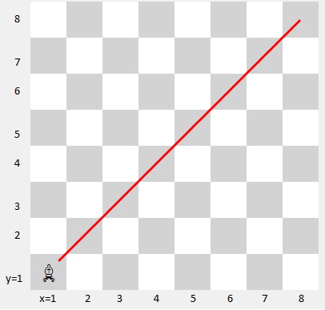
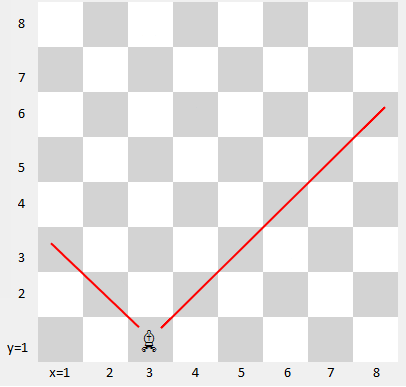
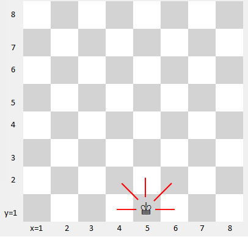

1. foydalanuvchi o'sish tartibida 3 ta son kiritsin. O'sish tartibida ekanligini tekshiring:
```text
Birinchi son: 4
Ikkinchi son: 6
Uchinshi son: 10
True
```
```text
Birinchi son: 4
Ikkinchi son: 16
Uchinshi son: 10
False
```
2. Foydalanuvchi kiritgan ikki son toq ekanligini tekshiring:
```text
Birinchi son: 4
Ikkinchi son: 16
False
```
```text
Birinchi son: 7
Ikkinchi son: 9
True
```
```text
Birinchi son: 7
Ikkinchi son: 16
False
```
3. Foydalanuvchi kiritgan ikki sondan hech bo'lmaganda bittasi toqligini tekshiring:
```text
Birinchi son: 7
Ikkinchi son: 16
True
```
```text
Birinchi son: 7
Ikkinchi son: 17
True
```
```text
Birinchi son: 8
Ikkinchi son: 16
False
```
4. Foydalanuvchi kiritgan ikki sondan faqat bittasi toqligini tekshiring: 
```text
Birinchi son: 8
Ikkinchi son: 16
False
```
```text
Birinchi son: 7
Ikkinchi son: 16
True
```
```text
Birinchi son: 8
Ikkinchi son: 9
True
```
```text
Birinchi son: 7
Ikkinchi son: 15
False
```
5. Foydalanuvchi kiritgan ikkala son bir paytda yoki juft bo'lsin yoki toq bo'lsin:
```text
Birinchi son: 7
Ikkinchi son: 15
True
```
```text
Birinchi son: 8
Ikkinchi son: 16
True
```
```text
Birinchi son: 7
Ikkinchi son: 16
False
```
```text
Birinchi son: 8
Ikkinchi son: 15
False
```
6. Foydalanuvchi kiritgan uchchala son hammasi musbatligini tekshiring:
```text
Birinchi son: 8
Ikkinchi son: 15
Uchinchi son: 6
True
```
```text
Birinchi son: -8
Ikkinchi son: 15
Uchinchi son: 6
False
```
7. Foydalanuvchi kiritgan uchchala sondan hech bo'lmasa bittasi musbatligini tekshiring:
```text
Birinchi son: 8
Ikkinchi son: 15
Uchinchi son: 6
True
```
```text
Birinchi son: -8
Ikkinchi son: 15
Uchinchi son: 6
True
```
```text
Birinchi son: -8
Ikkinchi son: -15
Uchinchi son: 6
True
```
```text
Birinchi son: -8
Ikkinchi son: -15
Uchinchi son: -6
False
```
8. Foydalanuvchi kiritgan son ikki honali ekanligini tekshiring:
```text
Ikki honali son kiriting: 20
True
```
```text
Ikki honali son kiriting: 2
False
```
```text
Ikki honali son kiriting: 200
False
```
9. Foydalanuvchi kiritgan son ikki honali va juft ekanligini tekshiring: 
```text
Ikki honali son kiriting: 20
True
```
```text
Ikki honali son kiriting: 21
False
```
```text
Ikki honali son kiriting: 2
False
```
```text
Ikki honali son kiriting: 200
False
```
10. Foydalanuvchi kiritgan uchta sondan hech bo'lmaganda ikkitasi bir-biriga tengligini tekshiring:
```text
Birinchi son: 8
Ikkinchi son: 8
Uchinchi son: 8
True
```
```text
Birinchi son: 18
Ikkinchi son: 8
Uchinchi son: 8
True
```
```text
Birinchi son: 18
Ikkinchi son: 28
Uchinchi son: 8
False
```
11. Foydalanuvchi kiritgan uchta sondan ikkitasining ishoralari qarama-qarshiligini tekshiring:
```text
Birinchi son: 18
Ikkinchi son: -18
Uchinchi son: 8
True
```
```text
Birinchi son: 18
Ikkinchi son: 18
Uchinchi son: 8
False
```
```text
Birinchi son: 18
Ikkinchi son: 40
Uchinchi son: 8
False
```
12. Foydalanuvchi kiritgan uchta sonning hammasi har hil ekanligini tekshiring:
```text
Birinchi son: 18
Ikkinchi son: 40
Uchinchi son: 8
True
```
```text
Birinchi son: 8
Ikkinchi son: 40
Uchinchi son: 8
False
```
```text
Birinchi son: 8
Ikkinchi son: 8
Uchinchi son: 8
False
```
13. Foydalanuvchi kiritgan uchchala son yoki o'suvchi tartibda yoki kamayish tartibida ekanligini tekshiring:
```text
Birinchi son: 8
Ikkinchi son: 10
Uchinchi son: 20
True
```
```text
Birinchi son: 18
Ikkinchi son: 10
Uchinchi son: 4
True
```
```text
Birinchi son: 8
Ikkinchi son: 30
Uchinchi son: 20
False
```
14. Foydalanuvchi kiritgan 5 honali sonni chapdan o'qisa ham o'ngdan o'qisa ham bir hil ekanligini tekshiring:
```text
5 honali son kiriting: 34567
False
```
```text
5 honali son kiriting: 34543
True
```
```text
5 honali son kiriting: 12321
True
```
### Sohaviy

15. Fil shaxmat doskasida (1,1) koordinatada joylashgan. Siz shunday dastur tuzinki, foydalnuvchi x va y koordinatasini kiritsin, agar fil usha koordinataga yurish qila olsa, ekranga True, aks holda False qiymati chiqsin
<br>*Yordam:*<br>
Mumkin bo'lgan koordinatalarni hammasini qog'ozga yozib chiqing, so'ng formulani topishga harakat qiling
<br>
<p align="center">

</p>

```text
Shaxmat doskasida rux (1,1) koordinatada joylashgan
Rux qaysi koordinataga yurish qila oladi?
x ni kiriting: 2 
y ni kiriting: 2
True
```
```text
Shaxmat doskasida rux (1,1) koordinatada joylashgan
Rux qaysi koordinataga yurish qila oladi?
x ni kiriting: 5 
y ni kiriting: 2
False
```
16. Fil shaxmat doskasida (3,1) koordinatada joylashgan. Siz shunday dastur tuzinki, foydalnuvchi x va y koordinatasini kiritsin, agar fil usha koordinataga yurish qila olsa, ekranga True, aks holda False qiymati chiqsin
<br>
<p align="center">

</p>

```text
Shaxmat doskasida rux (3,1) koordinatada joylashgan
Rux qaysi koordinataga yurish qila oladi?
x ni kiriting: 2 
y ni kiriting: 2
True
```
```text
Shaxmat doskasida rux (3,1) koordinatada joylashgan
Rux qaysi koordinataga yurish qila oladi?
x ni kiriting: 4 
y ni kiriting: 2
True
```
```text
Shaxmat doskasida rux (3,1) koordinatada joylashgan
Rux qaysi koordinataga yurish qila oladi?
x ni kiriting: 4 
y ni kiriting: 4
False
```
17. Huddi shunday shoxga nisbatan bajaring
<br>
<p align="center">

</p>

```text
Shaxmat doskasida shox (5,1) koordinatada joylashgan
Shox qaysi koordinataga yurish qila oladi?
x ni kiriting: 6 
y ni kiriting: 1
True
```

```text
Shaxmat doskasida shox (5,1) koordinatada joylashgan
Shox qaysi koordinataga yurish qila oladi? 
x ni kiriting: 7 
y ni kiriting: 1
False
```

