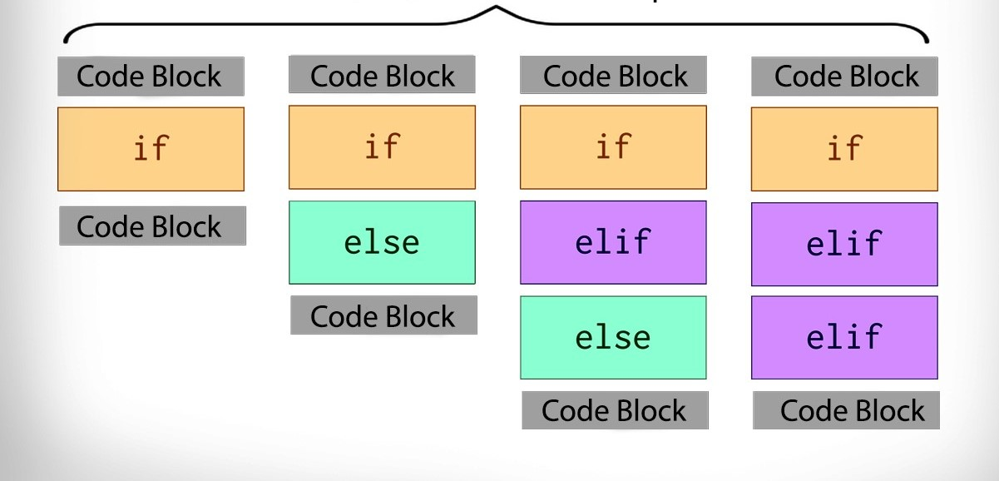
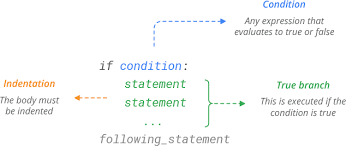

# 05: Shartli operator (if/elif/else)
 

**Reja:**

<!-- TOC -->
* [](#05--shartli-operator--ifelifelse-)
    * [1 Agar(if) ifodasi](#1-agar--if--ifodasi)
      * [Joy tashlash (Indentation)](#joy-tashlash--indentation-)
    * [2 Aks holda (else) ifodasi](#2-aks-holda--else--ifodasi)
    * [3 Aks holda agar (elif) ifodasi](#3-aks-holda-agar--elif--ifodasi)
      * [if ... elif](#if--elif)
      * [if .. elif .. else](#if--elif--else)
      * [if .. elif .. elif .. elif](#if--elif--elif--elif)
    * [4 Shartli operatorning qisqartmasi](#4-shartli-operatorning-qisqartmasi)
      * [if](#if)
      * [if .. else](#if--else)
      * [if .. elif .. else](#if--elif--else)
    * [5 Tarmoqli if](#5-tarmoqli-if)
      * [pass](#pass)
<!-- TOC -->

### Qayatirish uchun

a = 10

b = 13

#### And va Or

| Operator | Ma'nosi                                                                                                                                                                            | Misol           | Natija |
|----------|------------------------------------------------------------------------------------------------------------------------------------------------------------------------------------|-----------------|--------|
| And      | Bir paytda bajarilishi kerakligini bildiradi. <br/>Agar ikkala shart True bo'lsagina, natija True bo'ladi va if bloki ishga tushadi, aks holda else bloki yoki elif blokiga o'tadi | a > 0 and b > 0 | True   |
| Or       | Kamida bitta shart bajarilishi kerakligini bildiradi. <br/>Ikkala shartlardan kamida bittasi bajarilsa, if bloki aks holda, else bloki ishga tushadi                               | a < 0 or b < 0  | False  |

#### if, elif va else
 .
| Operator    | Misol                                                                                                                                                                                                                                                                                     |
|-------------|-------------------------------------------------------------------------------------------------------------------------------------------------------------------------------------------------------------------------------------------------------------------------------------------|
| if          | `son = 10`<br/>`if son > 10:`<br/>&nbsp; &nbsp; `son = son + 2`                                                                                                                                                                                                                           |
| else        | `a = 100`<br>`b = 100`<br>`if a > b:`<br>&nbsp; &nbsp; `print("a soni b sonidan katta")`<br>`elif a == b:`<br>&nbsp; &nbsp; `print("a soni b soniga teng")`                                                                                                                               |
| elif        | `kun = 5`<br>`if 1 <= kun <= 4:`<br>&nbsp; &nbsp; `print('Ish kuni')`<br>`elif 5 <= kun <= 6:`<br>&nbsp; &nbsp; `print('Dam olish kuni')`<br>`else:`<br>&nbsp; &nbsp; `print('Bunday kun mavjud emas')`                                                                                   |
| tarmoqli if | `son = int(input("Son kiriting: "))`<br>`if son > 0:`<br>&nbsp; &nbsp; `if son > 50:`<br>&nbsp; &nbsp; &nbsp; &nbsp; `print("50 dan katta")`<br>&nbsp; &nbsp; `else:`<br>&nbsp; &nbsp; &nbsp; &nbsp; `print("50 dan kichik")`<br>`else:`<br>&nbsp; &nbsp; `print('Musbat son kiriting')`  |





Aslida if operatorining yozilishi bu bilan cheklanmaydi, lekin boshlanishiga shuni o'zi yetarli deb o'ylaymiz

### 1 Agar(if) ifodasi 

1. a = 300 va b = 200. Agar a soni b sonidan katta bo'lsa, ekranga "a soni b sonidan katta" yozuvi chiqsin

Kod:

```python
a = 300 
b = 200
if a > b:
    print("a soni b sonidan katta")
```

Natija:

```text
a soni b sonidan katta
```
#### Joy tashlash (Indentation)
Ahamiyat bering joy tashlash muhim:

Xato kod:

```python
a = 300 
b = 200
if a > b:
print("a soni b sonidan katta")
print('Dastur tugadi')
```

Bu **XATO**. Chunki if blokidan so'ng komandalar surilish kerak.

To'g'ri kod:

```python
a = 300 
b = 200
if a > b:
    print("a soni b sonidan katta")
print('Dastur tugadi')
```

### 2 Aks holda (else) ifodasi


2. a = 100 va b = 200. Agar a soni b sonidan katta bo'lsa, ekranga "a soni b sonidan katta" yozuvi chiqsin. aks holda agar a soni b sonidan kichik bo'lsa, "a soni b sonidan kichik" yozuvi chiqsin

Kod:

```python
a = 100 
b = 100
if a > b:
    print("a soni b sonidan katta")
elif a < b:
    print("a soni b sonidan kichik")
```

Natija:

```text
a soni b sonidan kichik
```

### 3 Aks holda agar (elif) ifodasi

#### if ... elif


3. a = 100 va b = 100. Agar a soni b sonidan katta bo'lsa, ekranga "a soni b sonidan katta" yozuvi chiqsin. Agar a soni b soniga teng bo'lsa "a soni b soniga teng" yozuvi chiqsin

Kod:

```python
a = 100 
b = 100
if a > b:
    print("a soni b sonidan katta")
elif a == b:
    print("a soni b soniga teng")
```
Natija:

```text
a soni b soniga teng
```
#### if .. elif .. else


4. Svetofor dasturini yasaymiz. Bizda svetofor o'zgaruvchisi bor. Uning qiymatlari *qizil*, *yashil* va *sariq* bo'lishi mumkin. Agar yashil bo'lsa, ekranga 'Yuring!' yozuvi chiqsin, aks holda agar *sariq* bo'lsa, 'Tayyorlaning!' habari chiqsin, aks holda 'To'xtang!' yozuvi chiqsin

Kod:

```python
svetofor = input('Svetofor rangini kiriting (yashil, sariq, qizil): ')
if svetofor == 'yashil':
    print('Yuring!')
elif svetofor == 'sariq':
    print('Tayyorlaning!')
else:
    print("To'xtang! Qizil yondi yoki svetofor ishlamayapti :)")
```

Natija:

```text
Svetofor rangini kiriting (yashil, sariq, qizil): sariq
Tayyorlaning!
```

```text
Svetofor rangini kiriting (yashil, sariq, qizil): yashil
Yuring!
```

```text
Svetofor rangini kiriting (yashil, sariq, qizil): abc
To'xtang!
```

#### if .. elif .. elif .. elif

5. Hafta kunlari raqamiga qarab, kun nomlarini chiqaring

```python
kun = int(input("Hafta kunini raqam bilan kiriting: "))
if kun == 1:
    print('Dushanba')
elif kun == 2:
    print('Seshanba')
elif kun == 3:
    print('Chorshanba')
elif kun == 4:
    print('Payshanba')
elif kun == 5:
    print('Juma')
elif kun == 6:
    print('Shanba')
elif kun == 7:
    print('Yakshanba')
else:
    print('Bunday kun mavjud emas')
```

Natija:

```text
Hafta kunini raqam bilan kiriting: 5
Juma
```

```text
Hafta kunini raqam bilan kiriting: 12
Bunday kun mavjud emas
```
### 4 Shartli operatorning qisqartmasi
#### if 

Kod:

```python
a = 100 
b = 100
if a > b:
    print("a soni b sonidan katta")
```

Yuqoridagi kodni quyidagicha yozsak ham bo'ladi

```python
a = 100 
b = 100
if a > b: print("a soni b sonidan katta")
```

#### if .. else
6. a soni b sonidan katta bo'lsa, "a soni b sonidan katta" habari , agar teng bo'lsa "a soni b soniga teng" habari chiqsin

Kod:

```python
a = 100 
b = 100
if a == b:
    print("a soni b soniga teng")
else:
    print("a soni b soniga teng emas")
```

Yuqoridagi kodni quyidagicha yozsak ham bo'ladi

```python
a = 100 
b = 100
print("a soni b soniga teng") if a == b else print("a soni b soniga teng emas")
```

#### if .. elif .. else

7. Agar son manfiy bo'lsa, "manfiy", musbat bo'lsa "musbat", aks holda "0" habari chiqsin

Kod:

```python
a = 100 
print("manfiy") if a < 0 else print("musbat") if a > 0 else print("0")   
```

Natija:

```text
musbat
```

### 5 Tarmoqli if
8. Avval sonni musbatlikka tekshiring. Agar son musbat bo'lsa, u holda tekshiring, agar son 50 dan kichik bo'lsa, "50 dan kichik", aks holda "50 dan katta" habari chiqsin
```python
son = int(input("Son kiriting: "))
if son > 0:
    if son > 50:
        print("50 dan katta") 
    else:
        print("50 dan kichik")
else:
    print('Musbat son kiriting')
```
```text
Son kiriting: -10
Musbat son kiriting
```
```text
Son kiriting: 10
50 dan kichik
```
```text
Son kiriting: 60
50 dan katta
```
#### pass
pass so'zi hech narsani bildirmaydi, lekin xatolikni oldini oladi
```python
a = 10
if a > 0:
   
```
Bu XATO. Quyidagi kod esa to'g'ri
```python
a = 10
if a > 0:
   pass
```

