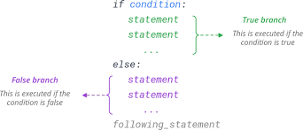
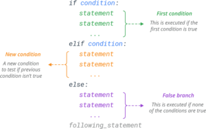

# 05: Shartli operator (if/elif/else)
 

**Reja:**

<!-- TOC -->
* []()
    * [2.1 Agar(if) ifodasi](#21-agar--if--ifodasi)
    * [2.2 Joy tashlash (Indentation)](#22-joy-tashlash--indentation-)
    * [2.3 Aks holda (else) ifodasi](#23-aks-holda--else--ifodasi)
    * [2.4 Aks holda agar (elif) ifodasi](#24-aks-holda-agar--elif--ifodasi)
    * [2.5 if .. elif .. else](#25-if--elif--else)
    * [2.6 if .. elif .. elif .. elif](#26-if--elif--elif--elif)
    * [2.7 Shartli operatorning qisqacha yozilishi](#27-shartli-operatorning-qisqacha-yozilishi)
      * [if](#if)
      * [if .. else](#if--else)
      * [if .. elif .. else](#if--elif--else)
    * [2.8 Shartlarni bir paytda (And) va ketma-ket bajarilishi (Or)](#28-shartlarni-bir-paytda--and--va-ketma-ket-bajarilishi--or-)
      * [And](#and)
      * [Or](#or)
    * [2.9 Tarmoqli if](#29-tarmoqli-if)
    * [2.10 pass](#210-pass)
<!-- TOC -->


Aslida if operatorining yozilishi bu bilan cheklanmaydi, lekin boshlanishiga shuni o'zi yetarli deb o'ylaymiz

### 2.1 Agar(if) ifodasi 

1. a = 300 va b = 200. Agar a soni b sonidan katta bo'lsa, ekranga "a soni b sonidan katta" yozuvi chiqsin

Kod:

```python
a = 300 
b = 200
if a > b:
    print("a soni b sonidan katta")
```

Natija:

```text
a soni b sonidan katta
```
### 2.2 Joy tashlash (Indentation)
Ahamiyat bering joy tashlash muhim:

Xato kod:

```python
a = 300 
b = 200
if a > b:
print("a soni b sonidan katta")
print('Dastur tugadi')
```

Bu **XATO**. Chunki if blokidan so'ng komandalar surilish kerak.

To'g'ri kod:

```python
a = 300 
b = 200
if a > b:
    print("a soni b sonidan katta")
print('Dastur tugadi')
```

### 2.3 Aks holda (else) ifodasi


2. a = 100 va b = 200. Agar a soni b sonidan katta bo'lsa, ekranga "a soni b sonidan katta" yozuvi chiqsin. Agar a soni b soniga teng bo'lsa "a soni b soniga teng" yozuvi chiqsin, aks holda "a soni b sonidan kichik" yozuvi chiqsin

Kod:

```python
a = 100 
b = 100
if a > b:
    print("a soni b sonidan katta")
elif a == b:
    print("a soni b soniga teng")
else:
    print("a soni b sonidan kichik")
```

Natija:

```text
a soni b sonidan kichik
```

### 2.4 Aks holda agar (elif) ifodasi


3. a = 100 va b = 100. Agar a soni b sonidan katta bo'lsa, ekranga "a soni b sonidan katta" yozuvi chiqsin. Agar a soni b soniga teng bo'lsa "a soni b soniga teng" yozuvi chiqsin

Kod:

```python
a = 100 
b = 100
if a > b:
    print("a soni b sonidan katta")
elif a == b:
    print("a soni b soniga teng")
```
Natija:

```text
a soni b soniga teng
```
### 2.5 if .. elif .. else



4. Svetofor dasturini yasaymiz. Bizda svetofor o'zgaruvchisi bor. Uning qiymatlari *qizil*, *yashil* va *sariq* bo'lishi mumkin. Agar yashil bo'lsa, ekranga 'Yuring!' yozuvi chiqsin, aks holda agar *sariq* bo'lsa, 'Tayyorlaning!' habari chiqsin, aks holda 'To'xtang!' yozuvi chiqsin

Kod:

```python
svetofor = input('Svetofor rangini kiriting (yashil, sariq, qizil): ')
if svetofor == 'yashil':
    print('Yuring!')
elif svetofor == 'sariq':
    print('Tayyorlaning!')
else:
    print("To'xtang! Qizil yondi yoki svetofor ishlamayapti :)")
```

Natija:

```text
Svetofor rangini kiriting (yashil, sariq, qizil): sariq
Tayyorlaning!
```

```text
Svetofor rangini kiriting (yashil, sariq, qizil): yashil
Yuring!
```

```text
Svetofor rangini kiriting (yashil, sariq, qizil): abc
To'xtang!
```

### 2.6 if .. elif .. elif .. elif

5. Hafta kunlari raqamiga qarab, kun nomlarini chiqaring

```python
kun = int(input("Hafta kunini raqam bilan kiriting: "))
if kun == 1:
    print('Dushanba')
elif kun == 2:
    print('Seshanba')
elif kun == 3:
    print('Chorshanba')
elif kun == 4:
    print('Payshanba')
elif kun == 5:
    print('Juma')
elif kun == 6:
    print('Shanba')
elif kun == 7:
    print('Yakshanba')
else:
    print('Bunday kun mavjud emas')
```

Natija:

```text
Hafta kunini raqam bilan kiriting: 5
Juma
```

```text
Hafta kunini raqam bilan kiriting: 12
Bunday kun mavjud emas
```
### 2.7 Shartli operatorning qisqacha yozilishi
#### if 

Kod:

```python
a = 100 
b = 100
if a > b:
    print("a soni b sonidan katta")
```

Yuqoridagi kodni quyidagicha yozsak ham bo'ladi

```python
a = 100 
b = 100
if a > b: print("a soni b sonidan katta")
```

#### if .. else
4. a soni b sonidan katta bo'lsa, "a soni b sonidan katta" habari , agar teng bo'lsa "a soni b soniga teng" habari chiqsin

Kod:

```python
a = 100 
b = 100
if a == b:
    print("a soni b soniga teng")
else:
    print("a soni b soniga teng emas")
```

Yuqoridagi kodni quyidagicha yozsak ham bo'ladi

```python
a = 100 
b = 100
print("a soni b soniga teng") if a == b else print("a soni b soniga teng emas")
```

#### if .. elif .. else

5. Agar son manfiy bo'lsa, "manfiy", musbat bo'lsa "musbat", aks holda "0" habari chiqsin

Kod:

```python
a = 100 
print("manfiy") if a < 0 else print("musbat") if a > 0 else print("0")   
```

Natija:

```text
musbat
```

### 2.8 Shartlarni bir paytda (And) va ketma-ket bajarilishi (Or)
#### And
And - bir paytda najarilishi kerakligini bildiradi.
<br>
Agar ikkala shart True bo'lsagina, natija True bo'ladi va if bloki ishga tushadi, aks holda else bloki yoki elif blokiga o'tadi 
6. Agar son musbat va juft bo'lsa, "musbat va juft" degan habar chiqsin, aks holda "musbat va juft emas" degan habar chiqsin

Kod:

```python
a = 10
if a > 0 and a % 2 == 0:
    print("musbat va juft")
else:
    print("musbat va juft emas")
```

Natija:

```text
musbat va juft
```
7. Foydalanuvchi sonni kiritsin, agar son 0 dan katta va 10 dan kichik bo'lsa "son 0 va 10  oralig'ida" degan habar chiqsin, aks holda "Xato" habari chiqsin

Kod:
```python
son = int(input("Son (0,10) oralig'ida son kiriting"))
if son > 0 and son < 10:
    print("son 0 va 10  oralig'ida")
else:
    print("Xato")
```
Yoki
```python
son = int(input("Son (0,10) oralig'ida son kiriting: "))
if 0 < son < 10:
    print("son 0 va 10  oralig'ida")
else:
    print("Xato")
```

Natija:

```text
Son (0,10) oralig'ida son kiriting: 13
Xato
```

```text
Son (0,10) oralig'ida son kiriting: 4
son 0 va 10  oralig'ida
```
#### Or
Ikkala shartlardan kamida bittasi bajarilsa, if bloki aks holda, else bloki ishga tushadi


8. Agar son1 juft bo'lsa, yoki son2 juft bo'lsa, "Sonlardan biri juft" habari chiqsin


```python
son1 = int(input("1-son:"))
son2 = int(input("2-son:"))
if son1 % 2 == 0 or son2 % 2 == 0:
    print("Sonlardan biri juft")
```
```text
1-son: 12
2-son: 13
Sonlardan biri juft
```
```text
1-son: 17
2-son: 13
```
### 2.9 Tarmoqli if
9. Avval sonni musbatlikka tekshiring. Agar son musbat bo'lsa, u holda tekshiring, agar son 50 dan kichik bo'lsa, "50 dan kichik", aks holda "50 dan katta" habari chiqsin
```python
son = int(input("Son kiriting: "))
if son > 0:
    if son > 50:
        print("50 dan katta") 
    else:
        print("50 dan kichik")
```
```text
Son kiriting: -10
```
```text
Son kiriting: 10
50 dan kichik
```
```text
Son kiriting: 60
50 dan katta
```
### 2.10 pass
pass so'zi hech narsani bildirmaydi, lekin xatolikni oldini oladi
```python
a = 10
if a > 0:
   
```
Bu XATO. Quyidagi kod esa to'g'ri
```python
a = 10
if a > 0:
   pass
```

