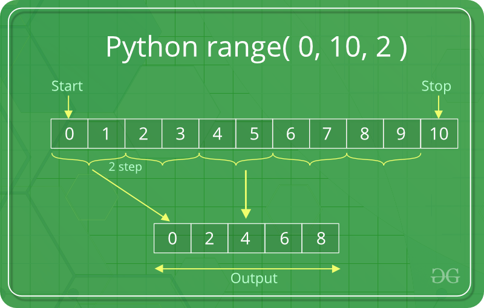
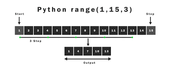

# 07. for tsikli


<!-- TOC -->
* [07. for tsikli](#07-for-tsikli)
    * [1 for sikli](#1-for-sikli)
    * [2 break ifodasi](#2-break-ifodasi)
    * [3 continue ifodasi](#3-continue-ifodasi)
    * [4 range() funksiyasi](#4-range---funksiyasi)
    * [5 for operatorining else bloki](#5-for-operatorining-else-bloki)
    * [6 Ichma-ich (tarmoqli) for](#6-ichma-ich--tarmoqli--for)
    * [7 pass ifodasi](#7-pass-ifodasi)
<!-- TOC -->

### 1 for sikli
Python dasturlash tilida ikkita tsikl bor:
- for
- while

<br>
Tsikl bu takrorlanishlardir. For ifodasi ketma-ketlikka (tuple, list, set, dict, str, va hak) takroriy murojaat qilib har bir elementini o'qish uchun ishlatiladi
<br><br>

1. To'g'ridan to'g'ri massivni berish:
```python
sonlar = [1,2,3]
for son in sonlar:
    print(son)
```
2. Index bilan murojaat qilish:
```python
sonlar = [1,2,3]
for index in range(len(sonlar)):
    print(sonlar[index])
```

3. Foydalanuvchi kiritgan satrni hamma belgilarini alohida qatorda chiqaring:
```python
satr = input("Biron yozuv kiriting: ")
for belgi in satr:
    print(belgi)
```
```text
Biron yozuv kiriting: python
p
y
t
h
o
n
```
### 2 break ifodasi
4. sonlar = [1,3,5,7,9,11,13,15] ro'yxati berilgan. Shulardan 11 gacha hammasini ekranga chiqaring:
```python
sonlar = [1,3,5,7,9,11,13,15]
for son in sonlar:
    if son == 11:        
        break
    print(son)
```
```text
1
3
5
7
9
```
*break* kalitidan keyin keluvchi for blokida joylashgan kodlar ishga tushmaydi   
5. Foydalnuvchi ',' bilan sonlar kiritsin. Toki toq son uchramaguncha sonlarni ekranga chiqarsin.
```python
sonlar = input("',' bilan sonlar kiriting: ").split(",")
for son in sonlar:
    if int(son.strip()) % 2 == 1:
        break
    print(son)
print("Dastur tugadi")
```
```text
',' bilan sonlar kiriting: 2,4,6,3,4,5
2
4
6
Dastur tugadi
```
### 3 continue ifodasi
6. bozorlik = ['olma', 'nok', 'banan', 'qulupnay', 'bodring'] berilgan. Qulupnaydan tashqari hammasini ekranga chiqarsin
```python
bozorlik = ['olma', 'nok', 'banan', 'qulupnay', 'bodring']
for mahsulot in bozorlik:
    if mahsulot == 'qulupnay':
        continue
    print(mahsulot)
```
```text
olma
nok
banan
bodring
```
### 4 range() funksiyasi

<br>

7. 1 dan 10 gacha sonlarni hosil qiling
```python
for i in range(1,11):
    print(i)
```
```text
1
2
3
4
5
6
7
8
9
10
```
8. 9,8,7,6,5,4,3,2,1 sonlarini hosil qiling
```python
for i in range(9,0,-1):
    print(i)
```
```text
9
8
7
6
5
4
3
2
1
```
9. 15,25,35,45,55 sonlarini hosil qiling
```python
for i in range(15, 56, 10):
    print(i)
```
```text
15
25
35
45
55
```
10. 15,25,35,45,55, … ohiri sonlarini hosil qiling. *ohiri* sonini foydalanuvchi kiritsin
```python
ohiri = int(input("Ohirgi chegarani kiriting: "))
for i in range(15, ohiri + 1, 10):
    print(i)
```
```text
Ohirgi chegarani kiriting: 95
15
25
35
45
55
65
75
85
95
```
11. 1 dan 10 gacha sonlarni yig’indisini ekranga chiqaring
```python
summa = 0
for i in range(0, 10):
   summa = summa + i
print(f"Sonlar yig'indisi: {summa}")
```
```text
Sonlar yig'indisi: 55
```
### 5 for operatorining else bloki
for tsiklida ishlatiluvchi *else* kalit so'zi, hamma elementlarni o'qib chiqqandagina ishga tushadi
<br>
12. [1,2,3,4,5,6] sonlardan hammasini ekranga chiqarib, ohirida "Hamma elementlar ekranga chiqarildi" habari chiqsin
```python
sonlar = [1,2,3,4,5,6]
for son in sonlar:
    print(son)
else:
    print("Hamma elementlar ekranga chiqarildi")
```
```text
1
2
3
4
5
6
Hamma elementlar ekranga chiqarildi
```
13. Agar hamma elementlar chiqmasa else bloki ichga tushmaydi:

```python
sonlar = [1,2,3,4,5,6]
for son in sonlar:
    print(son)
    if son == 4:
        break
else:
    print("Hamma elementlar ekranga chiqarildi")
```
```text
1
2
3
4
```

14. Tsikl umuman takrorlanmasa ham else bloki ishga tushadi:
```python
sonlar = []
for son in sonlar:
    print(son)
else:
    if len(sonlar) == 0:
        print("Ro'yxatda hech qanday element mavjud emas")
    else:
        print("Hamma elementlar ekranga chiqarildi")
```
```text
Ro'yxatda hech qanday element mavjud emas
```
### 6 Ichma-ich (tarmoqli) for
15. Bizda ranglar = ['oq', 'qizil', 'qora'] va ulovlar = ['nexia', 'spark', 'captiva'] rang va ulovlar berilgan. Hamma ulovlarni hamma rangda ekranga chiqaring:
```python
ranglar = ['oq', 'qizil', 'qora']
ulovlar = ['nexia', 'spark', 'captiva']
for rang in ranglar:
    for ulov in ulovlar:
        print(rang, ulov)
```
```text
oq nexia
oq spark
oq captiva
qizil nexia
qizil spark
qizil captiva
qora nexia
qora spark
qora captiva
```
16. Bozorda bozor_mahsulotlari = ['olma', 'nok', 'bodring', 'sabzi'] bor. Sizda ro'yxat bor. Ro'yxatda royxat = ['olma', 'nok', 'banan'] bor. Bozorda sizning ro'yxatingizda bor bo'lgan mahsulotlarni ekranga chiqaring:
```python
bozor_mahsulotlari = ['olma', 'nok', 'bodring', 'sabzi']
royxat = ['olma', 'nok', 'banan']
for bmahsulot in bozor_mahsulotlari:
    for mahsulot in royxat:
        if bmahsulot == mahsulot:
            print(f"{mahsulot} bor")
```
yoki
```python
bozor_mahsulotlari = ['olma', 'nok', 'bodring', 'sabzi']
royxat = ['olma', 'nok', 'banan']
for bmahsulot in bozor_mahsulotlari:    
    if bmahsulot in royxat:
        print(f"{bmahsulot} bor")
```
### 7 pass ifodasi
for bloki if bloki kabi bo'sh bo'la olmaydi. Lekin ba'zi sabablarga ko'ra for blokini kechroq yozmoqchi bo'lsangiz, u holda pass kalitini ishlatish kerak
```python
bozor_mahsulotlari = ['olma', 'nok', 'bodring', 'sabzi']
royxat = ['olma', 'nok', 'banan']
for mahsulot in bozor_mahsulotlari:    
    pass
```
17. 2,4,6,8,10 sonlarini ko’paytmasini va yig’indisini ekranga chiqaring
```text
Sonlar yig'indisi: 30
Sonlar ko'paytmasi: 3840
```
```python
summa = 0
kopaytma = 1
for i in range(2, 11, 2):
   summa = summa + i
   kopaytma = kopaytma * i
print(f"Sonlar yig'indisi: {summa}")
print(f"Sonlar ko'paytmasi: {kopaytma}")
```
18. Quyidagi ro’yxatlar berilgan
- sonlar = [2,3,4,5,6,5,7,3]
- qidir_sonlar = [2, 5]
- qidir_sonlar_summa = [0, 0]
<br>
Bu yerda qidir_sonlar necha marta takrorlanishini hisoblash kerak bo’lgan sonlar va qidir_sonlar_summa takrorlanadigan sonlar sonidan iborat. Endi siz 2 va 5 soni sonlar ro’yxatida  necha marta takrorlanishini hisoblaydigan dastur tuzing

```python
sonlar = [2,3,4,5,6,5,7,3]
qidir_sonlar = [2, 5]
qidir_sonlar_summa = [0, 0]
for son in sonlar:
   for i in range(len(qidir_sonlar)):
       if qidir_sonlar[i] == son:
           qidir_sonlar_summa[i] += 1
for i in range(len(qidir_sonlar)):
   print(f"{qidir_sonlar[i]} soni {qidir_sonlar_summa[i]} marta takrorlangan")
```

