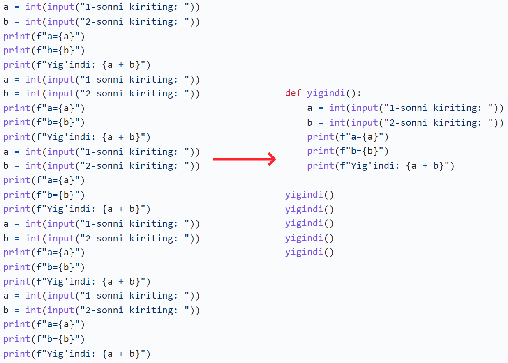
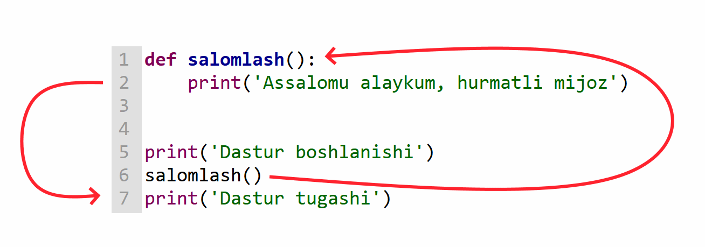
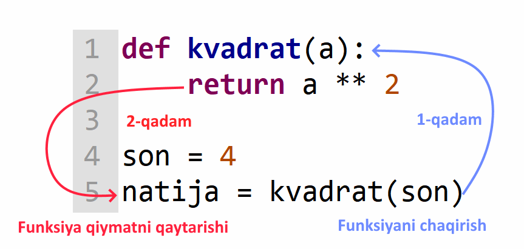
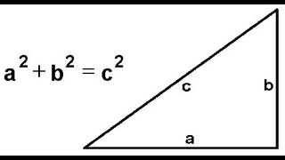
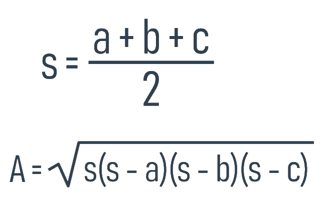
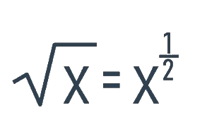
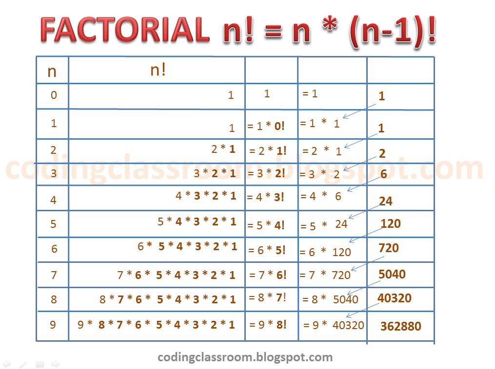

# Mavzu 10: Funksiyalar
 
<!-- TOC -->
* [1 Funksiya haqida](#1-funksiya-haqida)
  * [1.1 Funksiya bizga nega kerak?](#11-funksiya-bizga-nega-kerak)
  * [1.2 Funksiyalar qayerdan olinadi?](#12-funksiyalar-qayerdan-olinadi)
  * [1.3 Funksiya yozilishi](#13-funksiya-yozilishi)
  * [1.4 Funksiyalar qanday ishlaydi?](#14-funksiyalar-qanday-ishlaydi)
  * [1.5 XULOSA](#15-xulosa)
  * [1.6 TEST](#16-test)
* [2 Funksiyaning muhiti](#2-funksiyaning-muhiti)
  * [2.1 Parametr va argument tushunchasi](#21-parametr-va-argument-tushunchasi)
  * [2.2 Argumentlarni tartibli uzatish](#22-argumentlarni-tartibli-uzatish)
  * [2.3 Argumentlarni kalitli uzatish](#23-argumentlarni-kalitli-uzatish)
  * [2.4 Argumentlarni aralash uzatish](#24-argumentlarni-aralash-uzatish)
  * [2.5 Standart parametrlar](#25-standart-parametrlar)
  * [2.6 XULOSA](#26-xulosa)
  * [2.7 TEST](#27-test)
  * [2.8 AMALIYOT](#28-amaliyot)
* [3 Qiymat qaytaruvchi funksiya](#3-qiymat-qaytaruvchi-funksiya)
  * [3.1 return haqida](#31-return-haqida)
  * [3.2 None haqida](#32-none-haqida)
  * [3.3 O'zgartirish va qaytarish: ro'yxat va funksiya](#33-ozgartirish-va-qaytarish--royxat-va-funksiya)
  * [3.4 AMALIYOT](#34-amaliyot)
  * [3.5 XULOSA](#35-xulosa)
  * [3.6 TEST](#36-test)
* [4 Qamrov. Lokal va global o'zgaruvchilar](#4-qamrov-lokal-va-global-ozgaruvchilar)
  * [4.1 Funksiya va qamrov](#41-funksiya-va-qamrov)
  * [4.2 global kalit so'zi](#42-global-kalit-sozi)
  * [4.3 Funksiyaning argument bilan aloqasi](#43-funksiyaning-argument-bilan-aloqasi)
  * [4.4 XULOSA](#44-xulosa)
  * [4.5 TEST](#45-test)
* [5 Rekursiya](#5-rekursiya)
  * [5.1 Uchburchakka oid masala](#51-uchburchakka-oid-masala)
      * [1-masala. Uchburchak bo'lishi mumkinligi tekshirish](#1-masala-uchburchak-bolishi-mumkinligi-tekshirish)
      * [2-masala. Uchburchak to'g'ri burchakli uchburchak ekanligini aniqlash](#2-masala-uchburchak-tog--ri-burchakli-uchburchak-ekanligini-aniqlash)
      * [3-masala. Uchburchak yuzini aniqlash](#3-masala-uchburchak-yuzini-aniqlash)
  * [5.2 Faktorial masalasi](#52-faktorial-masalasi)
  * [5.3 Fibonachchi raqamlari](#53-fibonachchi-raqamlari)
  * [5.4 Rekursiya](#54-rekursiya)
  * [5.5 XULOSA](#55-xulosa)
  * [5.6 TEST](#56-test)
* [6 Cheksiz argumentlar](#6-cheksiz-argumentlar)
  * [6.1 *args - cheksiz tartibli argumentlar](#61--args---cheksiz-tartibli-argumentlar)
  * [6.2 **kwargs - cheksiz kalitli argumentlar](#62---kwargs---cheksiz-kalitli-argumentlar)
  * [6.3 Qo'shimcha misollar](#63-qoshimcha-misollar)
* [7 Yakuniy ish](#7-yakuniy-ish)
<!-- TOC -->


**Terminlar**
```
function - ma'lum vazifani bajaruvchi kodlar bloki
pass - Funksiya nomi bor, lekin blokida hech qanday kod bo'lmaganda yoziladigan kalit so'z
return True - True qiymatini qaytarish  
parameter - def chop_etish(soz, soni). Bu yerda *soz* va *soni* parametrlar
argument - chop_etish("12-dars", 1). Bu yerda *12-dars* va *1* argumentlardir 
```

# 1 Funksiya haqida
## 1.1 Funksiya bizga nega kerak?
- 1-holat. Qachonki kodlaringizni ba'zilari bir nechta joyda qaytarilsa, u holda qaytariladigan kodlarni funksiya qilib alohida yozib, keyin kerakli joyda funksiyani chaqirgan ma'qul. Shunda kod bir joydan o'zgartiriladi - boshqarish oson bo'ladi



- 2-holat. Qachonki kodlaringiz juda ham kattalashib, uni hatto tushunish va o'qish qiyinlashib ketsa, ularni sodda masalalarga bo'lib funksiya shaklida yozgan ma'qul. Shunda kod tushunarli bo'ladi. Bu jarayon **dekompozitsiya** deyiladi


## 1.2 Funksiyalar qayerdan olinadi?
- To'g'ridan to'g'ri chaqiriladi - ular **oldindan o'rnatildan** funksiyalar deyiladi. Ular Python bilan birga keladi: print(), len(), input()

```python
print("print funksiyasi")
```

- Modullardan chaqiriladi. Modullar **oldindan o'rnatilgan** (math, datetime, os va hak) yoki o'rnatish kerak bo'ladi (requests, django, pillow va hak). Har ikkala holatda ham modul import qilingach, funksiyalarni chaqirish mumkin bo'ladi: 
```python
import math

son = int(input('Son kiriting: '))
ildiz = math.sqrt(son)
print(f"{son} sonining ildizi: {ildiz}")
```

- Biz o'zimiz yozgan funksiyalarni chaqirishimiz mumkin - bular **foydalanuvchi yozgan** funksiyalar deyiladi

```python
def kvadratga_oshir(a):
    return a ** 2

son = 9
kvadrati = kvadratga_oshir(son)
print(f"{son} sonining kvadrati: {kvadrati}")
```

- Lyambda funksiyalar mavjud bo'lsa, ularni chaqirish mumkin

```python
# songa 10 ni qo'shib beradi
x = lambda a : a + 10
print(x(5)) # ekranga 15 chiqadi
```

- Obyekt orqali metodlarni (ya'ni obyekt funksiyalarini) chaqirish mumkin

```python
satr = 'Men mohir dasturhciman'
print(satr.split(' '))
```

## 1.3 Funksiya yozilishi
```text
def funksiya_nomi(parametrlar): # parametrlar bo'lmasligi mumkin
    funksiya tanasi
    return # return bo'lmasligi mumkin
```
<br>

## 1.4 Funksiyalar qanday ishlaydi?



**Eslatma**
- Funksiya aniqlangandan keyin, uni chaqirish mumkin
- Funksiya nomini o'zgaruvchi sifatida ishlatish, keyin usha funksiyani Python tarafidan unutilishiga olib keladi

**Funksiyani aniqlanishidan avval chaqirish**
```python

print('Dastur boshlanishi')
salomlash()
print('Dastur tugashi')

def salomlash():
    print('Assalomu alaykum, hurmatli mijoz.')
```

Natija xato bo'ladi:

```text
NameError: name 'salomlash' is not defined
```

**Funksiya nomidan o'zgaruvchi sifatida foydalanish**

```python
def salomlash():
    print('Assalomu alaykum, hurmatli mijoz.')

salomlash = 1
print('Dastur boshlanishi')
salomlash()
print('Dastur tugashi')
```

Natija xato bo'ladi:
```text
TypeError: 'int' object is not callable
```

Funksiya kodning ixtiyoriy joyida aniqlash mumkin

```python
print('Dastur boshlanishi')

def salomlash():
    print('Assalomu alaykum, hurmatli mijoz.')


salomlash()
print('Dastur tugashi')
```

**Misollar**

1.Salom beruvchi dastur:

Funksiyasiz

```python
print("Assalomu alaykum")
print("Sahifamizga hush kelibsiz")
```
Funksiya bilan

```python
def salomlash():
    print("Assalomu alaykum")
    print("Sahifamizga hush kelibsiz")

salomlash()
```

Natija:

```text
Assalomu alaykum
Sahifamizga hush kelibsiz
```

2. 2,4,6,8,10 sonlarini hosil qilib, ekranga chiqarish:

Funksiyasiz

```python
for i in range(2, 11, 2):
    print(i)
```
Funksiya bilan

```python
def juft_sonlar():
    for i in range(2, 11, 2):
        print(i)

juft_sonlar()
```

Natija:

```text
2
4
6
8
10
```

3. 1,3,5,7,9 sonlarini yig’indisini ekranga chiqarish

Funksiyasiz

```python
yigindi = 0
for i in range(1, 10, 2):
    yigindi += i

print(f"Sonlar yig'indisi: {yigindi}")
```
Funksiya bilan

```python
def toq_sonlar_yigindisi():
    yigindi = 0
    for i in range(1, 10, 2):
        yigindi += i
    
    print(f"Sonlar yig'indisi: {yigindi}")

toq_sonlar_yigindisi()
```

Natija:

```text
Sonlar yig'indisi: 25
```

## 1.5 XULOSA
1. Funksiya chaqirilganda ma'lum bir vazifani bajaradigan kod blokidir. Ma'lum koddan qayta foydalanish, tushunarli yozish uchun funksiyalardan foydalanishingiz mumkin. Funktsiyalar parametrlarga va qaytariladigan qiymatlarga ega bo'lishi mumkin.
2. Funksiyaning kamida 4 turi mavjud:
- **oldindan o'rnatildan funksiyalar**: Ular Python bilan birga keladi: print(), len()
- **oldindan o'rnatilgan modullar**dan olinadigan funksiyalar: math, datetime
- **foydalanuvchi yozgan funksiyalar**: siz yozgan funksiya
- **lyabmda funksiya** - bir ifodali funksiya 
- **metodlar** - obyektga biriktirilgan funksiya desa ham bo'ladi: str.len(), str.upper()
3. Quyidagi sintaksis bo'yicha o'z funksiyangizni yozishingiz mumkin

```text
def funksiya_nomi(ixtiyoriy sondagi parametrlar):
    # funksiya tanasi
```

*Argument olmaydigan funksiya*, ya'ni parametrsiz funksiya yozish mumkin ekan
```python
def habar(): # funksiyani aniqlash
    print("Assalomu alaykum") # funksiya tanasi
 
habar() # funksiyani chaqirish
```

_Argument oladigan funksiya_, ya'ni parametrsiz funksiya yozish mumkin ekan

```python
def habar(ism): # funksiyani aniqlash
    print("Assalomu alaykum", ism) # funksiya tanasi
 
ism = input("Ismingizni yozing: ")
habar(ism) # funksiyani chaqirish
```
## 1.6 TEST
1-savol. input() funksiyaning qaysi turiga kiradi

2-savol. Quyidagi kodni ishga tushirsa nima bo'ladi?
```python
salom_ber()
 
def salom_ber():
    print("Assalomu alaykum!")
```

3-savol. Quyidagi kodni ishga tushirsa nima bo'ladi?
```python
def salom_ber():
    print("Assalomu alaykum!")

salom_ber('Otabek')
``` 
# 2 Funksiyaning muhiti
## 2.1 Parametr va argument tushunchasi

Funksiyaning ahamiyati qachonki u ma'lumot qabul qilganda namayon bo'ladi. Funksiya qabul qilgan ma'lumotga qarab uning natijasi har hil bo'ladi. Bu holatda funksiya parametrlashgan deyiladi. Parametrlashgan funksiyada ikkita terminni yaxshilab tushunib olishimiz kerak:
- **parametr** - funksiya ichidagina mavjud bo'lgan o'zgaruvchidir. Faqat funksiya ichida ishlatiladi, boshqa hech qayerda uni ishlatib bo'lmaydi
- **argument** - funksiya parametriga qiymat uzatish uchun ishlatiladi. Ya'ni u funksiyani chaqirgan paytdagina ishlatiladi.

**_Unutmang:_**
Parametr funksiya ichida, argument tashqarisida bo'ladi

```python
def salomlash(ism):
    pass
```
Bu yerda _ism_ - parametr

Keling funksiyani kengaytiramiz

```python
def salomlash(ism):
    print(f"Assalomu alaykum {ism.title()}")
    print("Sahifamizga hush kelibsiz")
```

Yuqorida parametrni funksiya ichida qo'lladik. Lekin unga hali qiymat bermadik.

Mana endi qiymat berishni ko'ramiz, uning uchun funksiyani chaqiramiz
_Unutmang:_
Funksiyada nechta parametr bo'lsa, ushancha argument bo'lishi talab qilinadi, aks holda xato bo'ladi

```python
def salomlash(ism):
    print(f"Assalomu alaykum {ism.title()}")
    print("Sahifamizga hush kelibsiz")

salomlash('Anvar')
```

Natija:
```text
Assalomu alaykum Anvar
Sahifamizga hush kelibsiz
```

Bu yerda 'Anvar' argument

Agar argument bermasdan funksiyani chaqirsak xato bo'ladi:
```python
def salomlash(ism):
    print(f"Assalomu alaykum {ism.title()}")
    print("Sahifamizga hush kelibsiz")

salomlash()
```

Natija:
```text
TypeError: salomlash() missing 1 required positional argument: 'ism'
```

missing 1 required positional argument - bitta tartibli argument talab qilinadi deyilyapti. Tartibli nimaligini keyinroq ko'ramiz

Funksiyadan tashqarida Funksiya parametr nomi bilan bir hil bo'lgan o'zgaruvchi ishlatish mumkin va u funksiyaga ta'sir qilmaydi

```python
def salomlash(ism):
    print(f"Assalomu alaykum {ism.title()}")
    print("Sahifamizga hush kelibsiz")

ism = 'Otabek'
salomlash('Anvar')
print(ism)
```

Natija:

```text
Assalomu alaykum Anvar
Sahifamizga hush kelibsiz
Otabek
```

Bu yerda funksiya parametri bo'lgan ism va tashqaridagi ism umuman boshqa boshqa o'zgaruvchilardir, garchi nomlari bir bo'lsa ham.

Funksiyada ko'p parametrlar bo'lishi mumkin. Uni cheki yo'q. Lekin ko'paygani sari ularning ro'li va maqsadlarini eslab qolish qiyinlashadi

Keling ikki parametrli funksiyani ko'ramiz

```python
def salomlash(ism, sharif):
    print(f"Assalomu alaykum {sharif.title()} {ism.title()}")
    print("Sahifamizga hush kelibsiz")
```

Bu yerda _ism_ va _sharif_ funksiya parametrlaridir

Endi funksiyani chaqiramiz:

```python
def salomlash(ism, sharif):
    print(f"Assalomu alaykum {sharif.title()} {ism.title()}")
    print("Sahifamizga hush kelibsiz")

salomlash('Anvar', 'Jasurov')
salomlash('Bekzod', 'Otabekov')
salomlash('Ulug\'bek', 'Sardorov')
```

Natija:

```text
Assalomu alaykum Jasurov Anvar
Sahifamizga hush kelibsiz
Assalomu alaykum Otabekov Bekzod
Sahifamizga hush kelibsiz
Assalomu alaykum Sardorov Ulug'Bek
Sahifamizga hush kelibsiz
```

## 2.2 Argumentlarni tartibli uzatish

Funksiyani chaqirganda birinchi argument birinchi parametrga tushadi, ikkinchi argument ikkinchi parametrga tushadi, ya'ni n-tartibdagi argument n-tartibdagi parametrga tushadi.
Mana shu jarayon argumentlarni tartibli uzatish deyiladi

```python
def funksiya(a, b, c):
    print(a, b, c)
 
funksiya(1, 2, 3)
```

Bu yerda 1 -> a, 2 -> b, 3 -> c uzatiladi

Har doim ham argumentlarni tartibli uzatish qulay bo'lavermaydi. Keling bir holarni ko'ramiz:

```python
def tanishuv(ism, sharif):
    print(f"Assalomu alaykum. Mening ismim {ism} {sharif}")
 
tanishuv('Anvar', 'Jasurov')
tanishuv('Bekzod', 'Otabekov')
tanishuv('Ulug\'bek', 'Sardorov')
```

Natija:

```text
Assalomu alaykum. Mening ismim Anvar Jasurov
Assalomu alaykum. Mening ismim Bekzod Otabekov
Assalomu alaykum. Mening ismim Ulug'bek Sardorov
```

Faraz qiling bu funksiya boshqa davlatlarda qo'llanilsa. Ya'ni o'zini tanishtirganda avval sharifi keyin ismi kelsa natija qanday bo'ladi

```python
def tanishuv(ism, sharif):
    print(f"Assalomu alaykum. Mening ismim {ism} {sharif}")
 
tanishuv("Bartók", "Béla")
tanishuv("Kertész", "Imre")
```

Natija:

```text
Assalomu alaykum. Mening ismim Bartók Béla
Assalomu alaykum. Mening ismim Kertész Imre
```

Ko'rdingizmi? Natija biz kutgandek emas.
Muammo shundaki ba'zi davlatda avval ism, keyin sharif kelsa, bazi davlatda teskari. Ho'sh qanday qilib funksiyani davlatga bog'liq bo'lmagan holda yozsa bo'ladi?

**Misollar**

1. Sonni kvadratga oshiruvchi dastur yozing:

```python
def kvadrat(a):
    print(f"{a} * {a} = {a**2}")

kvadrat(3)
```
```text
3 * 3 = 9
```

2. Ism va familiyasini aytib salom beradigan dastur yozing:
```python
def salom_ber(ism, familiyasi):
    print(f"Assalomu alaykum, hurmatli {ism} {familiyasi}")
salom_ber("Anvar", "Jasurov")
```

Natija:

```text
Assalomu alaykum, hurmatli Anvar Jasurov
```

3. Huddi shu masala faqat ism va familiyani foydalanuvchi kiritsin:
```python
def salom_ber(ism, familiyasi):
    print(f"Assalomu alaykum, hurmatli {ism} {familiyasi}")

salom_ber(input("Isminigz: "), input("Familiyangiz: "))
```
Natija:

```text
Isminigz: Otabek
Familiyangiz: Nuriddinov
Assalomu alaykum, hurmatli Otabek Nuriddinov
```

## 2.3 Argumentlarni kalitli uzatish
Funksiyani chaqirganda argumentni funksiya parametri bilan birga yozilsa, argumentni kalitli uzatish deyiladi. Bu holda tartibini ahamiyati bo'lmaydi. Qaysi parametrni ko'rsatsa, argumentni usha parametrga tushadi

```python
def tanishuv(ism, sharif):
    print(f"Assalomu alaykum. Mening ismim {ism} {sharif}")
 
tanishuv(sharif="Bartók", ism="Béla")
tanishuv(sharif="Kertész", ism="Imre")
```

Natija:
```text
Assalomu alaykum. Mening ismim Béla Bartók
Assalomu alaykum. Mening ismim Imre Kertész
```

Bu holda argumentlarni tartibli uzatishga hojat qolmaydi. Argument ko'rsatilgan parametrga borib tushadi

_Yodda tuting_
- Funksiyani chaqirganda kalit o'rnida qo'llaniladigan parametrlar funksiyada mavjud bo'lishi kerak.
- Funksiya chaqirilgan paytda hamma parametrlarni ko'rsatgan holda argument uzatish kerak

Quyidagi kod xato:
```python
def tanishuv(ism, sharif):
    print(f"Assalomu alaykum. Mening ismim {ism} {sharif}")
 
tanishuv(sharif="Anvarov", otasining_ismi="Otabek o'g'li")

```

Natija:
```text
TypeError: tanishuv() got an unexpected keyword argument 'otasining_ismi'
```

**Misollar**

1. Uchta sonni yig'indisini ekranga chiqaruvchi dastur yozing:
```python
def yigindi(a, b, c):
    print(f"Yig'indi: {a+b+c}")

yigindi(3,4,5)
```
yoki

```python
def yigindi(a, b, c):
    javob = a + b + c
    print(f"Yig'indi: {javob}")

yigindi(3,4,5)
```

Natija:

```text
Yig'indi: 12
```

2. Son toqligini ekranga chiqaruvchi dastur tuzing:
```python
def toqmi(a):
    if a % 2 == 1:
        print(f"{a} soni toq")
    else:
        print(f"{a} soni juft")

toqmi(19)
toqmi(34)
```

Natija:

```text
19 soni toq
34 soni juft
```

Argument funksiyaga beriladigan qiymatdir. U funksiya nomidan keyin qavs ichida keladi
3. a sonini toq yoki juftligini ekranga chiqaradigan funksiya yozing: 

```python
def toqmi(a):
    if a % 2 == 1:
        print(f"{a} soni toq")
    else:
        print(f"{a} soni juft")

toqmi(19)
toqmi(34)
```
Bu yerda **19** va **34** argumentlardir

## 2.4 Argumentlarni aralash uzatish

Argumentlarni tartibli va kalit qilib aralash qilib uzatish mumkin. Faqat bitta qoida bor. Avval tartib argumentlar, keyin kalitli argumentlar keladi
Keling yig'indini hisoblovchi funksiyani ko'ramiz

```python
def yigindi(a, b, c):
    print(a, "+", b, "+", c, "=", a + b + c)
```

**1-holat.** Argumentni tartibli uzatish 
```python
def yigindi(a, b, c):
    print(a, "+", b, "+", c, "=", a + b + c)
    
yigindi(1, 2, 3)
```

Natija:

```text
1 + 2 + 3 = 6
```

**2-holat.** Argumentni kalit bilan uzatish 
```python
def yigindi(a, b, c):
    print(a, "+", b, "+", c, "=", a + b + c)
    
yigindi(c = 1, a = 2, b = 3)
```

Natija:

```text
2 + 3 + 1 = 6
```

3-holat. Aralash uzatish

```python
def yigindi(a, b, c):
    print(a, "+", b, "+", c, "=", a + b + c)
    
yigindi(3, c = 1, b = 2)
```

Natija:

```text
3 + 2 + 1 = 6
```

_Extiyot bo'ling_
Argumentni 2 marta uzatmang

```python
def yigindi(a, b, c):
    print(a, "+", b, "+", c, "=", a + b + c)
    
yigindi(3, a = 1, b = 2)
```

Natija:

```text
TypeError: yigindi() got multiple values for argument 'a'
```

## 2.5 Standart parametrlar

Standart parametr deganda oldindan berilgan qiymat tushuniladi va u parametrlar ro'yxatining ohirida kelishi kerak
<br><br>
**Masala:** a, b, c sonlarining yig'indisini ekranga chiqaradigan funksiya yozing. c soni berilmasa c = 10 deb hisoblansin : 

```python
def yigindi(a, b, c=10):
    javob = a + b + c
    print(f"Yig'indi: {javob}")

yigindi(b=4,c=5, a=3)
yigindi(b=4,a=5)
```

Natija:

```text
Yig'indi: 12
Yig'indi: 19
```

Bu yerda c=10 standart parametr.

## 2.6 XULOSA

Qoida 1. Funksiyaga parametrlar orqali ma'lumot uzatsa bo'ladi. Funksiya parametrlar soni belgilanmagan

Bir parametrli funksiyaga misol

```python
def salom_ber(ism):
    print("Assalomu alaykum,", ism)
 
salom_ber("Amnvar")
```

Ikki parametrli funksiyaga misol

```python
def salom_ber(ism, sharif):
    print("Assalomu alaykum,", ism, sharif)
    
 
salom_ber("Anvar", "Jasurov")
```

Uch parametrli funksiyaga misol

```python
def manzil(shahar, kocha, pochta_indeksi):
    print("Sizning manzil:", pochta_indeksi, " ", shahar, " sh.,", kocha, "ko'chasi")
 
shahar = input("Shahar nomi: ")
kocha = input("Ko'cha nomi: ")
pochta = input("Pochta indeksi: ")
manzil(shahar, kocha, pochta)
```

Qoida 2. Quyidagi usulda funksiyaga argument berish mumkin
- argumentni tartibli uzatish - tartibi bo'yicha uzatiladi (Misol 1)
- argumentni kalitli uzatish - ko'rsatilgan parametrga uzatiladi (Misol 2)
- aralash holda uzatish - avval tartibli keyin kalitli argument keladi (Misol 3)

```python
# Misol 1
def ayir(a, b):
    print(a - b)
 
ayir(5, 2) # natija: 3
ayir(2, 5) # natija: -3
 
 
# Misol 2
def ayir(a, b):
    print(a - b)
 
ayir(a=5, b=2) # natija: 3
ayir(b=2, a=5) # natija: 3
 
# Misol 3
def ayir(a, b):
    print(a - b)
 
ayir(5, b=2) # natija: 3
ayir(5, 2) # natija: 3
```

Argumentni aralash holda uzatganda taritbli argumentlar kalitli argumentdan keyin kelmasligi kerak
```python
def ayir(a, b):
    print(a - b)
 
ayir(5, b=2) # chiqish: 3
ayir(a=5, 2) # Xato
```

3. Funksiyada standart parametr qo'llash mumkin
```python
def salom_ber(ism, sharif='Anvarov'):
    print("Assalomu alaykum,", ism, sharif)
    
 
salom_ber("Jasur") # natija Assalomu alaykum, Jasur Anvarov
salom_ber("Jasur", "Bekzodov") # natija Assalomu alaykum, Jasur Bekzodov
```

## 2.7 TEST

1. Quyidagi kodni ishga tushirsa, natija nima bo'ladi?

```python
def tanishuv(a="Avarov Bekzod", b="Bekzod"):
     print("Mening ismim", b + ".", a + ".")
 
tanishuv()
```

2. Quyidagi kodni ishga tushirsa, natija nima bo'ladi?

```python
def tanishuv(a="Avarov Bekzod", b="Bekzod"):
     print("Mening ismim", b + ".", a + ".")
 
tanishuv(b='Otabek Ilhomov')
```

3. Quyidagi kodni ishga tushirsa, natija nima bo'ladi?

```python
def tanishuv(a, b="Bekzod"):
     print("Mening ismim", b + ".", a + ".")
 
tanishuv('Otabek')
```

4. Quyidagi kodni ishga tushirsa, natija nima bo'ladi?

```python
def yigindi(a, b=2, c):
    print(a + b + c)
 
yigindi(a=1, c=3)
```

## 2.8 AMALIYOT
Amaliyotni bajarish uchun quyidagi havolaga kiring:
[2 Qiymat qaytarmaydigan funksiya](https://replit.com/@Oybeklinux/2-Funksiyaning-muhiti#main.py)

# 3 Qiymat qaytaruvchi funksiya
## 3.1 return haqida
Shu paytgacha biz natijani ekranga chiqargan edik. Lekin funksiyani ahamiyati qiymat qaytarganda namayon bo'ladi
Qiymatni qaytarish uchun return kalit so'zi ishlatiladi. 
return ikki hil usulda ishlatiladi

**Ifodasiz return**

```python
def oyin(yutdi = True):
    print("Uch...")
    print("Ikki...")
    print("Bir...")
    if not yutdi:
        return
 
    print("Tabrikylaymiz!")

oyin()
```

Natija:

```text
Uch...
Ikki...
Bir...
Tabrikylaymiz!
```

Agar funksiyani argument bilan chaqirsak

```python
def oyin(yutdi = True):
    print("Uch...")
    print("Ikki...")
    print("Bir...")
    if not yutdi:
        return
 
    print("Tabrikylaymiz!")

oyin(False)
```

Natija:

```text
Uch...
Ikki...
Bir...
```

**Ifoda bilan yozilgan return**

Bu holatda return kalit so'zidan keyin ifoda bo'ladi

```python
def funksiya():
    return ifoda
```

_Bu yerda 2 xulosa bor:_
1. return qatori ishga tushgandan keyin, qaytib ketadi
2. return ifodani natijasi qaytaradi

Misol:
```python
def kvadrat(a):
    return a ** 2
 
son = 4
natija = kvadrat(son)
 
print(f"{son}ning kvadrati: {natija}")
```

Yuqorida kvadrat nomli funksiya 16 sonini qaytardi

Endi funksiyani tahlil qilamiz:



4-qatorda son o'zgaruvchisiga 4 yoziladi
5-qatorda funksiya chaqirilyapti. Boshqaruv funksiya aniqlangan joyga o'tadi
1-qatorda funksiya ishga tushadi. Bu yerda a=4
2-qatorda a ning kvadrati hisoblanadi. a ning kvadrati 16 soni 5-qatorga qaytariladi. 16 soni natija o'zgaruvchisiga saqlandi

Natijani saqlamaslik mumkinmi?
Ha mumkin, agar kerak bo'lmasa.

```python
def kvadrat(a):
    return a ** 2
 
son = 4
kvadrat(son)
```

Bu yerda natijani ekranga chiqarib bo'lmaydi, chunki funksiya natijasini saqlab qolmadik

Funksiya har doim kerakli ma'lumotni qaytaradimi?
Yo'q. U holda yana qanday ma'lumot qaytarishi mumkin

## 3.2 None haqida
None - hech narsa degani. U ifodalarda qatnashmaydi. Masalan mana bu ifoda xatolikka olib keladi

```python
print(None + 2)
```

Natija:

```text
TypeError: unsupported operand type(s) for +: 'NoneType' and 'int'
```

None bilan nima qilish mumkin?
1. O'zgaruvchiga salqash 
2. Funksiyadan qaytarish
3. O'zgaruvchi bilan solishtirish

Misol:
```python
qiymat = None
if qiymat is None:
    print("Kechirasiz, qiymat mavjud emas")
```

_Yodda tuting_:

Agar funksiya hech qanday qiymat qaytarmasa, ya'ni return mavjud bo'lmasa yoki ishga tushmasa, unda funksiya yashirin tarzda `None` ni qaytaradi 

Buni tekshirib ko'ramiz

```python
def biron_funksiya(n):
    if n % 2 == 0:
        return True

print(biron_funksiya(2))
print(biron_funksiya(1))
```

Natija:

```text
True
None
```

Agar funksiyadan None qaytsa, u holda funksiya chala yozilgan bo'lishi ham mumkin

## 3.3 O'zgartirish va qaytarish: ro'yxat va funksiya

list ni funksiyaga uzatish mumkinmi?
<br>Ha, mumkin

Misol:

```python
def royxat_yigindisi(royxat):
    yigindi = 0
 
    for son in royxat:
        yigindi += son
 
    return yigindi

print(royxat_yigindisi([5, 4, 3]))
```

Natija:

```text
12
```

_E'tibor bering_

Funksiyani chaqirganda uzatilayotgan parametr ma'lumot turini hisobga oling, aks holda xato bo'lishi mumkin

Misol:

```python
def royxat_yigindisi(royxat):
    yigindi = 0
 
    for son in royxat:
        yigindi += son
 
    return yigindi

print(royxat_yigindisi(3))
```

Natija:

```text
TypeError: 'int' object is not iterable
```

Funksiya list qaytarishi mumkinmi?
<br>Ha mumkin

Misol:

```python
def royxat_hosil_qil(n):
    royxat = []
    
    for i in range(0, n):
        royxat.insert(0, i)
    
    return royxat

print(royxat_hosil_qil(5))
```

Natija:

```text
[4, 3, 2, 1, 0]
```

Xulosa, siz funksiyani qiymat qaytaradigan yoki qaytarmaydigan qilib yozishingiz mumkin

## 3.4 AMALIYOT

Amaliyotni quyidagi havolada bajaring
[3 Qiymat qaytaradigan funksiyalar](https://replit.com/@Oybeklinux/3-Qiymat-qaytaradigan-funksiya#Vazifalar.md)

## 3.5 XULOSA

1. Funksiyadan biror qiymat qaytarish uchun `return` ishlatiladi. 

```python
def kopaytir(a, b):
    return a * b
 
print(kopaytir(3, 4)) # natija: 12
 
 
def yigindi(a, b):
    return
 
print(yigindi(3, 4)) # natija: None
```

2. Funksiya natijasini o'zgaruvchiga saqlash mumkin

```python
def tilaklar():
    return "Muborak bo'lsin!"
 
tilak = tilaklar()
 
print(tilak) # natija: Muborak bo'lsin!
```

Quyida ikki hil natijani ko'rishimiz mumkin

Misol 1
```python
def tilaklar():
    print("Eng yaxshi tilaklarni tilayman")
    return "Muborak bo'lsin"
 
tilaklar() # chiqish: Eng yaxshi tilaklarni tilayman
```

Misol 2
```python
def tilaklar():
    print("Eng yaxshi tilaklarni tilayman")
    return "Muborak bo'lsin"
 
print(tilaklar())
 
# natija: Eng yaxshi tilaklarni tilayman
# Muborak bo'lsin 
```

3. Funksiya argumenti sifatida list ishlatish mumkin

```python
def hammaga_salom_ber(royxat):
    for ism in royxat:
        print("Assalomu alaykum,", ism)
 
hammaga_salom_ber(["Anvar", "Bekzod", "Jasur"])
```

4. list ro'yxat natijasi bo'lishi mumkin

```python
def royxat_tuz(n):
    royxat = []
    for i in range(n):
        royxat.append(i)
    return royxat
 
print(royxat_tuz(5))
```
## 3.6 TEST

1. Kodni ishga tushirsak, ekranga nima chiqadi?

```python
def salom_ber():
    return
    print("Assalomu alaykum!")
 
salom_ber()
```

2. Kodni ishga tushirsak, ekranga nima chiqadi?

```python
def butun_sonmi(data):
    if type(data) == int:
        return True
    elif type(data) == float:
        return False
 
print(butun_sonmi(5))
print(butun_sonmi(5.0))
print(butun_sonmi("5"))
```


3. Kodni ishga tushirsak, ekranga nima chiqadi?

```python
def juft_sonlar_royxati(raqam):
    royxat = []
    for son in range(raqam):
        if son % 2 == 0:
            royxat.append(son)
    return royxat
 
print(juft_sonlar_royxati(11))
```

4. Kodni ishga tushirsak, ekranga nima chiqadi?

```python
def royxatni_yangila(royxat):
    yangilangan_royxat = []
    for elem in royxat:
        elem **= 2
        yangilangan_royxat.append(elem)
    return yangilangan_royxat
 
sonlar = [1, 2, 3, 4, 5]
print(royxatni_yangila(sonlar))
```

# 4 Qamrov. Lokal va global o'zgaruvchilar
## 4.1 Funksiya va qamrov

Ixtiyoriy nomning (o'zgaruvchi, funksiya) `qamrovi`  - ular tan olinadigan (yoki ko'rinadigan) joydir

_Misol_. Masalan funksiya parametrining qamrovi funkiyaning o'zidir. Funksiyadan tashqarida parametrdan foydalanib bo'lmaydi

```python
def qamrov_test():
    x = 123


qamrov_test()
print(x)
```

Natija:

```text
NameError: name 'x' is not defined
```

_Misol_. Ammo funksiyadan tashqarida aniqlangan o'zgaruvchini funksiya ichida ishlatish mumkin

```python
def mening_funksiyam():
    print("Bu o'zgaruvchini bilamanmi?", var)


var = 1
mening_funksiyam()
print(var)
```

Natija:

```text
Bu o'zgaruvchini bilamanmi? 1
1
```

Demak tashqarida aniqlangan o'zgaruvchining qamroviga funksiya ham kiradi

Ammo uning bir kutilmagan tomoni bor. Keling kodga ozina o'zgartirish kiritamiz

```python
def mening_funksiyam():
    var = 2
    print("Bu o'zgaruvchini bilamanmi?", var)


var = 1
mening_funksiyam()
print(var)
```

Natija:

```text
Bu o'zgaruvchini bilamanmi? 2
1
```

Lekin natija biroz farq qiladi. Nega?
- gap shundaki bu holatda funksiya ichidagi va tashqaridagi `var` o'zgaruvchilarni bir hil nomli ikkita alohida o'zgaruvchi deb oladi
- funksiya ichidagi o'zgaruvchi tashqaridagi o'zgaruvchini ko'rishdan to'sib qo'yadi (shadowing)

_Demak_
- Funksiya tashqarisidagi o'zgaruvchi qamroviga funksiya ham kiradi, agar huddi shunday nomli o'zgruvchi aniqlanmagan bo'lsa.
- Funksiya tashqarisidagi o'zgaruvchi funksiya ichida faqat o'qish uchun foydalanish mumkin, uni o'zgartirish yangi o'zgaruvchi yaratishga olib keladi

## 4.2 global kalit so'zi

Savol paydo bo'ladi, demak funksiya tashqarisidagi o'zgaruvchini funksiya ichida o'zgartirib bo'lmaydimi?
O'zgartirish mumkin. Buning uchun `global` kalit so'zi ishlatiladi

```python
global nom
global nom1, nom2, ...
```

`global` so'zi kelsa, o'zgaruvchini o'qish va yozish imkoni bo'ladi, aks holda faqat o'qish imkoni bo'ladi

```python
def mening_funksiyam():
    global var
    var = 2
    print("Bu o'zgaruvchini bilamanmi?", var)


var = 1
mening_funksiyam()
print(var)
```

Natija:

```text
Bu o'zgaruvchini bilamanmi? 2
2
```

## 4.3 Funksiyaning argument bilan aloqasi

Quyidagi misolda funksiya parametr qiymatini o'zgartirganini ko'rishimiz mumkin. Bu argumentga ham ta'sir qiladimi?

```python
def mening_funksiyam(n):
    print("Kelib tushdi", n)
    n += 1
    print("O'zgardi", n)


var = 1
mening_funksiyam(var)
print(var)
```

Natija:

```text
Kelib tushdi 1
O'zgardi 2
1
```

Natijadan ko'rinadiki, paramter qiymatining o'zgarishi argumentga ta'sir qilmaydi. 

Hamma holatda shunday bo'ladimi? Yo'q
Bir qiymatli ma'lumot turlarida (int, str, bool, float), shunindek o'zgarmas ro'yxatda (tuple) argument funksiyaga uzatilganda uning qiymati beriladi, o'zi emas. Shuning uchun o'zgarganda unga tasir qilmaydi

list ma'lutmor turida qanday bo'ladi. Keling quyidagi misolda ko'ramiz

```python
def mening_funksiyam(royxat_1):
    print("#1:", royxat_1)
    print("#2:", royxat_2)
    del royxat_1[0]  # Bu yerga ahamiyat bering
    print("#3:", royxat_1)
    print("#4:", royxat_2)


royxat_2 = [2, 3]
mening_funksiyam(royxat_2)
print("#5:", royxat_2)
```

Natija:

```text
#1: [2, 3]
#2: [2, 3]
#3: [3]
#4: [3]
#5: [3]
```

Ko'rib turganingizdek, royxatni argument sifatida funksiyaga berganda uni qiymati ko'chirilmaydi, balki o'zi beriladi. Shuning uchun funkisya ichidagi o'zgarishlar tashqaridagi royhatga ta'sir qiladi

Lekin bir narsadan extiyot bo'ling. Quyida yana bitta misol ko'ramiz

```python
def mening_funksiyam(royxat_1):
    print("Print #1:", royxat_1)
    print("Print #2:", royxat_2)
    royxat_1 = [0, 1]
    print("Print #3:", royxat_1)
    print("Print #4:", royxat_2)
 
 
royxat_2 = [2, 3]
mening_funksiyam(royxat_2)
print("Print #5:", royxat_2)
```

Natija:

```text
#1: [2, 3]
#2: [2, 3]
#3: [0, 1]
#4: [2, 3]
#5: [2, 3]
```

Natijadan go'yo list bo'lgan parametrni o'zgartirganda tashqaridagi list ga ta'siq qilmagandek ko'rinadi, aslida unday emas. Bu yerda ro'yxat o'zgartirilmayapti. Bu yerda yangi ro'yxat yaratilyapti

```python
royxat_1 = [0, 1]
```

Shuing uchun royxat_2 bilan royxat_1  xar xil ro'yxatlarga aylandi


## 4.4 XULOSA

1. Funksiya tashqarisidagi o'zgaruvchi qamroviga funksiya ham kiradi, agar funksiya ichida huddi shu nom bilan o'zgaruvchi aniqlangan bo'lmasa

**Misol 1**

```python
var = 2
 
 
def kopaytir(x):
    return x * var
 
 
print(kopaytir(7)) # natija: 14
```

**Misol 2**

```python
def kopaytir(x):
    var = 5
    return x * var
 
 
print(kopaytir(7)) # natija: 35
```

**Misol 3.** 

```python
def kopaytir(x):
    var = 7
    return x * var
 
 
var = 3
print(kopaytir(7)) # natija: 49
```

2. Funksiya ichida aniqlangan o'zgaruvchi qamrovi funksiyaning o'zidir.

**Misol**

```python
def qoshish(x):
    var = 7
    return x + var
 
 
print(qoshish(4)) # natija: 11
print(var) # NameError
```

3. Funksiya qamrovini global qilish uchun (hamma joyda ko'rinishi uchun) `global` kalit so'zi ishlatiladi

**Misol**

```python
var = 2
print(var) # natija: 2
 
 
def qaytar():
    global var
    var = 5
    return var
 
 
print(qaytar()) # natija: 5
print(var) # natija: 5
```
## 4.5 TEST

1. Quyidagi kodni ishga tushirsak nima chiqadi?

```python
def habar():
    alt = 1
    print("Assalomu alaykum!")
 
 
print(alt)
```

2. Quyidagi kodni ishga tushirsak nima chiqadi?

```python
def habar():
    alt = 1
    print("Assalomu alaykum!")
 
 
print(alt)
```

3. Quyidagi kodni ishga tushirsak nima chiqadi?

```python
a = 1
 
 
def funksiya():
    global a
    a = 2
    print(a)
 
 
funksiya()
a = 3
print(a)
```

4. Quyidagi kodni ishga tushirsak nima chiqadi?

```python
a = 1
 
 
def funksiya():
    global a
    a = 2
    print(a)
 
 
a = 3
funksiya()
print(a)
```
# 5 Rekursiya

## 5.1 Uchburchakka oid masala

#### 1-masala. Uchburchak bo'lishi mumkinligi tekshirish


Berilgan uzunlikdagi uchta tomon uchburchak hosil qilishi mumkinligini tekshirish kerak. 

Biz maktabdan bilamizki, ikkita ixtiyoriy tomonning yig'indisi uchinchi tomonning uzunligidan katta bo'lishi kerak.

Bu qiyin ish emas. Funktsiya uchta parametrga ega bo'ladi - har bir tomon uchun bittadan.

Agar tomonlar uchburchak hosil qilsa, u True, aks holda False qaytaradi. Quyidagi berilgan kodni davom ettiring. Test ma'lutmorlar bilan tekshiring


```python
def uchburchakmi(a, b, c):
    if a + b <= c:
        return False
    if b + c <= a:
        return False
    if c + a <= b:
        return False
    return True


print(uchburchakmi(1, 1, 1))
print(uchburchakmi(1, 1, 3))
```

Natija:

```text
True
False
```

Bu masalani qisqaroq shaklda yozsak bo'ladimi?

```python
def uchburchakmi(a, b, c):
    if a + b <= c or b + c <= a or c + a <= b:
        return False
    return True


print(uchburchakmi(1, 1, 1))
print(uchburchakmi(1, 1, 3))
```
Yana qisqartiramiz

```python
def uchburchakmi(a, b, c):
    return a + b > c and b + c > a and c + a > b


print(uchburchakmi(1, 1, 1))
print(uchburchakmi(1, 1, 3))
```

Endi yuqoridagi funksiyani ishlatadigan kod yozamiz

```python
def uchburchakmi(a, b, c):
    return a + b > c and b + c > a and c + a > b


a = float(input('Enter the first side\'s length: '))
b = float(input('Enter the second side\'s length: '))
c = float(input('Enter the third side\'s length: '))

if uchburchakmi(a, b, c):
    print("Ha u uchburchk bo'la oladi.")
else:
    print("Yo'q u uchburchak bo'lay olmaydi")
```

#### 2-masala. Uchburchak to'g'ri burchakli uchburchak ekanligini aniqlash

Ikkinchi bosqichda biz ma'lum bir uchburchakni to'g'ri burchakli uchburchak ekanligiga tekshiramiz.

Biz Pifagor teoremasidan foydalanishimiz kerak:



Uch tomonning qaysi biri gipotenuza ekanligini qanday bilasiz?

Gipotenuza - uchburchakning **eng uzun tomoni** bo'ladi.

Endi siz `togri_burchakli_uchburchakmi` nomli ikkinchi funksiyani yozing. Avval uchburchakmi funksiyasini chaqirib, uchburchak ekanligini tekshiramiz.

Kodni tugallang.

```python
def uchburchakmi(a, b, c):
    return a + b > c and b + c > a and c + a > b


def togri_burchakli_uchburchakmi(a, b, c):
    if not uchburchakmi(a, b, c):
        return False
    if c > a and c > b:
        return c ** 2 == a ** 2 + b ** 2
    if a > b and a > c:
        return a ** 2 == b ** 2 + c ** 2
    
print(togri_burchakli_uchburchakmi(5, 3, 4))
print(togri_burchakli_uchburchakmi(1, 3, 4))
print(togri_burchakli_uchburchakmi(4, 7, 5))
```

#### 3-masala. Uchburchak yuzini aniqlash

Biz uchburchakning yuzini hisoblash uchun Geron formulasidan foydalanamiz:

Kvadrat ildizni topish uchun darajadan foydalaniv yozsak bo'ladi:



Kvadrat ildizni topish uchun darajadan foydalaniv yozsak bo'ladi:



```python
def uchburchakmi(a, b, c):
    return a + b > c and b + c > a and c + a > b


def geron(a, b, c):
    p = (a + b + c) / 2
    return (p * (p - a) * (p - b) * (p - c)) ** 0.5


def uchburchak_yuzi(a, b, c):
    if not uchburchakmi(a, b, c):
        return None
    return geron(a, b, c)


print(uchburchak_yuzi(1., 1., 2. ** .5))
```

## 5.2 Faktorial masalasi



U undov belgisi bilan belgilanadi va birdan o'zigacha bo'lgan barcha natural sonlarning ko'paytmasiga teng.

Biz funktsiya yaratamiz va uni faktorial deb nomlaymiz. Quyida faktorial masalasini o'zgartiring

```python
def faktorial(n):
  if n < 0:
    return None
  if n < 2:
    return 1

    #1 dan o'zigacha sonlarni ko'paytmasini 
    #topadigan kodni shu yerga yozing

for n in range(1, 6): # testlash
  print(n, faktorial(n))
```

Natija:

```text
1 1
2 2
3 6
4 24
5 120
```

## 5.3 Fibonachchi raqamlari


Quyidagi koddan foydalanib fibonachi raqamlarini hosil qiluvchi funksiya yozing.

```python
def fib(n):
  if n < 1:
    return None
  if n < 3:
    return 1

  elem_1 = elem_2 = 1
  the_sum = 0
  for i in range(3, n + 1):
    # ketma-ketlikni hosil qiluvchi kod
  return the_sum

for n in range(1, 10): # testing
  print(n, "->", fib(n))
```

Natija:

```text
1 -> 1
2 -> 1
3 -> 2
4 -> 3
5 -> 5
6 -> 8
7 -> 13
8 -> 21
9 -> 34
```

## 5.4 Rekursiya

Rekursiya - funksiyaning o'zini o'zi chaqirish usulidir.


Fibonachchi raqamlarining ta'rifi rekursiyaning yorqin namunasidir.

`Fibi = Fibi-1 + Fibi-2`

n-raqamning ta'rifi n-1 raqamini                                                                                                                                                                                                                                                                                                                                                                                                                                                                                                                                                                                                                                                                                                                                                                                                                                                                                                                                                                                                                                                                                                                                                                                                                                                                                            anglatadi va siz birinchi va ikkitasiga yetguningizcha davom etadi.

Uni kodda ishlatish mumkinmi? Ha, mumkin. Shuningdek, u kodni qisqaroq va aniqroq qilishi mumkin.

fib() funksiyamizning ikkinchi versiyasi ushbu ta'rifdan bevosita foydalanadi:

```python
def fib(n):
    if n < 1:
        return None
    if n < 3:
        return 1
    return fib(n - 1) + fib(n - 2)
```
             
**Extiyot bo'ling**

Agar funksiyadan chiqish **sharti berilmasa**, cheksiz tsiklga tushib qolishi mumkin, natijada xotira to'lib qolishi mumkin

Faktorialni boshqa usul bilan ham yechsa bo'ladi

n! = 1 × 2 × 3 × ... × n-1 × n

Yuqoridagini n-1 gacha yozamiz

1 × 2 × 3 × ... × n-1 = (n-1)!

Undan esa buni hosil qilsa bo'ladi

n! = (n-1)! × n

Shunga ko'ra quyidagi kodni yozsa bo'ladi

```python
def factorial(n):
    if n < 0:
        return None
    if n < 2:
        return 1
    return n * factorial(n - 1)
```

Buni ham o'zingizda sinab ko'ring

```python
def fib(n):
    if n < 1:
         return None
    if n < 3:
        return 1

    elem_1 = elem_2 = 1
    the_sum = 0
    for i in range(3, n + 1):
        the_sum = elem_1 + elem_2
        elem_1, elem_2 = elem_2, the_sum
    return the_sum


for n in range(1, 10):
    print(n, "->", fib(n))
```

## 5.5 XULOSA
1. Funksiya boshqa funksiyani, xattoki o'zini ham chaqirishi mumkin ekan. Funksiya o'zini chaqirsa va chiqish kodi bo'lsa, **rekursiv funksiya** deyiladi
2. Kodingiz tushunarli va tartibli bo'lishi uchun siz rekursiv funksiyalardan foydalanishingiz mumkin. Boshqa tarafdan xato qilishdan extiyot bo'lish kerak, undan tashqari rekursiya hotiradan ko'p joy olib qo'yishi mumkin. Shuning uchun extiyotkorlik bilan ishlatish kerak. Faktorial rekursiv funksiyaga misol bo'ladi

```python
# Recursive implementation of the factorial function.

def factorial(n):
    if n == 1:    # The base case (termination condition.)
        return 1
    else:
        return n * factorial(n - 1)


print(factorial(4)) # 4 * 3 * 2 * 1 = 24
```
## 5.6 TEST

1. Ushbu kodni ishga tushirsa nima sodir bo'ladi

```python
def factorial(n):
    return n * factorial(n - 1)


print(factorial(4))
```

2Ushbu kodni ishga tushirsa, ekranga nima chiqadi?

```python
def fun(a):
    if a > 30:
        return 3
    else:
        return a + fun(a + 3)


print(fun(25))
```

# 6 Cheksiz argumentlar

## 6.1 *args - cheksiz tartibli argumentlar

Ixtiyoriy sondagi argumentlarni berish uchun *args ni ishlatamiz:

Quyidagi kod soni chegaralanmagan ismlarni uzatilganda hammasini ekranga chiqaradi

```python
def nomlarni_chiqar(*bolalar):
  for bola in bolalar:
    print(bola)

nomlarni_chiqar("Anvar", "Bekzod", "Ulug'bek")
```

Natija:

```text
Anvar
Bekzod
Ulug'bek
```

Ya'ni bu yerda ***args** toifasi tuple bo'ladi. Foydalanuvchi bergan hamma argumentlar bitt ro'yxatda jamlanadi

## 6.2 **kwargs - cheksiz kalitli argumentlar 

**kwargs - ixtiyoriy sondagi dict ko'rinishidagi parametr

Quyida soni chegaralanmagan kalitli argumentlar uzatilganda hammasi kalit va qiymatlari bilan ekranga chiqaradi

```python
def info(**kwargs):
    for key, value in kwargs.items():
        print(f"{key.capitalize()}: {value}")

info(ismi="Otabek", familiyasi="Nuriddinov", yoshi=20)
```

Natija:

```text
Ismi: Otabek
Familiyasi: Nuriddinov
Yoshi: 20
```
Bu yerda kwargs toifasi dict hisoblanadi. Berilgan hamma qiymatlar dict ko'rinishida jamlanadi

Quyidagi misolda funskiyaga argument sifatida list, dict, set, tuple larni ham bersak bo'ladi

```python
def ekranga_chiqar(mevalar):
    print(type(mevalar))  
    for meva in mevalar:
        print(meva)

        
ekranga_chiqar(['olma','nok','anor'])
ekranga_chiqar(('uzum','qulupnay'))
ekranga_chiqar({"olxo'ri","o'rik", "olxo'ri"})
ekranga_chiqar({"meva":"olxo'ri","og'irlgi":"5 kg"})
```
Natija:

```text
<class 'list'>
olma
nok
anor
<class 'tuple'>
uzum
qulupnay
<class 'set'>
olxo'ri
o'rik
<class 'dict'>
meva
og'irlgi
```


## 6.3 Qo'shimcha misollar
1. Kiritildan a, b, c sonlarini tartiblaydigan funksiya yozing:
```python
def osuvchan_tartibla(a,b,c):
    if a > b > c:
        return c, b, a
    elif a > c > b:
        return b, c, a
    elif b > a > c:
        return c, a, b
    elif b > c > a:
        return a, c, b
    elif c > a > b:
        return b, a, c
    else:
        return a, b, c

print(osuvchan_tartibla(int(input("a: ")),int(input("b: ")),int(input("c: "))))
```
2. Quyidagi formulani hisoblovchi funksiya yozing:
<br>


<br>Funksiyada ikki parametr bo'ladi. x va n (daraja)
```python
def factorial(n):
    if n == 1:
        return 1
    if n == 0:
        return 0
    return n * factorial(n-1)

def exp(x, n):
    total = 0
    for i in range(n):
        total += x ** i/(factorial(i) if i else 1)
    return total

print(exp(3, 6))
```

# 7 Yakuniy ish
[Yakuniy ishni](https://replit.com/@Oybeklinux/Yakuniy-ish#Vazifalar.md) replit.com sahifasidan yuklab olib, Vazfialar.md faylida berilgan masalalarni yeching