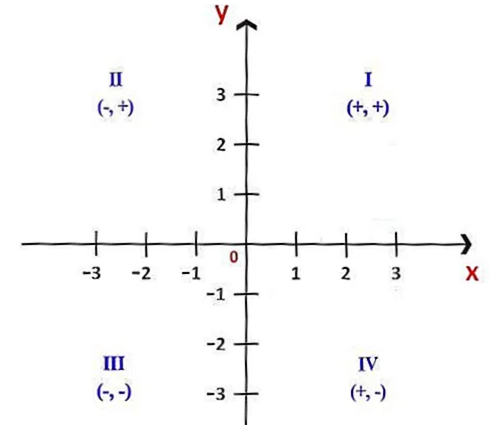
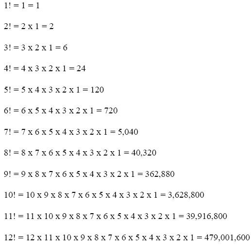
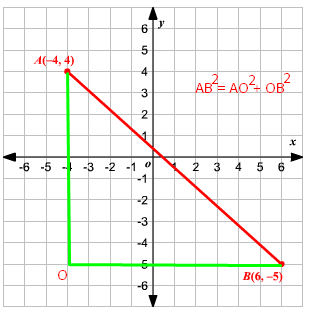
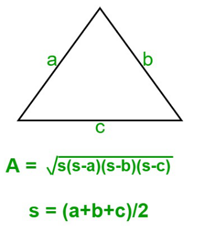

# Mavzu 12: Funksiyalar
 
## Reja:
1. [Bilim](#1-bilim)
   - [1.1 Terminlar](#11-terminlar)
   - [1.2 O'qish uchun materiallar](#12-oqish-uchun-materiallar)
2. [Amaliyot. O'qituvchi](#2-amaliyot-oqituvchi)
3. [Amaliyot. O'quvchi](#3-amaliyot-oquvchi)

## 1. Bilim

### 1.1 Terminlar
```
function - ma'lum vazifani bajaruvchi kodlar bloki
pass - Funksiya nomi bor, lekin blokida hech qanday kod bo'lmaganda yoziladigan kalit so'z
return True - True qiymatini qaytarish  
parameter - def chop_etish(soz, soni). Bu yerda *soz* va *soni* parametrlar
argument - chop_etish("12-dars", 1). Bu yerda *12-dars* va *1* argumentlardir 
```

### 1.2 O'qish uchun materiallar
- sariq dev
  - [#19 FUNKSIYA](https://python.sariq.dev/function/19-function)
  - [#20 QIYMAT QAYTARUVCHI FUNKSIYA](https://python.sariq.dev/function/20-qiymat-qaytarish)
  - [#21 FUNKSIYA VA RO'YXAT](https://python.sariq.dev/function/21-funksiya-va-royxat)
  - [#22 MOSLASHUVCHAN FUNKSIYA (*args, **kwargs)](https://python.sariq.dev/function/22-flexible-functions)
- w3schools
  - [Functions](https://www.w3schools.com/python/python_functions.asp)

## 2. Amaliyot. O'qituvchi

**Reja:**
- [2.1 Funksiya yaratish](#21-funksiya-yaratish)
- [2.2 Funksiyani chaqirish](#22-funksiyani-chaqirish)
- [2.3 Argument](#23-argument)
- [2.4 Parametr](#24-parametr)
- [2.5 Standart parametr](#25-standart-parametr)
- [2.6 *args](#26-args)
- [2.7 **kwargs](#27-kwargs)
- [2.8 ro'yxat argument](#28-royxat-argument)
- [2.9 return](#29-return)
- [2.10 Rekursiya](#210-rekursiya)


### 2.1 Funksiya yaratish

<br>
Funksiya - ma'lum vazifani bajaruvchi kodlar bloki bo'lib, faqat chaqirilgan payt ishga tushadi
<br>
Funksiyalar ikki hil bo'ladi:
- Oldindan aniqlangan (print, input)
- Foydalnuvchi yaratgan

### 2.2 Funksiyani chaqirish
Ikki sonni qo'shib ekranga chiqarish misolini ko'ramiz
```python
a = int(input("1-sonni kiriting: "))
b = int(input("2-sonni kiriting: "))
print(f"a={a}")
print(f"b={b}")
print(f"Yig'indi: {a + b}")
```
```text
1-sonni kiriting: 5
2-sonni kiriting: 15
a=5
b=15
Yig'indi: 20
```
Yuqoridagi misolni 5 marta qaytaring:
```python
a = int(input("1-sonni kiriting: "))
b = int(input("2-sonni kiriting: "))
print(f"a={a}")
print(f"b={b}")
print(f"Yig'indi: {a + b}")
a = int(input("1-sonni kiriting: "))
b = int(input("2-sonni kiriting: "))
print(f"a={a}")
print(f"b={b}")
print(f"Yig'indi: {a + b}")
a = int(input("1-sonni kiriting: "))
b = int(input("2-sonni kiriting: "))
print(f"a={a}")
print(f"b={b}")
print(f"Yig'indi: {a + b}")
a = int(input("1-sonni kiriting: "))
b = int(input("2-sonni kiriting: "))
print(f"a={a}")
print(f"b={b}")
print(f"Yig'indi: {a + b}")
a = int(input("1-sonni kiriting: "))
b = int(input("2-sonni kiriting: "))
print(f"a={a}")
print(f"b={b}")
print(f"Yig'indi: {a + b}")
```
```text
1-sonni kiriting: 5
2-sonni kiriting: 15 
a=5
b=15
Yig'indi: 20
1-sonni kiriting: 3
2-sonni kiriting: 7
a=3
b=7
Yig'indi: 10
1-sonni kiriting: 22
2-sonni kiriting: 44
a=22
b=44
Yig'indi: 66
1-sonni kiriting: 6
2-sonni kiriting: 8
a=6
b=8
Yig'indi: 14
1-sonni kiriting: 12
2-sonni kiriting: 34
a=12
b=34
Yig'indi: 46
```
25 qatorli koddan iborat dastur bo'ldi. Endi shu misolni funksiya yordamida yechamiz:
```python
def yigindi():
    a = int(input("1-sonni kiriting: "))
    b = int(input("2-sonni kiriting: "))
    print(f"a={a}")
    print(f"b={b}")
    print(f"Yig'indi: {a + b}")

yigindi()
yigindi()
yigindi()
yigindi()
yigindi()
```

11 qatorli koddan iborat dastur paydo bo'ldi. <br>
Demak funksiya:
- Kodlarni qayta yozmaslik uchun
- Kodni tushunarli bo'lishi

1. Sonni kvadratga oshiruvchi dastur yozing:
```python
def kvadrat(a):
    print(f"{a} * {a} = {a**2}")

kvadrat(3)
```
```text
3 * 3 = 9
```
2. Salom beruvchi dastur yozing:
```python
def salom_ber():
    print("Assalomu alaykum")
salom_ber()
```
```text
Assalomu alaykum
```
3. Ism va familiyasini aytib salom beradigan dastur yozing:
```python
def salom_ber(ism, familiyasi):
    print(f"Assalomu alaykum, hurmatli {ism} {familiyasi}")
salom_ber("Anvar", "Jasurov")
```
```text
Assalomu alaykum, hurmatli Anvar Jasurov
```
4. Huddi shu masala faqat ism va familiyani foydalanuvchi kiritsin:
```python
def salom_ber(ism, familiyasi):
    print(f"Assalomu alaykum, hurmatli {ism} {familiyasi}")

salom_ber(input("Isminigz: "), input("Familiyangiz: "))
```
```text
Isminigz: Otabek
Familiyangiz: Nuriddinov
Assalomu alaykum, hurmatli Otabek Nuriddinov
```
5. Uchta sonni yig'indisini ekranga chiqaruvchi dastur yozing:
```python
def yigindi(a, b, c):
    print(f"Yig'indi: {a+b+c}")

yigindi(3,4,5)
```
yoki
```python
def yigindi(a, b, c):
    javob = a + b + c
    print(f"Yig'indi: {javob}")

yigindi(3,4,5)
```
```text
Yig'indi: 12
```
6. Son toqligini ekranga chiqaruvchi dastur tuzing:
```python
def toqmi(a):
    if a % 2 == 1:
        print(f"{a} soni toq")
    else:
        print(f"{a} soni juft")

toqmi(19)
toqmi(34)
```
```text
19 soni toq
34 soni juft
```

### 2.3 Argument
Argument funksiyaga beriladigan qiymatdir. U funksiya nomidan keyin qavs ichida keladi
7. a sonini toq yoki juftligini ekranga chiqaradigan funksiya yozing: 
```python
def toqmi(a):
    if a % 2 == 1:
        print(f"{a} soni toq")
    else:
        print(f"{a} soni juft")

toqmi(19)
toqmi(34)
```
Bu yerda **19** va **34** argumentlardir

### 2.4 Parametr
Parametr funksiya e'lon qilinib, qavs ichida keladigan vaqtinchalik o'zgaruvchidir. Argument parametrga kelib tushadi.
```python
def toqmi(a):
    if a % 2 == 1:
        print(f"{a} soni toq")
    else:
        print(f"{a} soni juft")

toqmi(19)
toqmi(34)
```
Bu yerda *toqmi(a)* funksiya nomidagi **a** parametrdir. Parametr funksiya chaqirilganda xotiradan joy oladi, funksiyadan chiqib ketganda xotiradan o'chib ketadi. Ya'ni u argumentni o'zida saqlovchi vaqtinchalik o'zgaruvchi
<br>
Bir nechta parametr berish uchun har biri vergul bilan ajratiladi
<br><br>
8. a, b, c sonlarining yig'indisini ekranga chiqaradigan funksiya yozing: 
```python
def yigindi(a, b, c):
    javob = a + b + c
    print(f"Yig'indi: {javob}")

yigindi(3,4,5)
```
Bu yerda 3ta parametrlar bor: a, b, c
Parametr va argument aslida bitta narsa:
- Funksiyani e'lon qilgan paytdagisini parametr deyiladi
- Funksiyani chaqirgan paytdagisini argument deyiladi

### 2.5 Standart parametr
Standart parametr deganda oldindan berilgan qiymat tushuniladi va u parametrlar ro'yxatining ohirida kelishi kerak
<br><br>
9. a, b, c sonlarining yig'indisini ekranga chiqaradigan funksiya yozing. c soni berilmasa c = 10 deb hisoblansin : 
```python
def yigindi(a, b, c=10):
    javob = a + b + c
    print(f"Yig'indi: {javob}")

yigindi(b=4,c=5, a=3)
yigindi(b=4,a=5)
```
```text
Yig'indi: 12
Yig'indi: 19
```

### 2.6 *args
Ixtiyoriy sondagi argumentlarni berish uchun *args ni ishlatamiz:
10. Soni chegaralanmagan ismlarni argument qilib berganda hammasini ekranga chiqaradigan funksiya yozing
```python
def nomlarni_chiqar(*bolalar):
  for bola in bolalar:
    print(bola)

nomlarni_chiqar("Anvar", "Bekzod", "Ulug'bek")
```
```text
Bizning bolalar: Anvar, Bekzod
```
Ya'ni bu yerda ***args** toifasi tuple bo'ladi. Foydalanuvchi bergan hamma argumentlar bitt ro'yxatda jamlanadi

#### Argument nomini yozib qiymat berish
```python
def yigindi(a, b, c):
    javob = a + b + c
    print(f"Yig'indi: {javob}")

yigindi(a=3,b=4,c=5)
```
```text
Yig'indi: 12
```
Tartibini o'zgartirsak ham bo'ladi
```python
def yigindi(a, b, c):
    javob = a + b + c
    print(f"Yig'indi: {javob}")

yigindi(b=4,c=5, a=3)
```
```text
Yig'indi: 12
```
### 2.7 **kwargs
**kwargs - ixtiyoriy sondagi lug'at ko'rinishidagi parametr

11. Soni chegaralanmagan qiymatlarni kaliti bilan  argument qilib berganda hammasini kalit va qiymatlarni ekranga chiqaradigan funksiya yozing
```python
def info(**kwargs):
    for key, value in kwargs.items():
        print(f"{key.capitalize()}: {value}")

info(ismi="Otabek", familiyasi="Nuriddinov", yoshi=20)
```
```text
Ismi: Otabek
Familiyasi: Nuriddinov
Yoshi: 20
```
Bu yerda kwargs toifasi dict hisoblanadi. Berilgan hamma qiymatlar dict ko'rinishida jamlanadi
### 2.8 ro'yxat argument
Funskiyaga argument sifatida list, dict, set, tuple larni ham bersak bo'ladi:
12. Argument sifatida ro'yxatni berganda hamma elementlarini ekranga chiqaradigan funksiya yozing:
```python
def ekranga_chiqar(mevalar):
    for meva in mevalar:
        print(meva)

        
ekranga_chiqar(['olma','nok','anor'])
```
yoki
```python
def ekranga_chiqar(mevalar):
    for meva in mevalar:
        print(meva)

mahsulotlar = ['olma','nok','anor']
ekranga_chiqar(mahsulotlar)
```
```text
olma
nok
anor
```
### 2.9 return
return - funksiya chaqirilgan joyga qiymatni yuboradi. Funksiya ixtiyoriy toifada bo'lgan bitta yoki bir nechta qiymat qaytarishi mumkin :
13. a,b,c argumentlarni yig'indisini hisoblab, natijani qaytaradgigan funksiya yozing. Bu yerda c yozilmasa c=10 hisoblansin
```python
def yigindi(a, b, c=10):
    return a + b + c
    

javob = yigindi(b=4,c=5, a=3)
print(f"Yig'indi: {javob}")
javob = yigindi(b=4,a=5)
print(f"Yig'indi: {javob}")
```
```text
Yig'indi: 12
Yig'indi: 19
```
return qachon kerak bo'ladi? qachonki funksiya qayta ishlagan qiymat natijasi keyingi kodlarni yana kerak bo'lsa
14. Parametrlari a,b,c bo'lgan har birini kvadratga ochirib qaytaradigan funksiya yozing:
```python
def kvadratga_oshir(a,b,c):
    return a ** 2, b ** 2, c ** 2

print(kvadratga_oshir(4,5,6))
```
```text
(16, 25, 36)
```
### 2.10 Rekursiya
Rekursiya - bu funksiyadan qo'llaniladi, o'z-o'zini chaqirishdir
15. Faktorialni hisoblab natijani qaytaradigan funksiyada yozing
```python
def factorial(x):
    """This is a recursive function
    to find the factorial of an integer"""

    if x == 1:
        return 1
    else:
        return (x * factorial(x-1))


num = 3
print("The factorial of", num, "is", factorial(num))
```
```text
The factorial of 3 is 6
```
Tahlil
```text
factorial(3)          # 1st call with 3
3 * factorial(2)      # 2nd call with 2
3 * 2 * factorial(1)  # 3rd call with 1
3 * 2 * 1             # return from 3rd call as number=1
3 * 2                 # return from 2nd call
6                     # return from 1st call
```
16. Fibonachi ketma-ketligini rekursiya funskiyasi yordamida ko'ramiz. Rekursiya ketma-ketligi o'zidan oldingi ikki raqamni yig'indisidan hosil bo'ladi 
```python
def fibonachi(n):
    if n == 0:
        return 0
    if n == 1:
        return 1

    return fibonachi(n-1) + fibonachi(n-2)

print(f"4-tartibi: {fibonachi(4)}")
print(f"5-tartibi: {fibonachi(5)}")
print(f"6-tartibi: {fibonachi(6)}")
```

```text
4-tartibi: 3
5-tartibi: 5
6-tartibi: 8
```


### Qo'shimcha misollar
17. Kiritildan a, b, c sonlarini tartiblaydigan funksiya yozing:
```python
def osuvchan_tartibla(a,b,c):
    if a > b > c:
        return c, b, a
    elif a > c > b:
        return b, c, a
    elif b > a > c:
        return c, a, b
    elif b > c > a:
        return a, c, b
    elif c > a > b:
        return b, a, c
    else:
        return a, b, c

print(osuvchan_tartibla(int(input("a: ")),int(input("b: ")),int(input("c: "))))
```
18. Quyidagi formulani hisoblovchi funksiya yozing:
<br>


<br>Funksiyada ikki parametr bo'ladi. x va n (daraja)
```python
def factorial(n):
    if n == 1:
        return 1
    if n == 0:
        return 0
    return n * factorial(n-1)

def exp(x, n):
    total = 0
    for i in range(n):
        total += x ** i/(factorial(i) if i else 1)
    return total

print(exp(3, 6))
```
## 3. Amaliyot. O'quvchi
1. Foydalanuvchi kiritgan sonni kubga (3 darajaga) oshirib, ekranga chiqaruvchi funksiya yozing:
```text
Son kiriting: 4
4 sonining kubi: 64
```

```text
Son kiriting: 3
3 sonining kubi: 27
```

```python
def kubga_oshir(a):    
    # Sizning kod bu yeda bo'ladi
    pass

kubga_oshir(input("Son kiriting: "))
```
2. Foydalanuvchi kiritgan sonni 2,3,4 - darajaga oshirib, ekranga chiqaruvchi funksiya yozing:
```text
Son kiriting: 4
4 sonining 2-darajasi: 16
4 sonining 3-darajasi: 64
4 sonining 4-darajasi: 256
```
```text
Son kiriting: 2
4 sonining 2-darajasi: 4
4 sonining 3-darajasi: 8
4 sonining 4-darajasi: 16
```
3. Ikkita sonning o'rta arifmetigini hisoblab, ekranga chiqaruvchi funksiya yozing. Ya'ni (a+b)/2:
```text
1-sonni kiriting: 25
2-sonni kiriting: 15
O'rta arifmetigi: 20
```
```text
1-sonni kiriting: 10
2-sonni kiriting: 40
O'rta arifmetigi: 25
```
4. To'rtta sonning o'rta arifmetigini hisoblab, ekranga chiqaruvchi funksiya yozing. Ya'ni (a+b+c+d)/4:
```text
1-sonni kiriting: 25
2-sonni kiriting: 15
3-sonni kiriting: 5
4-sonni kiriting: 45
O'rta arifmetigi: 22.5
```
5. Ixtiyoriy sondagi sonning o'rta arifmetigini hisoblab qiymatni qaytaruvchi (bundan buyon hamma funskyalar qiymat qaytaradi) funksiya yozing. Ya'ni (a+b ... )/n:

```text
Nechta son kiritasiz: 3
1-sonni kiriting: 25
2-sonni kiriting: 15
3-sonni kiriting: 20
O'rta arifmetigi: 20
```
6. Kiritilgan sonning uzunligi va raqamlar yig'indisini hisoblaydigan funksiya yozing:
```text
Son kiriting: 12345
Son uzunligi: 5
Raqamlar yig'indisi: 15
```
7. Kiritildan son raqamlarini teskari tartibda chiqaruvchi funksiya yozing:
```text
Son kiriting: 23456
Teskari tartibi: 65432
```
8. Kiritilgan son boshi va ohiriga 8 sonini qo'shib qo'yadigan funksiya yozing:
```text
Son kiriting: 456
Natija: 84568
```
9. a,b,c sonlarini kamayuvchan tartibda chiqaradigan funksiya yozing
```text
a: 34
b: 10
c: 100
(100, 34, 10)
```
10. a,b,c qiymatlarni bir qadam o'ngga siljituvchi funksiya yozing. Bu holda quyidagi almashinishilar bo'ladi:
- a -> b
- b -> c
- c -> a
```text
a: 10
b: 20
c: 30
Natija: (30,10,20)
```
```text
a: 20
b: 100
c: 200
Natija: (200,20,100)
```
11. a,b,c qiymatlarni bir qadam chapga siljituvchi funksiya yozing. Bu holda quyidagi almashinishilar bo'ladi:
- c -> b
- b -> a
- a -> c
```text
a: 10
b: 20
c: 30
Natija: (20,30,10)
```
```text
a: 20
b: 100
c: 200
Natija: (100,200,20)
```
12. Sonni musbat, manfiy yoki 0 ekanligini aniqlovchi funksiya yozing:
```text
a: 100
musbat
```
```text
a: -100
manfiy
```
```text
a: 0
no'l
```
13. Kvadrat tenglama ildizlari sonini aniqlavchi funksiya yozing. Argument sifatida a, b, c sonlarni beramiz. Kvadrat tenglamaning haqiqiy ildizlari soni uning diskremenantiga bo'g'liq. **D = b<sup>2</sup>-4ac**

- D > 0 bo'lsa, ikkita haqiqiy ildizda ega
- D = 0 bo'lsa, bitta haqiqiy ildizda ega
- D < 0 bo'lsa, ildizda ega emas

```text
a: 20
b: 30
c: 10
Ildizlar soni: 2
```
14. Doiraning yuzini hisoblovchi funksiya yozing. math.pi dan foydalaning. <b>S = &#960;R<sup>2</sup></b>

```text
r: 15
Doira yuzi: 706.8583470577034
```
```text
r: 10
314.1592653589793
```
15. a va b sonlar orasidagi sonlarni yig'indisini hisoblovchi funksiya yozing. a va b ni ham hisobga olsin:
```text
a: 5
b: 10
Yig'indi: 45
```
```text
a: 15
b: 100
Yig'indi: 4945
```
16. hisoblagich(a,b,amal) nomli funksiya yarating. <br>
Bu yerda <br>
- a va b sondan iborat
- amal -, +, /, * belgilaridan biri<br>
Berilgan ikki son va amal ga ko'ra sonlar ustida biron amalni bajaradigan funksiya yozing:
```text
a: 5
b: 10
+
5 + 10 = 15
```
```text
a: 3
b: 4
*
3 * 4 = 12
```
```text
a: 3
b: 4
-
3 * 4 = -1
```

17. argument sifatida x,y ni beramiz, siz yozadigan funksiyamiz x va y koordinata o'qida qaysi choragida yotishini aniqlab bersin
<br>



```text
x: -10
y: -20
Chorak tartibi: III
```

```text
x: 10
y: 20
Chorak tartibi: I
```

```text
x: 10
y: -20
Chorak tartibi: IV
```

18. Son juft bo'lsa, True, toq bo'la False, 0 bo'lsa None qaytaradigan funksiya yozing:
```text
son: 10
True
```

```text
son: 11
False
```

```text
son: 0
None
```

19. Argument sifatida berilgan son boshqa sonning kvadrati ekanligini aniqlaydigan funksiya yozing. Funksiyadan False/True qaytsin:
```text
Son: 49
True
```
```text
Son: 40
False
```
```text
Son: 81
True
```

20. Argument sifatida berilgan son 5 soning darajasi ekanligini aniqlaydigan funksiya yozing:
```text
son: 125
True
```
```text
son: 120
False
```

21. Yuqoridagi funksiyadan foydalanib, (1-1000) oralig'ida qaysi son 5 ning darajasi bo'lsa, ularni ekranga chiqaring
```text
5
25
125
625
```
22. k soni n soning darajasi ekanini aniqlovchi funksiya yozing:
```text
k: 144
n: 12
True
```
```text
k: 12
n: 14
False
```
```text
k: 32
n: 2
True
```

23. Sonni tublikka tekshiruvchi funksiya yozing:
```text
son: 11
Tub
```
```text
son: 33
Tub emas
```
```text
son: 33
Tub emas
```
```text
son: 7
Tub 
```
24. Sonning raqamlar sonini aniqlovchi funksiya yozing:
```text
son: 1345
Raqam uzunligi: 4
```
```text
son: 134554321
Raqam uzunligi: 9
```
25. Sonning n-tartibini qaytaruvchi funksiya yozing. Tartib raqami katta bo'lsa, -1 qaytsin:
```text
son: 34567
tartibi: 3
5
```
```text
son: 8976
tartibi: 2
9
```
```text
son: 8976
tartibi: 12
-1
```
26. Faktorialni qaytaruvchi funksiya yozing:
<br>




```text
son: 5
5 faktorial: 120
```

```text
son: 7
5 faktorial: 5040
```
27. Fibonachi ketma-ketligini hosil qiluvci funksiya  yozing
```text
0-tartibi: 0
1-tartibi: 1
2-tartibi: 1
3-tartibi: 2
4-tartibi: 3
5-tartibi: 5
6-tartibi: 8
7-tartibi: 13
8-tartibi: 21
9-tartibi: 34
```
28. a sonini b darajaga oshiruvchi funksiya yozing:
```text
son: 2
daraja: 3
Natija: 8
```
```text
son: 10
daraja: 2
Natija: 100
```
29. Son palindrom (simmetrik) ekanini aniqlovchi funksiya yozing:
```text
Son kiriting: 1234321
True
```
```text
Son kiriting: 123432
False
```
30. (1-100) oraliqda hamma palindrom sonlarni ekranga chiqaring
```text
11
22
33
44
55
66
77
88
99
```
31. Gradusni radianga o'giruvchi funksiya yozing. pi=3.14:
<br> <br>
```text
Gradusni kiriting: 100
Radianda 1.7444444444444447 bo'ladi
```
```text
Gradusni kiriting: 500
Radianda 8.722222222222223 bo'ladi
```
32. Radianni gradusga o'giruvchi funksiya yozing. pi=3.14:
```text
Radianni kiriting: 8.722222222222223
Gradusda 500.0 bo'ladi
```
33. For tsikli yordamida kiritilgan n-tartibgacha fibonachi ketma-ketligini hosil qiluvchi funksiya yozing
```text
[0, 1, 1, 2, 3, 5, 8, 13, 21, 34, 55, 89, 144, 233, 377]
```
34. Fibonachi ketma-ketligini tartibini berganda usha tartibdagi qiymatni chiqaradigan funksiya yozing
<br>


```text
Tartib raqamini kiriting: 5
3
```
```text
Tartib raqamini kiriting: 15
377
```

35'. Parametri x va n dan iborat bo'lgan quyidagi formulani hisoblaydigan funksiya yozing:
<br>
Bu yerda:<br>
- x - qiymat
- n - takrorlanish indeksi


<br>
Bu formulani quyidagicha tasavvur qilsa ham bo'ladi:
<br>

<br>Bu yerdan ko'rinadiki daraja va faktorialni tsikl qadamlari bilan bersak bo'ladi. Chunki u har qadamda +1 ga oshib ketyapti. Natijani esa har gal *summa* o'zgaruvchisiga qo'shib ketamiz. Faktorial funksiyasini alohida yozib olamiz:

```python
def factorial(n):
    total = 1
    for i in range(1, n + 1):
        total *= i
    return total


def exp(x, n):
    summa = 0
    for i in range(n):
        summa += x ** i / (factorial(i))
        print(f"qadam-{i + 1}: {x ** i / (factorial(i))}")
    print(f"Yig'indisi: {summa}")
    return summa

x = int(input("x: "))
n = int(input("Daraja n: "))
natija = exp(x, n)
```
```text
x: 5
Daraja n: 10
qadam-1: 1.0
qadam-2: 5.0
qadam-3: 12.5
qadam-4: 20.833333333333332
qadam-5: 26.041666666666668
qadam-6: 26.041666666666668
qadam-7: 21.70138888888889
qadam-8: 15.500992063492063
qadam-9: 9.68812003968254
qadam-10: 5.3822889109347445
Yig'indisi: 143.68945656966488
```
35. Parametri x va n dan iborat bo'lgan quyidagi formulani hisoblaydigan funksiya yozing:


<br>
```text
x: 5
Daraja n: 10
qadam-1: 1.0
qadam-2: 12.5
qadam-3: 26.041666666666668
qadam-4: 21.70138888888889
qadam-5: 9.68812003968254
qadam-6: 2.6911444554673722
qadam-7: 0.5096864498991235
qadam-8: 0.07001187498614334
qadam-9: 0.007292903644389931
qadam-10: 0.0005958254611429682
Yig'indisi: 74.20990710469627
```
36. Parametri x va n dan iborat bo'lgan quyidagi formulani hisoblaydigan funksiya yozing:


<br>
```text
x: 5
Daraja n: 10
qadam-1: 1.0
qadam-2: 12.5
qadam-3: 26.041666666666668
qadam-4: 21.70138888888889
qadam-5: 9.68812003968254
qadam-6: 2.6911444554673722
qadam-7: 0.5096864498991235
qadam-8: 0.07001187498614334
qadam-9: 0.007292903644389931
qadam-10: 0.0005958254611429682
Yig'indisi: 0.283625015089173
```
37. EKUB (eng katta umumiy bo'luvchisi) ni topuvchi funksiya yozing. Funksiyani ikki parametri (a va b) bo'ladi va int toifani qaytaradi: ekub(a, b) -> int:
```text
a: 20
b: 10
ekub: 10
```
```text
a: 40
b: 80
ekub: 40
```
```text
a: 8
b: 12
ekub: 4
```
```text
a: 7
b: 12
ekub: 1
```
38. EKUK (eng kichik umumiy karralisi) ni topuvchi funksiya yozing. Funksiyani ikki parametri (a va b) bo'ladi va int toifani qaytaradi: ekuk(a, b) -> int. **EKUK = a * b / ekub(a, b)**:
```text
a: 8
b: 12
ekuk: 24
```
```text
a: 7
b: 12
ekuk: 84
```
39. EKUBni topuvchi funksiya yozing. Funksiyani uch parametri (a va b) bo'ladi va int toifani qaytaradi: ekub(a, b, c) -> int:
```text
a: 12
b: 8
c: 4
ekub : 4
```
```text
a: 7
b: 12
c: 5
ekub : 1
```
```text
a: 16
b: 12
c: 20
ekub : 4
```
40. Berilgan soniyani soat, daqiqa va soniyaga o'giruvchi funksiya yozing. soniyani_soatga(soniya) -> int:
```text
Soniyani kiriting: 5000
1 soat 23 daqiqa 20 soniya
```
41. Soat, daqiqa va soniyalarni soniyaga o'girib beruvchi funksiya yozing. soatni_soniyaga(soat, minut, soniya) -> int:
```text
Soatni kiriting: 1
Daqiqani kiriting: 23
Soniyani kiriting: 20
Soniyakarda: 5000
```
42. Yil kabisa ekanligi yoki emasligini aniqlovchi funksiya yozing: kabisami(yil) -> bool
```text
Yilni kiriting: 2022
Kabisa yili emas
```
```text
Yilni kiriting: 2024
Kabisa yili 
```
43. kabisami(yil) funksiyasidan foydalanib, bir kun avvalgi sanani qaytaruvchi funksiya yozing. Avvalgi_sana(yil, oy, kun) -> (yil, oy, kun)
```text
Joriy yilni kiriting: 2022
Joriy oyni kiriting: 4
Joriy kunni kiriting: 9
Avvalgi sana: 8.4.2022
```
```text
Joriy yilni kiriting: 2024
Joriy oyni kiriting: 3
Joriy kunni kiriting: 1
Avvalgi sana: 29.2.2024
```
44. Koordinata o'qidagi A va B nuqtalar orasidagi masofasini topuvchi funksiya yozing: ab_uzunlik(a,b) -> int
<br>



<br>

```text
A nuqtani kiriting: -4,4
B nuqtani kiriting: 6, -5
A va B nuqtalar orasidagi masofa: 13.45362404707371
```

45. ab_uzunlik(a,b) funksiyasidan foydalanib, uchburchak perimetrini hisoblovchi funksiya yozing. perimetr(a,b) -> int:<br>
Uchburchak perimetri formulasi: **P = (a + b + c) **

```text
A nuqtani kiriting: -4,4
B nuqtani kiriting: 6, -5
Uchburchak perimetri: 32.45362404707371
```
46. ab_uzunlik(a,b) va perimetr(a,b) funksiyasidan foydalanib, uchburchak yuzini hisoblovchi funksiya yozing. yuzi(a,b) -> int:
<br>



```text
A nuqtani kiriting: -4,4
B nuqtani kiriting: 6, -5
Uchburchak yuzi: 

```