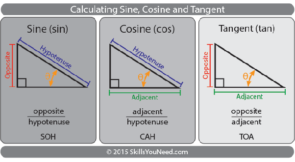
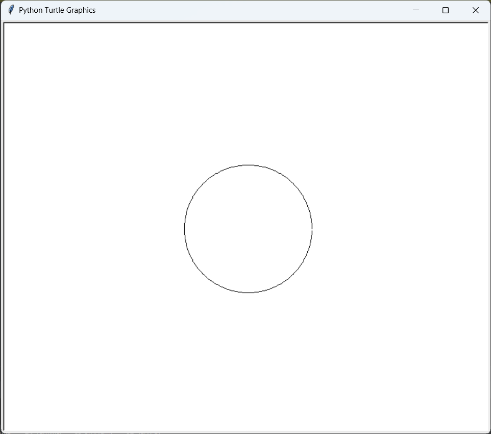

# Mavzu 5.2: Ba'zi modullarning qo'llanilishi


## math moduli




Aylana chizish:

```python
import turtle
import math

# Create a turtle screen
screen = turtle.Screen()

# Create a turtle
t = turtle.Turtle()

# Set the speed of the turtle
t.speed(0)  # Set the maximum speed

# Set the radius of the circle
radius = 100

# Move the turtle to the starting position
t.penup()
t.goto(0, -radius)

i = 0
# Draw the circle using mathematical calculations
for i in range(360):
    # Calculate the x and y coordinates of the point on the circumference
    x = radius * math.cos(math.radians(i))
    y = radius * math.sin(math.radians(i))

    # Move the turtle to the calculated position
    t.goto(x, y)
    if not i:
        i = 1
        t.pendown()

# Hide the turtle
t.hideturtle()

# Keep the window open until it's manually closed
screen.mainloop()
```

Natija:




2. To'lqin shaklni chizish

```python
import turtle
from math import sin,cos
radius = 100
window = turtle.Screen()
window.bgcolor("black")
main_dot = turtle.Turtle()
main_dot.pensize(5)
main_dot.shape("circle")
main_dot.color("white")
main_dot.penup()
main_dot.goto(0,0)
main_dot.pendown()

for x in range(1000):
    main_dot.goto(x*20, sin(x)*10)

turtle.done()
```


## patform moduli


1-misol

```python
import platform

# Get information about the platform
print("Operating System:", platform.system())
print("Platform:", platform.platform(0,1))
print("Architecture:", platform.architecture())
print("Python Version:", platform.python_version())
```


Hammasi 
```python
import platform
from platform import python_implementation, python_version_tuple


# Get information about the platform
print("Operating System:", platform.system())
print("Platform:", platform.platform(0,1))
print("Architecture:", platform.architecture())

print("Processor: ", platform.processor())
print("Processor short: ", platform.machine())
print("OS version: ", platform.version())


print("Python Version:", platform.python_version())

print(python_implementation())

for atr in python_version_tuple():
    print(atr)


```