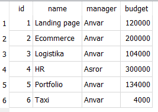

# Mavzu 24: SQLite. CRUD
 
## Reja:
1. [Bilim](#1-bilim)
   - [1.1 Terminlar](#11-terminlar)
   - [1.2 O'qish uchun materiallar](#12-oqish-uchun-materiallar)
2. [Amaliyot. O'qituvchi](#2-amaliyot-oqituvchi)
3. [Amaliyot. O'quvchi](#3-amaliyot-oquvchi)

## 1. Bilim

### 1.1 Terminlar
```
CRUD - Create, Read, Update, Delete
Create - tuzish (jadval, funksiya, indeks va hak)
Read - ya'ni bazada SELECT bo'ladi, u ma'lumot olish uchun ishlatiladi
Update - ma'lumotni o'zgartirish uchun ishlatiladi
Delete - ma'lumotni o'chirish uchun ishlatiladi
```

### 1.2 O'qish uchun materiallar
- sariq dev
- w3schools

## 2. Amaliyot. O'qituvchi

**Reja:**
- [2.1 MB va MBBT](#21-mb-va-mbbt)
- [2.2 Relatsion bazada jadval](#22-relatsion-bazada-jadval)
- [2.3 DB Browser (SQLite)](#23-db-browser-sqlite)
- [2.4 CREATE - tuzish](#24-create---tuzish)
- [2.5 Cheklovlar](#25-cheklovlar)  
- [2.6 Bog'lanish](#26-boglanish)
   - [2.6.1 Birga bir](#261-birga-bir)
   - [2.6.2 Birga ko'p](#262-birga-kop)
   - [2.6.3 Ko'pga ko'p](#263-kopga-kop)
- [2.7 CRUD amallari](#27-crud-amallari)
  - [2.7.1 INSERT - kiritish](#271-insert---kiritish)
  - [2.7.2 SELECT - olish](#272-select---olish)
  - [2.7.3 UPDATE - o'zgartirish](#273-update---ozgartirish)
  - [2.7.4 DELETE - o'chirish](#274-delete---ochirish)

### 2.1 MB va MBBT
Ma'lumotlar bazasi (MB) - tartiblagan ma’lumotlar to'plamidir
ma'lumotlar bazasini boshqarish tizimlari (MBBT) - MBni boshqaradigan tizimdir

Ma'lumotlar bazasi turlari:


<br>
Ma'lumotlar bazasi bo'yicha [qo'shimcha ma'lumotlar](https://phoenixnap.com/kb/database-types)

Biz ulardan relatsion MB ko'ramiz. Relatsion MBBTlarga quydagilar misol bo'ladi:
1. Oracle
2. MySQL
3. Microsoft SQL Server
4. PostgreSQL
5. IBM Db2
6. SQLite
7. Microsoft Access
8. MariaDB
9. Hive
10. Microsoft Azure SQL Database

Relatsion MB ning asosiy hususiyati quyidagilar:
- ma'lumotlar jadvalda saqlanadi
- jadval qator va ustundan iborat


### 2.2 Relatsion bazada jadval

- har bir predmet haqidagi ma'lumot alohida jadvalda saqlanadi


[Yuqoridagi rasm qayerdan hosil bo'ldi](https://docs.google.com/spreadsheets/d/1qsyVHvBYLveDzQxlxalYR8koeHSVmKUL/edit?usp=sharing&ouid=116070295501620847886&rtpof=true&sd=true)

**Buyurtma jadvali**
- id 
- sanasi
- mijoz_id
- mahsulot_id

**Mijoz jadvali**
- id
- ismi
- manzili

**Mahsulot**
- id
- nomi
- narxi

Jadval nima haqida bo'lsa, usha narsa u jadvalda qaytarilmas bo'lishi kerak. Masalan Mijoz jadvalida mijozlar qaytarilmaydi, huddi shunday Mahsulot jadvalida ham. Buyurtma jadvalida esa qaysi mijoz qaysi mahsulotdan sotib olganligini ko'rsatish uchun ularning mos id lari ko'rsatiladi. Mahsulot va mijoz haqida to'liq ma'lumot mana shu id orqali olinadi

### 2.3 DB Browser (SQLite)
[DB Browser for SQLite](https://sqlitebrowser.org/dl/) tizimini o'rnatamiz


<br>
Operatsion tizimga mos bo'lganini yuklab olamiz, so'ng ikki marta bosib ishga tushiramiz:


<br>
So'ng next ni bosib, keyingi oynaga o'tamiz

<br>
Dastur ko'rinishi:

<br>

SQL turlari


- **DDL** - Data Definition Language. DDL buyruqlari sxema bilan, ya'ni ma'lumotlarimiz saqlanadigan jadval bilan ishlaydi.
- **DML** -  Data Manipulation Language. SQL da DML buyruqlaridan foydalanib, biz jadvallardagi ma'lumotlarga o'zgartirishlar kiritishimiz mumkin.
- **DCL** - Data Control Language. DCL buyruqlari har qanday ma'lumotlar bazasi foydalanuvchisidan vakolat berish va qaytarib olish uchun ishlatiladi.
- **TCL** - Transaction Control Language. TCL buyruqlari faqat INSERT, DELETE va UPDATE kabi DML buyruqlari bilan ishlatilishi mumkin.

### 2.4 CREATE - tuzish

[SQLite hujjati](https://www.sqlite.org/keyword_index.html)

1. Mijoz jadvalini tuzing

```sql
CREATE TABLE Mijoz (
	id integer PRIMARY KEY AUTOINCREMENT,
	ismi varchar,
	manzili varchar
);
```

2. Mahsulot jadvalini tuzing

```sql
CREATE TABLE Mahsulot (
	id integer PRIMARY KEY AUTOINCREMENT,
	nomi varchar,
	narxi integer
);
```

3. Karta jadvalini tuzing
```sql
CREATE TABLE Karta (
	id integer PRIMARY KEY AUTOINCREMENT,
	sanasi date,
	raqam NUMERIC(16) UNIQUE ,	
	mijoz_id INTEGER,
	CONSTRAINT fk_mijoz FOREIGN KEY (mijoz_id) REFERENCES mijoz (id)
)
```

4. Buyurtma jadvalini tuzing 
```sql
CREATE TABLE Buyurtma (
	id integer PRIMARY KEY AUTOINCREMENT,
	sanasi date,
	mijoz_id integer,
	mahsulot_id integer,
	CONSTRAINT fk_mijoz FOREIGN KEY (mijoz_id) REFERENCES mijoz (id),
	CONSTRAINT fk_mahsulot FOREIGN KEY (mahsulot_id) REFERENCES mahsulot (id)
);
```

### 2.5 Cheklovlar
- Primary key. Dublikat bo'lmaydi, bo'sh (NULL) bo'lmaydi. Foreign key bilan birga ishlatilishi mumkin. Jadvalda bitta bo'ladi
<br>
Mahsulotlar jadvali
<br>


<br>
- Foreign key. Dublikat bo'lishi mumkin, bo'sh (NULL) bo'lishi mumkin
<br>
Buyurtmalar jadvali
<br>


<br>
- Unique key - Dublikat bo'lmaydi, bo'sh (NULL) bo'lishi mumkin
<br>
Kartalar jadvali
<br>


### 2.6 Bog'lanish
PK blan FK orasidagi bog'lanish 3 hil bo'ladi <br>


#### 2.6.1 Birga bir
1-misol <br>


2-misol <br>

#### 2.6.2 Birga ko'p
1-misol <br>


2-misol <br>


#### 2.6.3 Ko'pga ko'p
1-misol <br>


1-misol <br>


### 2.7 CRUD amallari
### 2.7.1 INSERT - kiritish
#### Mijoz
5. Mijoz jadvaliga ma'lumotlar kiriting

```sql
INSERT INTO "Mijoz" VALUES (1,'Otabek','Toshkent sh. Yunusobod');
INSERT INTO "Mijoz" VALUES (2,'Bekzod','Toshkent sh. Sergeli');
INSERT INTO "Mijoz" VALUES (3,'Jasur','Sirdaryo sh. 5-6 daha');
INSERT INTO "Mijoz" VALUES (4,'Ilyos','Andijon sh. Yunus ota ko''shasi');
```
Natija


### Mahsulot
6. Mahsulot jadvaliga ma'lumotlar kiriting
```sql
INSERT INTO "Mahsulot" VALUES (1,'iPhone',1000);
INSERT INTO "Mahsulot" VALUES (2,'Smart braslet',50);
INSERT INTO "Mahsulot" VALUES (3,'Sumsung Galaxy A52',330);
INSERT INTO "Mahsulot" VALUES (4,'Quloqchin Apple Airpods 3',200);
```

Natija


#### Karta
7. Karta jadvaliga ma'lumotlar kiriting
```sql
INSERT INTO "Karta" VALUES (2,'2022-05-30',1111222233334444,1);
INSERT INTO "Karta" VALUES (4,'2022-05-30',1111222233335555,2);
INSERT INTO "Karta" VALUES (5,'2022-05-30',1111222233336666,3);
```
Natija


#### Buyurtma
8. Buyurtma jadvaliga ma'lumotlar kiriting
```sql
INSERT INTO "Buyurtma" VALUES (1,'2022-05-30 07:57:28',1,1);
INSERT INTO "Buyurtma" VALUES (2,'2022-05-30 10:47:21',1,2);
INSERT INTO "Buyurtma" VALUES (3,'2022-05-30 10:47:25',2,3);
INSERT INTO "Buyurtma" VALUES (4,'2022-05-30 10:48:12',1,3);
INSERT INTO "Buyurtma" VALUES (5,'2022-05-30 10:48:18',3,3);
INSERT INTO "Buyurtma" VALUES (6,'2022-05-30 10:48:25',4,1);
INSERT INTO "Buyurtma" VALUES (7,'2022-05-30 10:48:30',4,2);
INSERT INTO "Buyurtma" VALUES (8,'2022-05-30 10:50:36',4,NULL);
INSERT INTO "Buyurtma" VALUES (9,'2022-05-30 10:50:47',NULL,2);
```

### 2.7.2 SELECT - olish
9. Hamma mijozlarni ko'rsating

```sql
SELECT *
FROM mijoz
```

10. Hamma mahsulotlarni ko'rsating
```sql
SELECT *
FROM mahsulot
```
11. Hamma mahsulotlarni faqat ismlarini ko'rish

```sql
SELECT nomi
FROM mahsulot
```

12. Hamma mahsulotlarni faqat ismlari bo'yicha  tartiblab chiqarish

```sql
SELECT nomi
FROM mahsulot
ORDER BY nomi
```

13. Hamma mahsulotlarni faqat ismlari bo'yicha teskari tartiblab chiqarish

```sql
SELECT id, nomi
FROM mahsulot
ORDER BY nomi DESC
```
 
14. Eng qimmat 3 mahsulotni chiqarish

```sql
SELECT *
FROM Mahsulot
ORDER BY narxi DESC
LIMIT 3
```

15. 400 dan qimmat hamma mahsulotlarni ro'yxatini tartiblab chiqarish

```sql
SELECT *
FROM Mahsulot
WHERE narxi > 400
ORDER BY narxi DESC

```

16. Otabek nomli mijoz haqida ma'lumot olish

```sql
SELECT *
FROM Mijoz
WHERE ismi="Otabek"
```

17. Nomi *e* ga tugaydigan mijoz haqida ma'lumot olish

```sql
SELECT *
FROM Mijoz
WHERE ismi like '%e'
```

17. Nomida *mm* mavjud bo'lgan mijoz haqida ma'lumot olish

```sql
SELECT *
FROM Mijoz
WHERE ismi like '%mm%'
```

18. 5 ta harfdan iborat bo'lgan mijoz haqida ma'lumot olish

```sql
SELECT *
FROM Mijoz
WHERE ismi like '_____'
```
19. Eng qimmat mahsulotni chiqarish

```sql
SELECT max(narxi)
FROM mahsulot
```
yoki
```sql
SELECT narxi 
FROM mahsulot 
ORDER BY narxi DESC 
LIMIT 1
```
20. Eng kichik mahsulotni chiqarish

```sql
SELECT min(narxi)
FROM mahsulot
```
yoki
```sql
SELECT narxi 
FROM mahsulot 
ORDER BY narxi 
LIMIT 1
```
21. Mahsulotni o'rtacha narxini chiqarish

```sql
SELECT avg(narxi)
FROM mahsulot
```
22. id=1 bo'lgan mahsulotni chiqarish

```sql
SELECT *
FROM Mahsulot
WHERE id=1
```

23. Qaysi mijoz qanday mahsulot buyurtma bergan

```sql
SELECT b.*, m.*,n.*
FROM Buyurtma b
LEFT JOIN Mijoz m ON m.id=b.mijoz_id
LEFT JOIN Mahsulot n ON n.id=b.mahsulot_id
```


### 2.7.3 UPDATE - o'zgartirish
24. id = 1 bo'lgan mahsulot narxini 5000 ga o'zgartirish

```sql
UPDATE  mahsulot SET narxi=5000
WHERE id = 1
```

24. nomi = iPhone bo'lgan mahsulot narxini 15000 ga o'zgartirish

```sql
UPDATE  mahsulot SET narxi=15000
WHERE nomi = "iPhone" 
```
24. Hamm  mahsulot narxini 2 barobarga oshirish

```sql
UPDATE  mahsulot SET narxi=narxi*2
```

### 2.7.4 DELETE - o'chirish

25. Mahsulotlarni o'chirish

```sql
DELETE  FROM mahsulot
```

26. id=2 bo'lgan mahsulotni o'chirish

```sql
DELETE  FROM mahsulot
WHERE id=2
```

## 3. Amaliyot. O'quvchi

Faraz qilamiz excell da *hodimlarning qaysi loyihadan soatiga necha pul olishi* haqida ma'lumot bor. Endi uni relatsion jadvalga o'girishimiz kerak


Jadvalda hodim, departament va loyiha haqida ma'lumot bor, hammasi uchun alohida jadval yasaymiz, so'ng har birini qaytarilmasligini PK bilan ta'minlaymiz
<br>
**Loyiha jadvali**


<br>
**Hodim jadvali**


<br>
**Departament jadvali**


Mana endi oylik haqida jadval yasaymiz. Hodimni ko'rsatish uchun hodim jadvalidan PK ni, departamentni ishlatish uchun departament jadvalidagi PK dan foydalanamiz:
<br>

**Oylik jadvali**


### CREATE - jadvallarni tuzib olamiz
- Departament jadvali
```sql
create table department (
    id integer PRIMARY KEY,
    name text
)
```
Hodimlar jadvali
```sql
create table employee (
    id integer PRIMARY KEY,
    name text,
    department_id integer 
)
```

- Loyihalar jadvali
```sql
create table project (
    id integer PRIMARY KEY,
    name text,
    manager text,
    budget integer 
)
```

Loyiha bo'yicha oyliklar jadvali
```sql
create table salary (
    id integer Primary key,
    employee_id integer ,
    project_id integer ,
    total float,
    CONSTRAINT fk_employee FOREIGN KEY (employee_id) REFERENCES employee (id),
    CONSTRAINT fk_project FOREIGN KEY (project_id) REFERENCES project (id) 
)
```
### INSERT - kiritish
Departament jadvali
```sql
insert into department(name) values('Xavfsizlik');
insert into department(name) values('Administrator');
insert into department(name) values('Ishlab chiqish');
insert into department(name) values('Oldi-sotdi');
```


Hodimlar jadvali
```sql
insert into employee(name, department_id) values('Bobur', 1);
insert into employee(name, department_id) values('Aziz', 2);
insert into employee(name, department_id) values('Akmal', 3);
insert into employee(name, department_id) values('Abdulaziz', 3);
insert into employee(name, department_id) values('Murod', 4);
insert into employee(name, department_id) values('Otabek', 4);
```


Loyihalar jadvali
```sql
insert into project(name, manager, budget) values('Landing page', 'Asror', 120000);
insert into project(name, manager, budget) values('Ecommerce', 'Asror', 200000);
insert into project(name, manager, budget) values('Logistika', 'Asror', 104000);
insert into project(name, manager, budget) values('HR', 'Asror', 300000);
insert into project(name, manager, budget) values('Portfolio', 'Asror', 134000);
insert into project(name, manager, budget) values('Taxi', 'Asror', 4000);
```


Loyiha bo'yicha oyliklar jadvali

```sql
insert into salary (employee_id, project_id, total) values(1,1,10000);
insert into salary (employee_id, project_id, total) values(2,2,20000);
insert into salary (employee_id, project_id, total) values(3,3,30000);
insert into salary (employee_id, project_id, total) values(4,4,40000);
insert into salary (employee_id, project_id, total) values(5,5,50000);
```


1. Hamma hodimlarni ko'rish


2. Hamma hodimlarni faqat ismlarini ko'rish


3. Hamma hodimlarni ismlari bo'yicha  tartiblab chiqarish
 


4. Hamma hodimlarni ismlari bo'yicha teskari tartiblab chiqarish


5. Hamma loyihalarni byudjet bo'yicha tartiblab chiqarish


6. Eng katta byudjet ajratilgan 3 loyihani chiqarish


7. 100 000 dan ko'p byudjet ajratilgan loyihalar ro'yxatini tartiblab chiqarish


8. 100 000 bilan 200 000 orasida byudjet ajratilgan loyihalar ro'yxatini tartiblab chiqarish


9. *Logistika* loyihasi haqida ma'lumot olish


10. Nomi *e* ga tugaydigan loyihalarni chiqarish


11. Nomida *mm* mavjud bo'lgan loyihalarni chiqarish


12. 2 ta harfdan iborat bo'lgan loyihalarni chiqarish


13. Menejeri *Asror* va ajratilgan byudjet 200000 teng yoki undan katta bo'lgan loyihalarni chiqarish


14. Eng katta oylikni chiqarish


15. Eng kichik oylikni chiqarish


16. O'rtacha oylikni chiqarish


17. Hodimlar sonini chiqarish


18. id=1 bo'lgan hodimni chiqarish


19. Eng katta oylik oladigan hodimni chiqarish


20. Eng katta oylik oladigan hodim qaysi departmentda ishlashini chiqarish


21. Hamma hodim va u ishlaydigan department nomi ro'yxatini chiqarish


22. Hamma hodimni, u ishlaydigan department nomi va oyliklarini ro'yxatini chiqarish


23. Hamma hodimni, u ishlaydigan department nomi va oyliklarini ro'yxatini chiqarish. Departament nomi ma'lum bo'lganlarigina chiqsin


### UPDATE - o'zgartirish
24. Loyiha menejerini 'Anvar' ga o'zgartisih


25. Nomi *HR* bo'lgan loyiha menejerini 'Asror'ga o'zgartirish

)

26. Oylikni 2 barobarga oshirish

)

### DELETE - o'chirish

27. Hamma hodimlarni o'chirish

28. Administrator departamentini o'chirish
