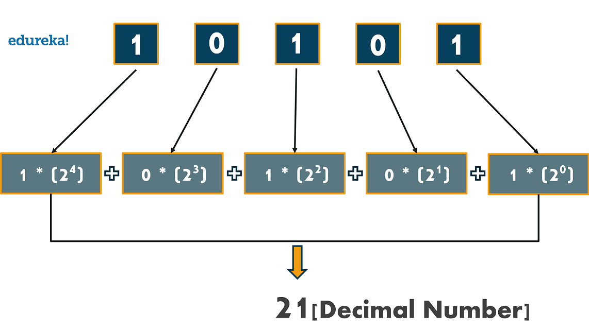

<!-- TOC -->
* [2.2 Literallar - ma'lumotlar](#21-pythonda-birinchi-dastur)
  * [Savollar](#savollar)
  * [Amaliyot. Uy ishi](#amaliyot-uy-ishi)
  * [Lug'at](#lugat)
  * [Savollarga javob](#savollarga-javob)
  * [Amaliyot. Uy ishi javobi](#amaliyot-uy-ishi-javobi)
<!-- TOC -->
# 2.2 Literallar - ma'lumotlar

## Savollar

1. Literallar nima?
2. Quyidagilardan qaysi biri literal?
- aylana yuzini bildiruvchi `S`
  - `100`
  - `Anvar`
  - `True`
  - tezlikni bildiruvchi `v`
  - 200.45
3. Quyidagi literallarning turini aytib bering
   - "34.5"
   - 4.5
   - 4
   - "4"
   - True
   - "True"
   - "Ulug'bek"
4. Quyidagi sonlarlardan qaysi biri to'g'ri yozilgan
   - 2_00_0
   - 2_000
   - 2 000
   - 2, 000
   - 2,000
   - 2.000
   - 2. 000
   - .2
   - 2.
   -  -.2
   -  +2
   - +.2

5. Qanday sanoq tizimlari mavjud?
6. 2lik dan 10likka va aksincha qanday o'giriladi?
7. Quyidagilar nechchiga teng?
   - 3e3
   - 5e6
   - 4e1
   - 4e-1
   - 3.5e1
   - 1000e-3
   - 1e1 * 1e-1
   - 2e1 * 2e-1

## Amaliyot. Uy ishi
7. 10likdan 2likka o'giring:
   - 1
   - 5
   - 10
   - 16
   - 20
   - 32

8. 2likdan 10likka o'giring
   - 0001
   - 1000
   - 1100
   - 0011
   - 1010
   - 0100

## Lug'at

1. Literallar:
   - satr/yozuv - string (str)
   - butun son - integer (int)
   - haqiqiy son - floating point (float)
   - mantiqiy qiymat - boolean (bool)

2. Ma'lumot turi - type
3. Sanoq tizimlari:
   - 2lik  - binary (bin)
   - 8lik  - octal (oct)
   - 10lik - decimal (dec)
   - 16lik - hexadecimal (hex)
4. Darjani qisqartirib yozish

Masalan `3e8`

daraja - exponent (bu yerda e)
asos - base (bu yerda 10)

5. Satrni bildiruvchi belgilar:

qo'shtirnoq - quote
birtirnoq - apostrophe

6. Mantiqiy qimmatlar:

Haqiqat - True
Yolg'on - False

## Savollarga javob

1. Literallar bu oddiy qilib aytganda qiymat/ma'lumot. Literallarning turi jihatidan farqlanadi:
   - butun sonlar, masalan, 10, 45. Pythonda `int` deyiladi
   - haqiqiy sonlar, masalan, 10.3, 45.0. Pythonda `float` deyiladi
   - yozuvlar, masalan, 'Otabek', "Python". Pythonda `str` deyiladi
   - mantiqiy literal. Ular ikkita: `False` va `True`. Pythonda `bool` deyiladi
2. Aylana yuzi S har xil qiymatga teng bo'lishi mumkin. Literal esa aynan bitta qiymatni nazarda tutadi. 
Masalan S=4 desak, mana shu 4 ni biz literal deymiz. S esa o'zgaradi, u literal emas, balki o'zgaruvchi, uni keyingi mavzularda ko'ramiz
3. 

| №   | Literal    | Turi  |
|-----|------------|-------|
| 1   | "34.5"     | str   |
| 2   | 4.5        | float |
| 3   | 4          | int   |
| 4   | "4"        | str   |
| 5   | True       | bool  |
| 6   | "True"     | str   |
| 7   | "Ulug'bek" | str   |

4. 
   - ✅ 2_00_0
   - ✅ 2_000
   - ❌ 2 000
   - ❌ 2, 000
   - ❌ 2,000
   - ✅ 2.000
   - ❌ 2. 000
   - ✅ .2
   - ✅ 2.
   - ✅ -.2
   - ✅ +2
   - ✅ +.2

5. Ular juda ko'p, asosan ikkilik, sakizlik, o'n oltilik va biz hayotda ishlatadigan o'nlik sanoq tizimlari ishlatiladi.
   - 2lik 0 va 1 raqamlaridan iborat, masalan, 0b0101. Kompyuter mana shu sanoq tizimida ishlaydi
   - 8lik 0,1,2,3,4,5,6 va 7 raqamlaridan iborat, masalan, 0o3456
   - 10lik 0,1,2,3,4,5,6,7,8 va 9 raqamlaridan iborat, masalan, 3456. Biz hayotda ishlatadigan sanoq tizimi
   - 16lik 0,1,2,3,4,5,6,7,8,9,A,B,C,D,E va F raqamlaridan iborat, masalan, 0xFA45ED. Ranglar ko'pincha mana shu sanoq tizimida ifodalanadi
6. 2lik va 10 lik sanoq tizimlarini o'girish

**2likdan 10likka o'girish**

Misol 1

Misol 2

**10likdan 2likka o'girish**

Misol 1

Misol 2

7. Quyidagilar nechchiga teng?
Pythonda e bilan yozilgan daraja natijasi har doim haqiqiy bo'ladi

   - 3e3         = 3 * 103 = 3 000.0
   - 5e6         = 5 * 106 = 5 000 000 .0
   - 4e1         = 4 * 101 = 40.0         
   - 4e-1        = 4 * 10-1 = 0.4 
   - 3.5e1       = 3.5 * 101 = 35.0
   - 1000e-3     = 1000 * 10-3 = 1.0
   - 1e1 * 1e-1  = 1 * 101 * 1 * 10-1 = 10 * 0.1 = 1.0
   - 2e1 * 2e-1  = 2 * 101 * 2 * 10-1 = 20 * 0.2 = 4.0

## Amaliyot. Uy ishi javobi

1. 10likdan 2likka o'giring:

10010 = 11001002

6910 = 10001012

5710 = 1110012

2. 2likdan 10likka o'giring

10112 = 1110

10102 = 1010

101012 = 2110

