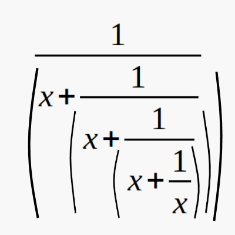

<!-- TOC -->
* [2.5 Izohlar](#21-pythonda-birinchi-dastur)
  * [Amaliyot. Sinf ishi](#amaliyot-sinf-ishi)
  * [Savollar](#savollar)
  * [Amaliyot. Uy ishi](#amaliyot-uy-ishi)
  * [Lug'at](#lugat)
  * [Savollarga javob](#savollarga-javob)
  * [Amaliyot. Uy ishi javobi](#amaliyot-uy-ishi-javobi)
<!-- TOC -->
# 2.5 Izohlar
## Amaliyot. Sinf ishi
## Savollar

1. Izoh nima uchun kerak?
2. O'zgaruvchi yoki funksiya qanday qilib o'zini izohlab kelishi mumkin?
3. Qatorni izohlash uchun qanday qisqa tugmalardan foydalanamiz?
## Amaliyot. Uy ishi
## Lug'at

1. Izoh - comment
2. o'zini-o'zi izohlovchi -self-commenting
3. Dastur ishlash davomida o'tkazib yuboriladi - ommited at runtime
## Savollarga javob
1. Izoh nima uchun kerak?

**Javob:**

- Dastur dasturchiga tushunarli bo'lishi uchun
- Ba'zi kod qismini vaqtinchalik ishlatmay turish uchun

2. O'zgaruvchi yoki funksiya qanday qilib o'zini izohlab kelishi mumkin?
 
**Javob:**

Agar o'zgaruvchi yoki funksiya nomi nomidan vazifasi tushunarli bo'lsa, u o'zini-o'zi izohlaydigan nom hisoblanadi

3. Qatorni izohlash uchun qanday qisqa tugmalardan foydalanamiz?
 
**Javob:**

Windowsda CTRL+/, MacOSda CMD+/

## Amaliyot. Uy ishi javobi

