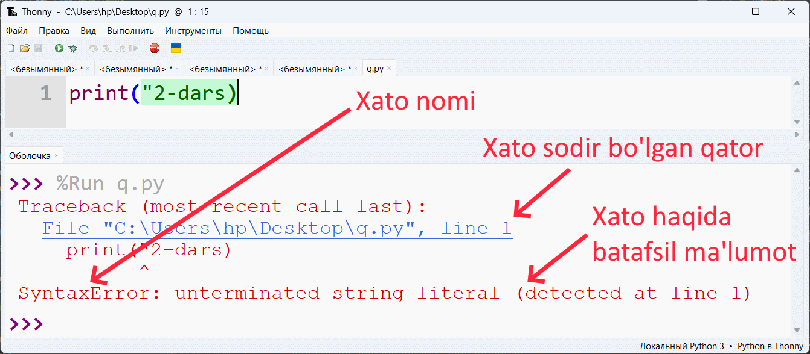
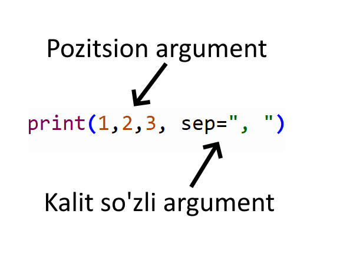

<!-- TOC -->
  * [2.1 Pythonda birinchi dastur](#21-pythonda-birinchi-dastur)
    * [Amaliyot. Sinf ishi](#amaliyot-sinf-ishi)
    * [Savollar](#savollar)
    * [Amaliyot. Uy ishi](#amaliyot-uy-ishi)
    * [Savollarga javob](#savollarga-javob)
    * [Amaliyot. Uy ishi javobi](#amaliyot-uy-ishi-javobi)
<!-- TOC -->
## 2.1 Pythonda birinchi dastur

### Amaliyot. Sinf ishi

1. Ekranga `Assalomu alaykum` so'zini chiqaring.

Yechim:

```python
print('Assalomu alaykum')
```

Natija:

```
Assalomu alaykum
```

2. Ekranga `Ra'no` so'zini chiqaring

Yechim:

```python
print('Ra\'no')
```

yoki

```python
print("Ra'no")
```

Natija:

```
Ra'no
```

3. Ekranga quyidagini chiqaring

```
Meni ismim Abdulloh.
Men qiyinchiliklardan qo'rqmayman, chunki meni buyuk robbim bor
```

Yechim:

```python
print("Meni ismim Abdulloh.")
print("Men qiyinchiliklardan qo'rqmayman, chunki meni buyuk robbim bor")
```

yoki

```python
print("Meni ismim Abdulloh.\nMen qiyinchiliklardan qo'rqmayman, chunki meni buyuk robbim bor")
```

yoki

```python
print("Meni ismim Abdulloh.", "Men qiyinchiliklardan qo'rqmayman, chunki meni buyuk robbim bor", sep="\n")
```

yoki

```python
print("""Meni ismim Abdulloh.
Men qiyinchiliklardan qo'rqmayman, chunki meni buyuk robbim bor
""")
```

4. Quyidagi gapni ekranga chiqaring

```
daftar, qalam, ruchka, kitoblar
```

Yechim:

```python
print("daftar, qalam, ruchka, kitoblar")
```

yoki

```python
print("daftar", "qalam", "ruchka", "kitoblar", sep=", ")
```

5. Quyidagi print funksiyasida satrlarga tegmagan holda faqat sep va end parametrlarga beriladigan argumentlarni shunday
   o'zgartiringki, natijasi quyidagi bilan bir xil bo'lsin:

Natija:

```text
otabek_bekzodov@gmail.com
```

Kod:

```python
print("otabek", "bekzodov")
```

Yechim

```python
print("otabek", "bekzodov", sep="_", end="@gmail.com")
```

6. Quyidagi print funksiyasida satrlarga tegmagan holda faqat sep va end parametrlarga beriladigan argumentlarni shunday
   o'zgartiringki, natijasi quyidagi bilan bir xil bo'lsin:

Natija:

```text
otabek_bekzodov@gmail.com
```

Kod:

```python
print("otabek", "bekzodov")
print("gmail.com")
```

Yechim

```python
print("otabek", "bekzodov", sep="_", end="@")
print("gmail.com")
```

7. Quyidagi print funksiyasida satrlarga tegmagan holda faqat sep va end parametrlarga beriladigan argumentlarni shunday
   o'zgartiringki, natijasi quyidagi bilan bir xil bo'lsin:

Natija:

```text
Men o'qishga soat 7 da boraman
```

Kod:

```python
print("Me", "o'qishga")
print("soat 7")
print(" da boraman")
```

Yechim

```python
print("Me", "o'qishga", sep="n ", end=" ")
print("soat 7", end="")
print(" da boraman")
```

8. Quyidagi print funksiyasida satrlarga tegmagan holda faqat sep va end parametrlarga beriladigan argumentlarni shunday
   o'zgartiringki, natijasi quyidagi bilan bir xil bo'lsin:

Natija:

```text
"Chempionlar g'olib bo'lishmagunicha o'ynashni davom ettirishadi". — Billie Jean King
```

Kod:

```python
print("\"Chempionlar g'olib bo'lishmagunicha")
print("o'ynashni davom ettirishadi")
print("Billie Jean King")
```

Yechim:

```python
print("\"Chempionlar g'olib bo'lishmagunicha", end=" ")
print("o'ynashni davom ettirishadi", end="\". — ")
print("Billie Jean King")
```

9. Quyidagi print funksiyasida satrlarga tegmagan holda faqat sep va end parametrlarga beriladigan argumentlarni shunday
   o'zgartiringki, natijasi quyidagi bilan bir xil bo'lsin:

Natija:

```text
    «Agar bajarishdan qo’rqsangiz, demak bu ishni bajarishga albatta urinib ko’rishingiz kerak!» — Seth Godin
```

Kod:

```python
print("«Agar bajarishdan qo’rqsangiz", "demak")
print("bu ishni bajarishga albatta urinib ko’rishingiz")
print("kerak", "Seth Godin")
```

Yechim:

```python
print("«Agar bajarishdan qo’rqsangiz", "demak", sep=", ", end=" ")
print("bu ishni bajarishga albatta urinib ko’rishingiz")
print("kerak", "Seth Godin", sep="!» — ")
```

10. Quyidagi print funksiyasida satrlarga tegmagan holda faqat sep va end parametrlarga beriladigan argumentlarni
    shunday o'zgartiringki, natijasi quyidagi bilan bir xil bo'lsin:

Natija:

```text
Sabr deb, inson boshiga tushgan alam va chidab bo‘lmaydigan og‘riqni to yengunga qadar ushlab turishga aytiladi.
Sabr – insonni maqsadiga eng tez olib boradigan yo‘l ko‘rsatuvchidir.
    
    Jaloliddin Rumiy
```

Kod:

```python
print("Sabr deb, inson boshig", "tushgan alam va chidab bo‘lmaydigan og‘riqni to yengung", "qadar ushlab turishg",
      "aytiladi.")
print("Sabr – insonni maqsadiga eng tez olib boradigan yo‘l ko‘rsatuvchidir.")
print("Jaloliddin Rumiy")
```

Yechim:

```python
print("Sabr deb, inson boshig", "tushgan alam va chidab bo‘lmaydigan og‘riqni to yengung", "qadar ushlab turishg",
      "aytiladi.", sep="a ")
print("Sabr – insonni maqsadiga eng tez olib boradigan yo‘l ko‘rsatuvchidir.", end="\n\n   ")
print("Jaloliddin Rumiy")
```

11. print yordamida moshina rasmini chizib bering

Yechim:
```python
print("      _______  ")
print("  ___/       \\____")
print(" |                | ")
print("  --(_)------(_)-- ")
```

### Savollar

1. Qaysi holatda sep parametriga qiymat bersak, natijaga ta'sir qilmaydi?
2. Funksiyalarning kelib chiqishi bo'yicha xillari?
3. Funksiyaning hususiyatlari?
4. Funksiya nomidan keyin bir juft qavslarni qo'yish shartmi?
5. Funksiya qavisi ichida nima bo'lishi mumkin?
6. Funksiyani chaqirgan paytimizda qavs ichida beriladigan qiymat nomi?
7. Pythonda bitta qatorda nechta ko'rsatma bo'lishi mumkin?
8. \ belgisi nomi nima deb ataladi?
9. Agar kodimizda xato bo'lsa, Python bizga qanday qilib xatolikni ko'rsatadi
10. Quyida har bir uchun nechta argument borligini ayting.
11. Necha xil argumentlar mavjud?
12. Python son bilan satrni (ya'ni matnni) qanday ajratadi?
```python
print("2-dars")
print(2, 3)
print(2, 3 * 5)
print(4 + 5)
print(1, "dars")
print(1,2,3)
print("1,2,3")
print("1,2", 3)
```

### Amaliyot. Uy ishi
1. Ekranga `Bu mening 2-darsim` matnini chiqaring.

Natija:

```
Bu mening 2-darsim
```

2. Ekranga `Ma'no` so'zini print yodamida turli variantlarda ekranga chiqaring

Natija:

```
Ma'no
```

3. Ekranga print yordamida turli variantlarda quyidagini chiqaring

```
Hech qachon xato qilmagan inson, hech qachon yangi narsaga harakat qilmagan insondir.
Hech qachon to'xtamaydigan insondan o'tib keta olmaysiz.
```

4. Quyidagi gapni print yordamida turli variantlarda ekranga chiqaring

```
olma | anor | nok | uzum
```

5. Quyidagi print funksiyasida satrlarga tegmagan holda faqat sep va end parametrlarga beriladigan argumentlarni shunday
   o'zgartiringki, natijasi quyidagi bilan bir xil bo'lsin:

Natija:

```text
https://hikmatlar.uz/
```

Kod:

```python
print("https:/", "hikmatlar.uz")
```

6. Quyidagi print funksiyasida satrlarga tegmagan holda faqat sep va end parametrlarga beriladigan argumentlarni shunday
   o'zgartiringki, natijasi quyidagi bilan bir xil bo'lsin:

Natija:

```text
https://hikmatlar.uz/
```

Kod:

```python
print("https", "hikmatlar")
print("uz")
```

7. Quyidagi print funksiyasida satrlarga tegmagan holda faqat sep va end parametrlarga beriladigan argumentlarni shunday
   o'zgartiringki, natijasi quyidagi bilan bir xil bo'lsin:

Natija:

```text
Hayotda muvaffaqiyatga erishish uchun uch narsa kerak; diqqat, intizom va harakat.
```

Kod:

```python
print("Hayotda muvaffaqiyatga", "erishish uchun uch narsa kerak")
print("diqqat")
print("intizom")
print("harakat")
```

8. Quyidagi print funksiyasida satrlarga tegmagan holda faqat sep va end parametrlarga beriladigan argumentlarni shunday
   o'zgartiringki, natijasi quyidagi bilan bir xil bo'lsin:

Natija:

```text
Bilmaganni so'rab o'rgangan olim, orlanib so'ramagan o'ziga zolim
```

Kod:

```python
print("Bilmaganni so'rab o'rgangan olim")
print("orlanib so'ramagan")
print("o'ziga zolim")
```

9. Quyidagi print funksiyasida satrlarga tegmagan holda faqat sep va end parametrlarga beriladigan argumentlarni shunday
   o'zgartiringki, natijasi quyidagi bilan bir xil bo'lsin:

Natija:

```text
Ey do’st, darding nima bo’lsa bo’lsin, Umiding har zamon Alloh bo’lsin.

 Jaloliddin Rumiy
```

Kod:

```python
print("Ey do’st", "darding nima bo’lsa bo’lsin")
print("Umiding har zamon Alloh bo’lsin")
print(".")
print("Jaloliddin Rumiy")
```

10. Quyidagi print funksiyasida satrlarga tegmagan holda faqat sep va end parametrlarga beriladigan argumentlarni
    shunday o'zgartiringki, natijasi quyidagi bilan bir xil bo'lsin:

Natija:

```text
Hech kim sizdan aqilli emas, shunchaki, ular sizdan ancha vaqtliroq boshlashgan.
```

Kod:

```python
print("Hech kim sizdan aqilli emas")
print("shunchaki")
print("ular sizdan ancha vaqtliroq boshlashgan")
```

11. print yordamida uy rasmini chizib bering


Lug'at

1. Funksiyani chaqirish - function invocation

```python
print("printni chaqirish")
```

2. Funksiya hususiyatlari:

- ta'sir - effect
- natija - result
- argument - argument

3. Qiymat - value
4. Ko'rsatma - instruction
5. Yangi qator(`\n`) - newline
6. \ belgisi - backslash (escape character)
7. separator (sep) - ajratuvchi
8. end - ohiri/tugashi
9. Argument xillari:
- pozitsion argument - positional argument
- kalit so'zli argument - keyword argument


### Savollarga javob

Qaysi holatda sep parametriga qiymat bersak, natijaga ta'sir qilmaydi?

Javob:

print funksiyasiga beriladigan tartibli argumentlar soni bitta bo'lganda sep parametriga berilgan qiymatning ahamiyati
yo'q

```python
print("Mening ismim Otabek", sep="===")
```

Natija:

```
Mening ismim Otabek
```

2. Funksiyalarning kelib chiqishi bo'yicha xillari?

Javob:

- To'g'ridan to'g'ri Pythondan
- Modullardan
- Kodingizdan

To'g'ridan to'g'ri Pythondan

```python
print()  # 
```

Modullardan

```python
import math

math.sin(100)  # 
```

Kodingizdan

```python
def ismni_chiqar(ism, familiya):
    print(ism, familiya)


ismni_chiqar("Otabek", "Anvarov")
```

3. Funksiyaning hususiyatlari?

Javob:

- **ta'sir**, ya'ni qandaydir ish bajaradi
- **natija**, ya'ni qiymatni hisoblab, uni natija sifatida qaytaradi
- **argument**, ya'ni qiymatni funksiya uzatuvchi

Masalan

Ta'sir

```python
# ta'siri - ekranga chiqarish
# natija - hech narsa qaytarmaydi
# argumenti - 0 tadan cheksizgacha
print("2-dars")

# ta'siri - hech qanday
# natija - belgilar sonini hisoblab natijani qaytaradi
# argumenti - faqat bitta
a = len("2-dars")
print(a)

# ta'siri - hech qanday
# natija - ekranga kiritilgan qiymatni o'qib oladi
# argumenti - 0ta yoki bitta
son = input("Son kiriting: ")
print("Siz kiritgan son", son)
```

4. Funksiya nomidan keyin bir juft qavslarni qo'yish shartmi?

Javob:

Ha, funksiyadan keyin doim qavs qo'yish shart

```python
# quyida turli funksiyalar berilgan 
print()
input()
len("")
```

5. Funksiya qavisi ichida nima bo'lishi mumkin?

Javob:

Parametr

```python
# bu yerda a parametr
def mening_funksiyam(a):
    pass
```

6. Funksiyani chaqirgan paytimizda qavs ichida beriladigan qiymat nomi?

Javob:

Argument

```python
# bu yerda "2-dars" argument
print("2-dars")
```

7. Pythonda bitta qatorda nechta ko'rsatma bo'lishi mumkin?

Javob:

0 ta yoki faqat bitta

```python
print("1-qator")

print("3-qator")
```

8. \ belgisi nomi nima deb ataladi?

Javob:

\ belgisi _teskari chiqziq_ yoki _bekslesh_ yoki _eskeyp belgisi_ deyiladi

9. Agar kodimizda xato bo'lsa, Python bizga qanday qilib xatolikni ko'rsatadi

Javob:

Agar kodimizda xato bo'lsa, Python bizga quyidagilar haqida habar beradi:

- xato nomi
- xato sodir bo'lgan qator
- xato haqida batafsil ma'lumot



10. Quyida har bir uchun nechta argument borligini ayting.

```python
print("2-dars")  # 1 ta argument
print(2, 3)      # 2 ta argument
print(2, 3 * 5)  # 2 ta argument: 2 va 15
print(4 + 5)     # 1 ta argument: 9
print(1, "dars") # 2 ta argument: 1 va "dars"
print(1,2,3)     # 3 ta argument: 1,2 va 3
print("1,2,3")   # 1 ta argument: "1,2,3"
print("1,2", 3)  # 2 ta argument: "1,2" va 3
```

11. Necha xil argumentlar mavjud?

Javob:

Argumentlar 2 xil bo'ladi: 
- pozitsion, ya'ni tartibi bilan uzatish
- kalit so'zli, ya'ni funksiya parametri ko'rsatilgan holda uzatish



```python
print(1,2,3, sep=", ")
print("1-dars", )
```

12. Python son bilan satrni (ya'ni matnni) qanday ajratadi?

Javob:

Satr pythonda `str` deyiladi, uni quyidagi belgilardan biri ichida berishimiz kerak:
- " (qo'shtirnoq) belgisi
- ' (birtirnoq) belgisi
- """ (uchta qo'shtirnoq) belgisi
- ''' (uchta birtirnoq) belgisi

```python
print("satr")
print('bu ham satr')
print("""bu ham satr, faqat bir qator""")
print('''bu ham bir qatorli satr''')
print('''bu esa 
ko'p qatorli satr''')
print("""bu ham 
ko'p qatorli satr""")
```


### Amaliyot. Uy ishi javobi

1. Ekranga `Bu mening 2-darsim` matnini chiqaring.

Yechim:

```python
print('Bu mening 2-darsim')
```

Natija:

```
Bu mening 2-darsim
```

2. Ekranga `Ma'no` so'zini print yodamida turli variantlarda ekranga chiqaring

Yechim:

```python
print('Ma\'no')
```

yoki

```python
print("Ma'no")
```

Natija:

```
Ma'no
```

3. Ekranga print yordamida turli variantlarda quyidagini chiqaring

```
Hech qachon xato qilmagan inson, hech qachon yangi narsaga harakat qilmagan insondir.
Hech qachon to'xtamaydigan insondan o'tib keta olmaysiz.
```

Yechim:

```python
print("Hech qachon xato qilmagan inson, hech qachon yangi narsaga harakat qilmagan insondir.")
print("Hech qachon to'xtamaydigan insondan o'tib keta olmaysiz.")
```

yoki

```python
print("""Hech qachon xato qilmagan inson, hech qachon yangi narsaga harakat qilmagan insondir.
Hech qachon to'xtamaydigan insondan o'tib keta olmaysiz.
""")
```

4. Quyidagi gapni print yordamida turli variantlarda ekranga chiqaring

```
olma | anor | nok | uzum
```

Yechim:

```python
print("olma | anor | nok | uzum")
```

yoki

```python
print("olma", "anor", "nok", "uzum", sep=" | ")
```

5. Quyidagi print funksiyasida satrlarga tegmagan holda faqat sep va end parametrlarga beriladigan argumentlarni shunday
   o'zgartiringki, natijasi quyidagi bilan bir xil bo'lsin:

Natija:

```text
https://hikmatlar.uz/
```

Kod:

```python
print("https:/", "hikmatlar.uz")
```

Yechim

```python
print("https:/", "hikmatlar.uz", sep="/", end="/")
```

6. Quyidagi print funksiyasida satrlarga tegmagan holda faqat sep va end parametrlarga beriladigan argumentlarni shunday
   o'zgartiringki, natijasi quyidagi bilan bir xil bo'lsin:

Natija:

```text
https://hikmatlar.uz/
```

Kod:

```python
print("https", "hikmatlar")
print("uz")
```

Yechim

```python
print("https", "hikmatlar", sep="://", end=".")
print("uz")
```

7. Quyidagi print funksiyasida satrlarga tegmagan holda faqat sep va end parametrlarga beriladigan argumentlarni shunday
   o'zgartiringki, natijasi quyidagi bilan bir xil bo'lsin:

Natija:

```text
Hayotda muvaffaqiyatga erishish uchun uch narsa kerak; diqqat, intizom va harakat.
```

Kod:

```python
print("Hayotda muvaffaqiyatga", "erishish uchun uch narsa kerak")
print("diqqat")
print("intizom")
print("harakat")
```

Yechim

```python
print("Hayotda muvaffaqiyatga", "erishish uchun uch narsa kerak", sep=" ", end=": ")
print("diqqat", end=", ")
print("intizom", end=" va ")
print("harakat")
```

8. Quyidagi print funksiyasida satrlarga tegmagan holda faqat sep va end parametrlarga beriladigan argumentlarni shunday
   o'zgartiringki, natijasi quyidagi bilan bir xil bo'lsin:

Natija:

```text
Bilmaganni so'rab o'rgangan olim, orlanib so'ramagan o'ziga zolim
```

Kod:

```python
print("Bilmaganni so'rab o'rgangan olim")
print("orlanib so'ramagan")
print("o'ziga zolim")
```

Yechim:

```python
print("Bilmaganni so'rab o'rgangan olim", end=", ")
print("orlanib so'ramagan", end=" ")
print("o'ziga zolim")
```

9. Quyidagi print funksiyasida satrlarga tegmagan holda faqat sep va end parametrlarga beriladigan argumentlarni shunday
   o'zgartiringki, natijasi quyidagi bilan bir xil bo'lsin:

Natija:

```text
Ey do’st, darding nima bo’lsa bo’lsin, Umiding har zamon Alloh bo’lsin.

 Jaloliddin Rumiy
```

Kod:

```python
print("Ey do’st", "darding nima bo’lsa bo’lsin")
print("Umiding har zamon Alloh bo’lsin")
print(".")
print("Jaloliddin Rumiy")
```

Yechim:

```python
print("Ey do’st", "darding nima bo’lsa bo’lsin", sep=", ", end=", ")
print("Umiding har zamon Alloh bo’lsin", end="")
print(".", end="\n\n   ")
print("Jaloliddin Rumiy")
```

10. Quyidagi print funksiyasida satrlarga tegmagan holda faqat sep va end parametrlarga beriladigan argumentlarni
    shunday o'zgartiringki, natijasi quyidagi bilan bir xil bo'lsin:

Natija:

```text
Hech kim sizdan aqilli emas, shunchaki, ular sizdan ancha vaqtliroq boshlashgan.
```

Kod:

```python
print("Hech kim sizdan aqilli emas")
print("shunchaki")
print("ular sizdan ancha vaqtliroq boshlashgan")
```

Yechim:

```python
print("Hech kim sizdan aqilli emas", "shunchaki", sep=", ", end=", ")
print("ular sizdan ancha vaqtliroq boshlashgan")
```

11. print yordamida uy rasmini chizib bering

Yechim:
```python
print(" ________")
print("|[] [] []|")
print("|        |")
print("|[] [] []|")
print("|________|")
```
